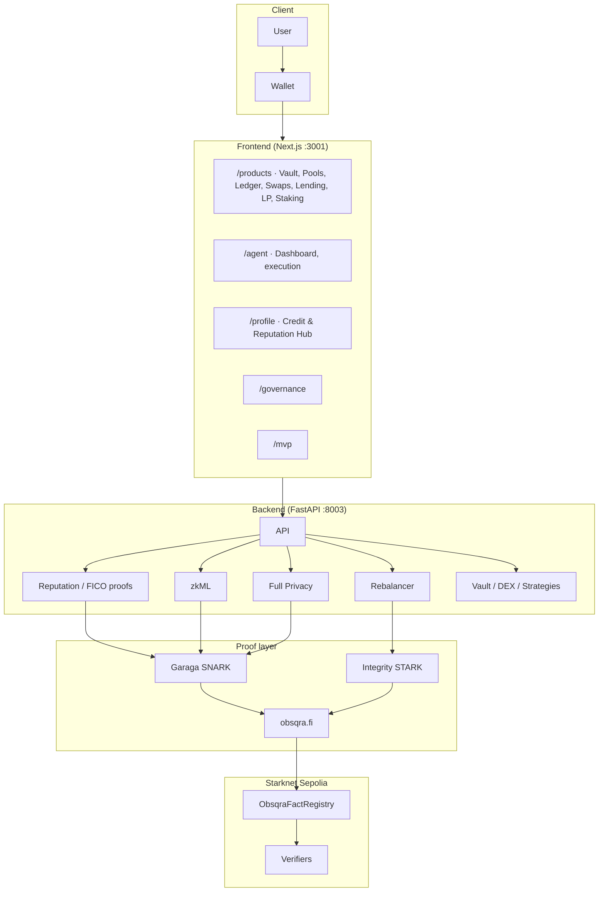
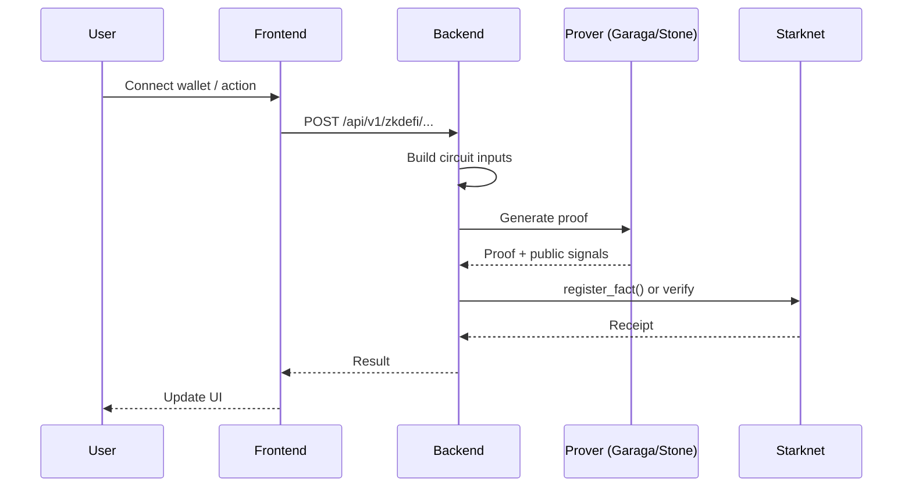

# zkde.fi

**Private DeFi execution, portable reputation, and proof-gated capital on Starknet.**  
By [Obsqra Labs](https://obsqra.xyz).

Live: [zkde.fi](https://zkde.fi) · Docs: [docs.zkde.fi](https://docs.zkde.fi)

---

## What it is

zkde.fi is a **full-stack private DeFi platform** on Starknet (Sepolia). Productized surfaces for private execution, settlement, and attestation — not just an agent.

**Product surface (what’s built):**

- **Private Vault** — Shielded deposits, withdrawals, and policy-gated capital with configurable privacy tiers.
- **Privacy Pools** — Tiered commitment/nullifier pools for capital entry and exit.
- **Dark Ledger** — Private internal settlement with no public transfer trail.
- **Private Swaps** — Swap execution with private intent and slippage constraints.
- **Private Lending** — Supply and borrow with proof-backed eligibility and liquidation safety.
- **Private LP + Yield** — LP and yield allocation with privacy tiers, anomaly checks, and exposure controls.
- **Private Staking** — Staking and delegation integrated with vault privacy and proof-aware execution.
- **Risk Passport** — Portable trust and risk attestations; profile, passport, and receipt rails (Credit & Reputation Hub, FICO pack proofs).
- **Private Governance** — Private proposal and voting workflows with ZK verification (DAO).
- **Adapters** — Composable strategy adapters for protocol-specific private deployment paths.

**Under the hood:** Garaga (SNARK) for zkML and confidential transfers; Integrity (STARK) for execution. Proof-gated: no proof, no execution. Session keys for delegation; rebalancer and agent tooling for autonomous flows.

---

## Architecture



**Request flow (high level):**



---

## Repository index

| Directory | Contents |
|-----------|----------|
| **[backend/](backend/README.md)** | FastAPI: vault/DEX/strategies, reputation & FICO proofs, zkML, full-privacy, rebalancer, session keys, governance. |
| **[frontend/](frontend/README.md)** | Next.js: products (vault, pools, ledger, swaps, lending, LP, staking, governance), agent dashboard, profile, Credit & Reputation Hub. |
| **[circuits/](circuits/README.md)** | Garaga/Circom circuits (zkML, full-privacy, reputation verifiers). |
| **[contracts/](contracts/README.md)** | Cairo contracts (ProofGatedYieldAgent, ObsqraFactRegistry, verifiers). |
| **[scripts/](scripts/README.md)** | Deploy verifiers, DAO proposal test, emergency controls, smoke tests. |
| **[monitoring/](monitoring/README.md)** | Prometheus alert rules, Grafana dashboard (reputation proofs). |
| **[docs/](docs/README.md)** | Architecture, L3/Madara, reputation API, plans. |
| **[market-maker-sim/](market-maker-sim/README.md)** | Simulated market-maker and LP data for testing. |
| **credit-scoring/** | Credit-scoring model and tooling. |
| **tests/** | E2E and integration tests; see [tests/README.md](tests/README.md). |

---

## Quick start

**Backend**

```bash
cd backend
python -m venv venv
source venv/bin/activate   # Windows: venv\Scripts\activate
pip install -r requirements.txt
# Copy .env.example to .env and set STARKNET_RPC_URL, FULL_PRIVACY_*, etc.
uvicorn app.main:app --host 0.0.0.0 --port 8003
```

**Frontend**

```bash
cd frontend
npm install
# Set .env.local: NEXT_PUBLIC_API_URL=http://localhost:8003, NEXT_PUBLIC_RPC_URL
npm run dev
```

Open [http://localhost:3001](http://localhost:3001). **/products** — full product map (vault, pools, ledger, swaps, lending, LP, staking, risk passport, governance, adapters). **/agent** — launch app (dashboard, execution). **/profile** — Credit & Reputation Hub. **/governance** — DAO. **/mvp** — risk → recommend → deploy.

---

## Tech stack

| Layer | Tech |
|-------|------|
| Frontend | Next.js, React, Tailwind |
| Backend | FastAPI, Python 3.12 |
| Proofs | Garaga (Circom/BN254), Stone/Integrity (STARK), EZKL (zkML) |
| Contracts | Cairo, Scarb |
| Chain | Starknet Sepolia |

---

## Key docs (condensed)

- **Reputation proofs** — [docs/REPUTATION_PROOF_API.md](docs/REPUTATION_PROOF_API.md): GET/POST proof status and generation; verifier addresses.
- **L3 / Madara** — [docs/MADARA_L3_APPCHAIN_ARCHITECTURE.md](docs/MADARA_L3_APPCHAIN_ARCHITECTURE.md): Proof chain, settlement, zkde.fi integration.
- **L3 proving paths** — [docs/L3_PROVING_PATHS_INTEGRATION.md](docs/L3_PROVING_PATHS_INTEGRATION.md): Implementation guide for frontend/backend.
- **Full doc index** — [docs/README.md](docs/README.md).

---

## Pool intent & rebalance mode

**Intent-aware drawers:** Deposit and Withdraw can be launched from pool bucket cards (fixed pool intent — pool selector hidden, title reads "Deposit to Moderate") or from vault-level actions (global intent — pool selector shown, title reads "Fund Vault"). The pool context flows through `openSlideout("deposit", poolId)` and is respected by both `DepositPanel` and `WithdrawPanel`.

**Rebalance mode** is an account-level setting stored in the execution policy:
- **My Agent** (`user`) — only the wallet owner can deploy or close pool capital.
- **Oracle** (`oracle`) — an operator/admin can trigger rebalances, gated by zkML verification via the policy engine.

Toggle the mode in the Agent Controls panel (right rail) or via the API:
```
GET  /api/v1/zkdefi/mc/rebalance-mode/{address}
PUT  /api/v1/zkdefi/mc/rebalance-mode/{address}  {"rebalance_mode": "user"|"oracle"}
```

Pool composition is tracked by the double-entry ledger under `POOL:{pool_id}:idle:{token}` and `POOL:{pool_id}:deployed:{adapter}:{token}` accounts. Query it via:
```
GET  /api/v1/zkdefi/pools/{pool_id}/composition
POST /api/v1/zkdefi/pools/{pool_id}/deploy
POST /api/v1/zkdefi/pools/{pool_id}/close
```

---

## License

Apache-2.0
