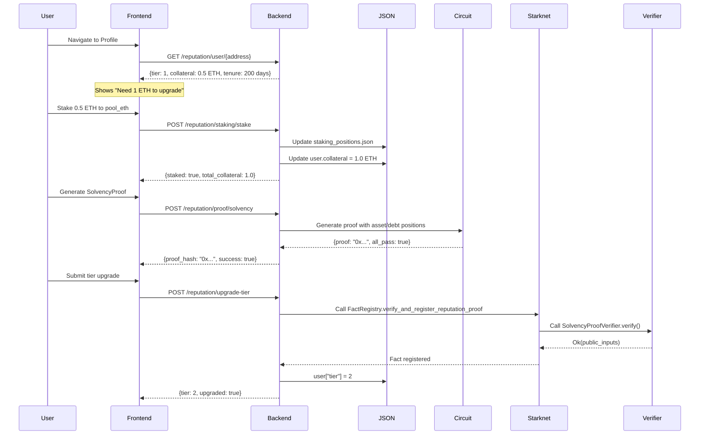
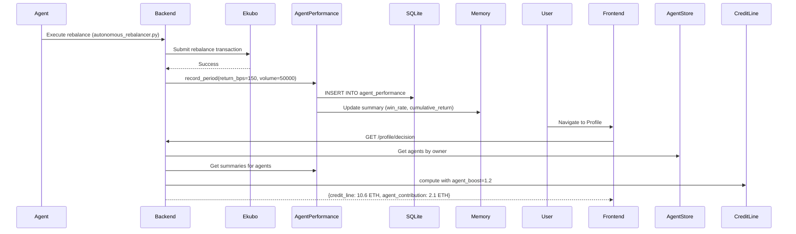
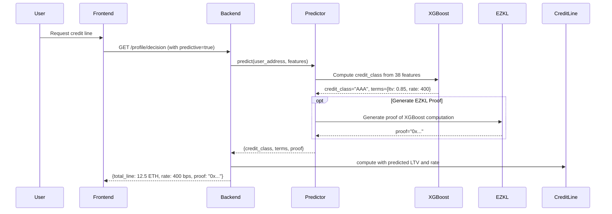

# Reputation System Architecture Map

**Date**: March 5, 2026  
**Purpose**: Comprehensive map of reputation, credit, collateral, and agent reputation systems

---

## System Overview

zkDeFi has **4 interconnected identity/credit systems** that work together to enable privacy-preserving DeFi:

```
┌─────────────────────────────────────────────────────────────────────┐
│                      USER REPUTATION SYSTEM                         │
│  Tier (0/1/2) → Relayer Delay + Passport Score + Profile Display   │
│  Source: JSON store + cross-chain baseline                          │
└──────────────────┬──────────────────────────────────────────────────┘
                   │
                   ├─────────> COLLATERAL STAKING
                   │           └─> Tier 2 upgrade (1 ETH required)
                   │           └─> Collateral-backed credit line
                   │
                   ├─────────> CREDIT SCORING (3 methods)
                   │           ├─> Formulaic (tier × letter × credit_tier)
                   │           ├─> RISC Zero (cross-chain history → AAA/AA/A/B)
                   │           └─> Predictive XGBoost (zkML EZKL proof)
                   │
                   └─────────> AGENT REPUTATION
                               └─> AgentReputationScore circuit (7 metrics)
                               └─> HistoricalPerformanceAttestation circuit
                               └─> SQLite-backed performance tracking
```

---

## 1. User Reputation System

### Storage
- **Backend**: `backend/data/reputation_users.json` (JsonStore)
- **On-Chain**: `contracts/src/reputation_registry.cairo` (ReputationRegistry)

### Fields
```json
{
  "tier": 0,                    // 0=Strict, 1=Standard, 2=Express
  "transaction_count": 0,
  "total_volume_eth": 0.0,
  "first_interaction": 1234567890,
  "successful_txns": 0,
  "collateral": 0               // In wei, from staking
}
```

### Tier Definitions

| Tier | Name | Limits | Relayer | Fee |
|------|------|--------|---------|-----|
| **0** | Strict | 2 dep/day, 1 w/d, 10 ETH max | No access | 0.5% |
| **1** | Standard | 10 dep/day, 5 w/d, 50 ETH max | 1h delay | 0.3% |
| **2** | Express | 255 dep/day, 255 w/d, unlimited | No delay | 0.1% |

### Upgrade Requirements
- **Tier 0→1**: 30 days tenure + 5 successful txns
- **Tier 1→2**: 180 days tenure + 1 ETH collateral staked

### Baseline Sources
1. **In-app activity**: `POST /reputation/record-transaction` (manual calls)
2. **Cross-chain history**: `CrossChainFetcher` fetches from:
   - Starknet RPC (`starknet_getNonce`)
   - Ethereum/Arbitrum/Base (Etherscan API)
   - Linked addresses from `linked_addresses.json`
3. **Merged**: `tenure_days = max(in_app, cross_chain)`; `successful_txns = sum(in_app, cross_chain)`

### Current Consumers

| Consumer | How Used |
|----------|----------|
| **Relayer** | `_get_user_tier()` → sets `ready_time` delay on queue entries |
| **Risk Passport** | Tier + tenure + volume → composite score 0-100 + letter A/B/C/D |
| **Profile Frontend** | Display tier badge, upgrade progress |
| **Agent Header** | Show tier badge for user's agents |

### Known Gaps
- **Reputation not updated by usage**: Deploy, execute, vault operations don't call `record_transaction`
- **TIER_INFO limits not enforced**: max_deposits_per_day, max_position_eth are advisory only
- **Ledger disconnected**: Vault deposits don't update reputation volume
- **Demo mode**: Paper trades don't build reputation

---

## 2. Collateral Staking System

### Storage
- **Backend**: `backend/data/staking_positions.json` (JsonStore)
- **Structure**:
```json
{
  "0x123...": {
    "pool_usdc": {
      "staked_wei": 1000000,
      "rewards_wei": 50000,
      "last_accrued_at": 1234567890,
      "last_staked_at": 1234567890
    }
  }
}
```

### Staking Pools
```python
STAKING_POOLS = [
    {"pool_id": "pool_usdc", "name": "USDC Stability", "apr_bps": 500, "lock_days": 0},
    {"pool_id": "pool_strk", "name": "STRK Governance", "apr_bps": 1200, "lock_days": 30},
    {"pool_id": "pool_eth", "name": "ETH Security", "apr_bps": 800, "lock_days": 7},
]
```

### Integration with Reputation
- **Staking → Collateral**: `POST /reputation/staking/stake` increments `user["collateral"]`
- **Unstaking → Collateral**: `POST /reputation/staking/unstake` decrements `user["collateral"]`
- **Tier 2 Requirement**: 1 ETH minimum collateral for Express tier upgrade

### Integration with Credit Line
- **Collateral-backed credit**: `credit_line_collateral = collateral_eth × 0.80` (80% LTV)
- **Formula**: See Section 3 below

---

## 3. Credit Scoring System (3 Methods)

### Method 1: Formulaic Credit Line (Default)

**Location**: `backend/app/services/credit_line_service.py`

**Formula**:
```python
# Collateral-backed
collateral_line_eth = collateral_eth × 0.80

# Unsecured capacity (reputation-based)
tier_weight = {0: 0.0, 1: 0.5, 2: 1.0}
letter_weight = {"A": 1.0, "B": 0.6, "C": 0.3, "D": 0.0}
credit_weight = {"AAA": 1.5, "AA": 1.2, "A": 1.0, "B": 0.5, "C": 0.2}

unsecured_cap_eth = tier_weight × letter_weight × credit_weight × 5.0

# Cross-chain boost
if cross_chain_verified:
    cross_chain_mult = min(1.0 + 0.1 × linked_address_count, 1.5)
    unsecured_cap_eth × cross_chain_mult

# Collaborative credit graph boost
collaborative_mult = 1.0–2.0x (from credit graph analysis)
unsecured_cap_eth × collaborative_mult

# Total
total_line_eth = min(collateral_line + unsecured_cap, 50.0 global cap)
```

**Rate Calculation**:
```python
base_rate_bps = 800
tier_discount = {0: 0, 1: 100, 2: 200}
letter_discount = {"A": 150, "B": 80, "C": 30, "D": 0}

rate_bps = max(base_rate - tier_discount - letter_discount, 100)
```

**Example**:
- User: Tier 2 (Express), 2 ETH collateral, Letter A, credit_tier AAA, 2 linked addresses
- Collateral line: 2 × 0.80 = 1.6 ETH
- Unsecured: 1.0 × 1.0 × 1.5 × 5.0 = 7.5 ETH
- Cross-chain boost: 7.5 × 1.2 = 9.0 ETH
- **Total**: 1.6 + 9.0 = 10.6 ETH
- **Rate**: 800 - 200 - 150 = 450 bps (4.5%)

### Method 2: RISC Zero Credit Service

**Location**: `backend/app/services/risc_zero_credit_service.py`

**Purpose**: Cross-chain credit scoring with zero-knowledge proof of history

**Scoring Model**:
```python
base_score = 500
+ volume_score (0-300): based on total volume across chains
+ tenure_score (0-100): log(tenure_days + 1) × 20
+ repayment_score (0-50): repayment_rate / 2
+ cross_chain_bonus (50): if active on both ETH and Starknet
- liquidation_penalty (0-100): liquidation_count × 20

final_score = clamp(score, 300, 850)
```

**Credit Tiers**:
- **AAA**: score ≥ 750
- **AA**: score ≥ 650
- **A**: score ≥ 550
- **B**: score < 550

**Proof Generation**:
- **When available**: Uses RISC Zero guest program to prove credit score computation
- **Fallback**: Computes locally without proof
- **Future**: Deploy RISC Zero verifier to Starknet for on-chain verification

### Method 3: Predictive XGBoost Model (zkML)

**Location**: `backend/app/ml/creditworthiness/predictor.py`

**Purpose**: ML-based creditworthiness with EZKL proof

**Features** (38 total):
- Cross-chain behavior (tx_count, volume, protocols_used, tenure_days)
- Reputation metrics (tier, successful_txns, collateral)
- Behavioral patterns (avg_position_size, rebalance_frequency, risk_tolerance)
- Linked addresses (verified_linked_count, cross_chain_activity)

**Model**: XGBoost classifier trained on synthetic data

**Output**:
```json
{
  "credit_class": "AAA",
  "confidence": 0.95,
  "terms": {
    "ltv": 0.85,
    "rate_bps": 400,
    "unsecured_multiplier": 1.5
  },
  "proof": "0x...",  // EZKL proof (optional)
  "model_hash": "0x..."
}
```

**Integration with Credit Line**:
- Uses predicted LTV instead of fixed 0.80
- Uses predicted rate_bps
- Uses unsecured_multiplier to boost unsecured capacity
- Falls back to formulaic if model not ready

---

## 4. Agent Reputation System

### Storage
- **SQLite**: `backend/data/agents.db`
  - `agents` table: agent_id, owner, identity_commitment, **reputation_tier**, bound_skills
  - `agent_performance` table: period performance records

### Performance Metrics (Per Period)
```python
{
  "period_id": "2024-02-w3",
  "agent_id": "agent_abc123",
  "return_bps": 150,              # 1.5% return
  "volume": 50000,                # Trade volume
  "proof_count": 12,              # ZK proofs generated
  "successful_actions": 45,
  "failed_actions": 5,
  "max_drawdown_bps": 800,        # 8% max drawdown
  "timestamp": 1234567890
}
```

### Aggregate Summary
```python
{
  "total_periods": 12,
  "total_volume": 500000,
  "total_proofs": 120,
  "cumulative_return_bps": 1800,
  "mean_return_bps": 150,
  "max_drawdown_bps": 800,
  "sharpe_estimate": 1.85,
  "win_rate": 0.90
}
```

### ZK Circuits for Agent Reputation

#### AgentReputationScore Circuit
**Location**: `circuits/AgentReputationScore.circom`

**Purpose**: Proves agent meets minimum reputation score without revealing individual metrics

**Private Inputs** (7 metrics):
1. `total_volume`
2. `successful_rebalances`
3. `failed_rebalances`
4. `avg_return_bps`
5. `max_drawdown_bps`
6. `tenure_days`
7. `total_proofs`

**Weights**: `[5, 25, -30, 20, -15, 10, 15]` (sum = 100)

**Score Calculation**:
```
raw_score = Σ(metric_i × weight_i) / scale
reputation_score = clamp(raw_score, 0, 1000)
is_reputable = reputation_score ≥ min_reputation_score
```

**Public Output**: `is_reputable` (boolean) - **metrics remain private**

#### HistoricalPerformanceAttestation Circuit
**Location**: `circuits/HistoricalPerformanceAttestation.circom`

**Purpose**: Proves agent's historical returns meet thresholds

**Private Inputs**:
- `period_returns[12]` - 12 period returns
- `period_balances[12]` - Equity curve
- `peak_balance` - All-time high

**Public Inputs**:
- `min_total_return_bps` - Minimum cumulative return
- `max_drawdown_bps` - Maximum allowed drawdown

### Agent Reputation → User Credit

**Concept**: User's owned agents contribute to user's overall creditworthiness

**Implementation** (from `ProfileDecisionService`):
```python
# Get all agents owned by user
agents = get_agents_by_owner(user_address)

# Aggregate agent performance
total_agent_volume = sum(agent.total_volume for agent in agents)
total_agent_proofs = sum(agent.total_proofs for agent in agents)
mean_agent_return = avg(agent.mean_return_bps for agent in agents)

# Boost credit line
if has_reputable_agents(agents, min_score=500):
    unsecured_cap × 1.2  # 20% boost for proven agent performance
```

**Agent Reputation Tier** (stored in `agents.reputation_tier`):
- Computed from AgentPerformanceSummary
- Feeds into user's composite credit score
- Can be proven via `AgentReputationScore` circuit

---

## 5. Integration Points

### 5.1 Reputation → Credit Line

**API**: `GET /api/v1/zkdefi/profile/decision`

**Flow**:
```python
# 1. Fetch reputation data
reputation = reputation_service.get_user_data(address)
tier = reputation["tier"]
collateral_eth = reputation["collateral"] / 1e18

# 2. Fetch risk passport (includes letter rating)
passport = risk_passport_service.get_passport(address)
letter_rating = passport["letter_rating"]  # A/B/C/D
credit_tier = passport.get("credit_tier")  # AAA/AA/A/B/C (from RISC Zero or XGBoost)

# 3. Fetch linked addresses
linked = linked_addresses_service.get_linked(address)
linked_count = len(linked["verified"])
cross_chain_verified = linked_count > 0

# 4. Compute credit line
credit_line = compute_credit_line(
    collateral_eth=collateral_eth,
    tier=tier,
    letter_rating=letter_rating,
    credit_tier=credit_tier,
    linked_address_count=linked_count,
    cross_chain_verified=cross_chain_verified,
)
```

**Result**:
```json
{
  "collateral_line_eth": 1.6,
  "unsecured_cap_eth": 9.0,
  "total_line_eth": 10.6,
  "rate_bps": 450,
  "tier": 2,
  "letter_rating": "A",
  "credit_tier": "AAA"
}
```

### 5.2 Collateral Staking → Tier Upgrade

**Stake Flow**:
```bash
# 1. User stakes 1 ETH to unlock Express tier
POST /api/v1/zkdefi/reputation/staking/stake
{
  "address": "0x...",
  "pool_id": "pool_eth",
  "amount_wei": 1000000000000000000  # 1 ETH
}

# 2. Backend updates collateral
user["collateral"] += 1e18
staking_positions[address][pool_eth]["staked_wei"] += 1e18

# 3. Check tier upgrade eligibility
GET /api/v1/zkdefi/reputation/user/0x...
{
  "tier": 1,
  "tenure_days": 200,
  "collateral_eth": 1.0,
  "upgrade_eligible": true,
  "upgrade_requirements": {"met": true}
}

# 4. User requests upgrade
POST /api/v1/zkdefi/reputation/upgrade-tier
{
  "address": "0x...",
  "target_tier": 2,
  "upgrade_proof_hash": "0x..."  # SolvencyProof from new circuits
}

# 5. Backend verifies and upgrades tier
user["tier"] = 2
```

### 5.3 Agent Reputation → User Credit

**Agent Creation Flow**:
```bash
# 1. User creates agent (identity-bound)
POST /api/v1/zkdefi/agents/create
{
  "name": "My Trading Agent",
  "identity_commitment": "0x...",
  "bound_skills": ["rebalancing", "liquidity_provision"]
}

# Response includes reputation_tier: 0 (new agent)
```

**Agent Performance Tracking**:
```bash
# 2. Agent executes trades (recorded by autonomous_agent.py)
# After each rebalance/deploy:
performance_service.record_period(
    PeriodPerformance(
        period_id="2026-03-w1",
        agent_id="agent_abc123",
        return_bps=150,
        volume=50000,
        proof_count=5,
        successful_actions=10,
        failed_actions=1,
        max_drawdown_bps=200
    )
)

# 3. Backend computes aggregate summary
summary = performance_service.get_summary("agent_abc123")
# {total_periods: 12, cumulative_return_bps: 1800, win_rate: 0.90, ...}
```

**Agent Reputation Proof**:
```bash
# 4. Generate AgentReputationScore proof
POST /api/v1/zkdefi/zkml/scan
{
  "circuits": ["AgentReputationScore"],
  "user_address": "agent_abc123",
  "mode": "gate",
  "inputs_override": {
    "AgentReputationScore": {
      "metrics": [500000, 108, 12, 150, 800, 12, 120],
      "weights": [5, 25, -30, 20, -15, 10, 15],
      "min_reputation_score": 500,
      "scale": 10
    }
  }
}

# Response: {"all_pass": true, "results": [{"success": true, "proof": "0x..."}]}
```

**User Credit Boost**:
```python
# 5. ProfileDecisionService evaluates agent performance
agents = agent_service.get_agents_by_owner(user_address)
reputable_agents = [a for a in agents if a.reputation_tier >= 1]

if len(reputable_agents) > 0:
    credit_line.unsecured_cap_eth × 1.2  # 20% boost
    credit_line.collaborative_multiplier × 1.1  # Additional boost for proven agents
```

---

## 6. New Reputation Circuits (FICO Pack)

These 5 circuits (just integrated) enable **proof-gated tier upgrades**:

### SolvencyProof
- **Claim**: Assets ≥ liabilities × min_ratio
- **Use**: Tier 1→2 upgrade (prove 1 ETH collateral without revealing positions)
- **API**: `POST /reputation/proof/solvency`

### RiskPassportTier
- **Claim**: Portfolio metrics qualify for specific risk tier
- **Metrics**: volume, profit, volatility, drawdown, leverage, tenure (11 total)
- **Use**: Express tier eligibility based on portfolio quality
- **API**: `POST /reputation/proof/risk-passport`

### TraderPerformanceProof
- **Claim**: Meets Sharpe ratio, win rate, drawdown benchmarks
- **Inputs**: 30-period returns + equity curve
- **Use**: Prove trading competency for lower fees or higher limits
- **API**: `POST /reputation/proof/performance`

### StrategyIntegrity
- **Claim**: Strategy adheres to position limits, leverage caps, slippage bounds
- **Inputs**: 8-position weights + slippage + exposures
- **Use**: Prove risk management compliance for autonomous strategies
- **API**: `POST /reputation/proof/strategy-integrity`

### ExecutionIntegrity
- **Claim**: Transaction execution met timing and price requirements (anti-MEV)
- **Inputs**: submission_block, inclusion_block, expected_price, actual_price
- **Use**: Prove fair execution for reputation/credit boost
- **API**: `POST /reputation/proof/execution-integrity`

---

## 7. On-Chain Reputation Components

### ReputationRegistry Contract
**Location**: `contracts/src/reputation_registry.cairo`

**Storage**:
```cairo
struct UserStats {
    transaction_count: u64,
    successful_txns: u64,
    total_volume_eth: u128,
    first_interaction: u64,
    current_tier: u8,
}

user_stats: LegacyMap<ContractAddress, UserStats>
user_collateral: LegacyMap<ContractAddress, u128>
```

**Score Calculation** (on-chain):
```cairo
fn get_reputation_score(user: ContractAddress) -> u16 {
    // Max score: 1000
    tenure_points = f(tenure_days)    // 0-300
    txn_points = f(successful_txns)   // 0-300
    collateral_points = f(collateral) // 0-200
    proof_count_points = f(proofs)    // 0-200
    
    total = tenure + txn + collateral + proof_count
    return min(total, 1000)
}
```

**Tier Upgrade** (on-chain):
```cairo
fn upgrade_tier(user: ContractAddress, target_tier: u8, proof_hash: felt252) {
    // 1. Verify proof exists in FactRegistry
    assert(fact_registry.is_fact_registered(proof_hash))
    
    // 2. Check requirements met
    let stats = user_stats.read(user);
    let collateral = user_collateral.read(user);
    
    if target_tier == 2:
        assert(stats.tenure_days >= 180)
        assert(collateral >= 1_000_000_000_000_000_000)  // 1 ETH
    
    // 3. Upgrade
    stats.current_tier = target_tier
    user_stats.write(user, stats)
}
```

### ObsqraFactRegistry (Now with Reputation Proofs)
**Location**: `contracts/src/obsqra_fact_registry.cairo`

**New Functionality** (Task 1.3):
```cairo
fn verify_and_register_reputation_proof(
    fact_type: felt252,  // 100-104 for FICO pack
    subject: felt252,    // User address
    proof_data: Span<felt252>
) {
    // 1. Route to correct Garaga verifier
    let verifier = match fact_type {
        100 => self.solvency_verifier.read(),
        101 => self.risk_passport_verifier.read(),
        102 => self.trader_performance_verifier.read(),
        103 => self.strategy_integrity_verifier.read(),
        104 => self.execution_integrity_verifier.read(),
    };
    
    // 2. Verify Groth16 proof on-chain
    let result = IGroth16VerifierBN254::verify(verifier, proof_data);
    assert(result.is_ok(), "PROOF_VERIFICATION_FAILED");
    
    // 3. Register fact
    let public_inputs = result.unwrap();
    let fact_hash = poseidon_hash(fact_type, subject, public_inputs);
    self.facts.write(fact_hash, true);
}
```

---

## 8. Frontend Integration Points

### Profile Page Components

#### Current (Existing):
- **TierBadge**: Displays tier (0/1/2) with color coding
- **ReputationCard**: Shows tenure, txn count, volume, collateral
- **StakingPanel**: Lists staking pools, stake/unstake actions
- **UpgradeRequirements**: Shows progress toward next tier

#### New (To Build):
- **ReputationProofPanel**: Generate and submit FICO pack proofs
  - Generate SolvencyProof (for tier upgrade)
  - Generate RiskPassportTier (for tier qualification)
  - Generate TraderPerformanceProof (for fee reduction)
  - Display proof status (pending/verified/failed)
- **CreditLineDisplay**: Show total credit capacity breakdown
  - Collateral-backed: X ETH
  - Unsecured (reputation): Y ETH
  - Total available: Z ETH
  - Current rate: N bps
- **AgentPerformanceCard**: Show owned agents' performance
  - List agents with reputation_tier
  - Aggregate volume, return, proof count
  - Link to agent dashboard

### Agent Dashboard Components

#### Existing:
- **AgentCard**: Name, identity, bound skills
- **BrainVisualizer**: Shows agent activity
- **AgentRebalancer**: Manual rebalance trigger

#### New (To Build):
- **AgentReputationCard**: Show agent's performance summary
  - Periods tracked, total volume, proofs generated
  - Win rate, mean return, max drawdown
  - **Generate AgentReputationScore proof** button
  - Display proof status and reputation tier
- **PerformanceChart**: Historical returns over time
- **LeaderboardRank**: Show agent's rank vs others

---

## 9. System Flows

### Flow 1: User Tier Upgrade (Express)



### Flow 2: Agent Performance → User Credit



### Flow 3: zkML Credit Scoring



---

## 10. Key Insights for Frontend Integration

### What Should the UI Show?

**Profile Section**:
1. **Current Tier** with badge and limits
2. **Upgrade Progress**:
   - Tenure: 200/180 days ✅
   - Collateral: 1.0/1.0 ETH ✅
   - Status: "Ready to upgrade"
3. **Credit Line Breakdown**:
   - Collateral: 1.6 ETH (from 2 ETH staked @ 80% LTV)
   - Unsecured: 9.0 ETH (from tier 2 + letter A + credit AAA)
   - Total: 10.6 ETH available
   - Rate: 4.5% APR
4. **Reputation Proofs** (NEW):
   - SolvencyProof: ✅ Verified
   - RiskPassportTier: ⏳ Not generated
   - TraderPerformanceProof: ❌ Failed (thresholds not met)
   - StrategyIntegrity: ✅ Verified
   - ExecutionIntegrity: ✅ Verified
5. **Agent Performance** (if owns agents):
   - "My Trading Agent": Tier 1, 12 periods, 18% cumulative return
   - "MEV Shield Agent": Tier 0, 3 periods, -5% return (learning)
   - **Boost from agents**: +1.8 ETH unsecured credit

**Agent Dashboard**:
1. **Agent Identity**: Name, commitment, bound skills
2. **Performance Metrics**:
   - Win rate: 90%
   - Mean return: 1.5% per period
   - Max drawdown: 8%
   - Total proofs: 120
3. **Reputation Tier**: Tier 1 (Standard)
4. **Generate Proof**: Button to generate AgentReputationScore proof
5. **Historical Chart**: 12-period equity curve

### What's Missing?

**Gap Analysis**:
1. **No UI for proof generation** - Users can't generate or view reputation proofs
2. **No credit line display** - Users don't see their total borrowing capacity
3. **No agent performance display** - Can't see agent metrics or contribution to credit
4. **No proof verification status** - Can't track which proofs are verified on-chain
5. **Staking UI is basic** - Doesn't show credit line impact of staking

### Integration Requirements

**Data Sources Needed**:
- `GET /reputation/user/{address}` - Tier, tenure, collateral
- `GET /reputation/proof/status/{address}` - Which proofs are verified (NEW endpoint needed)
- `GET /profile/decision` - Full credit line with breakdown
- `GET /agents/my-agents` - Owned agents
- `GET /agents/{id}/performance` - Agent performance summary (NEW endpoint needed)

**Actions Needed**:
- `POST /reputation/proof/*` - Generate each proof type
- `POST /reputation/upgrade-tier` - Submit tier upgrade with proof
- `POST /reputation/staking/stake` - Stake collateral
- `POST /reputation/staking/unstake` - Unstake collateral

---

## 11. Recommended Frontend Approach

### Phase 1: Reputation Proof UI (Current Task 2.1-2.3)
Build `ReputationProofPanel` with:
- List all 5 proof types with descriptions
- Generate buttons for each proof
- Real-time proof status (pending/success/fail)
- Link to tier upgrade when proofs verified

### Phase 2: Credit Line Display
Add `CreditLineCard` showing:
- Collateral-backed capacity
- Reputation-based unsecured capacity
- Cross-chain boost (if linked addresses)
- Agent performance boost (if reputable agents)
- Total available line + current rate

### Phase 3: Agent Performance Integration
Add `AgentPerformanceCard` to agent dashboard:
- Performance summary (periods, volume, proofs)
- Win rate, return, drawdown metrics
- Generate AgentReputationScore proof
- Show how agent contributes to user credit

### Phase 4: Unified Reputation View
Create `ReputationOverview` dashboard:
- User tier + agent tiers
- All verified proofs
- Credit capacity breakdown
- Staking positions with APR
- Path to Express tier with checklist

---

## 12. Next Steps for Frontend Implementation

Given the exploration findings, **revise Task 2.1-2.3**:

### Task 2.1 (Revised): Create Reputation Proof Panel
- Display all 5 FICO pack proofs with status
- **NEW**: Add mock data for proof inputs (don't ask user for 30-period returns manually)
- **NEW**: Show credit line impact of each proof
- **NEW**: Integrate with existing `ReputationCard` component (don't create duplicate)

### Task 2.2 (Revised): Add Proof Generation with Realistic Inputs
- Use `GET /profile/decision` to fetch current metrics
- Auto-populate proof inputs from:
  - Solvency: ledger balances (assets/debts)
  - RiskPassport: reputation metrics (volume, profit, tenure)
  - Performance: agent performance (if user has agents)
  - Strategy: current vault allocations
  - Execution: recent transaction history
- **Don't force user to manually input 30 values**

### Task 2.3 (Revised): Integrate with Existing Profile Components
- Add to existing `frontend/src/app/profile/page.tsx` (don't replace)
- Position below `ReputationCard` or inside tabbed interface
- Link tier upgrade button to proof panel
- Show credit line impact of tier upgrades

---

## Summary

**The zkDeFi reputation system is a multi-layer stack**:

1. **User Reputation** (tier 0/1/2) → Relayer access + profile display
2. **Collateral Staking** → Tier 2 requirement + collateral-backed credit
3. **Credit Scoring** (3 methods) → Total credit line computation
   - Formulaic (tier × letter × credit_tier)
   - RISC Zero (cross-chain history)
   - XGBoost zkML (predictive)
4. **Agent Reputation** → Autonomous agent performance tracking
5. **FICO Pack Circuits** (NEW) → Zero-knowledge proof of creditworthiness

**Integration is non-trivial**: Reputation affects credit, credit affects tier upgrades, agents affect user credit, proofs gate tier upgrades.

**Frontend should expose**:
- Proof generation UI for tier upgrades
- Credit line visualization with breakdowns
- Agent performance contribution to user credit
- Clear path from "Strict tier + no collateral" to "Express tier + 10 ETH credit line"

---

## 5. Frontend Credit & Reputation Hub

### Overview
The **Credit & Reputation Hub** is a unified UI component (`CreditReputationHub`) that replaces the previous scattered reputation tab content on the Profile page. It integrates FICO pack proofs additively with existing credit systems, lending/borrowing, and explainability.

### Location
- **Profile page**: `/profile` → **Reputation** tab
- **Component**: `frontend/src/components/zkdefi/CreditReputationHub.tsx`

### Component Structure
```
CreditReputationHub (4 tabs)
├── Overview → CreditOverviewPanel
│   ├── TierCard (tier + upgrade path)
│   ├── CreditLineVisualizer (collateral + unsecured)
│   └── LendingPositionsSummary (borrowed + supplied)
├── FICO Pack Proofs → FicoPackProofPanel (5 ProofCards)
├── Explainability → ExplainabilityPanel (credit formula breakdown)
└── System Perks → SystemPerksPanel (unlocked vs available perks)
```

### Data Sources
- `GET /api/v1/zkdefi/reputation/user/{address}` → User reputation
- `GET /api/v1/zkdefi/profile/decision?address={address}` → Credit line
- `GET /api/v1/zkdefi/lending/positions/{address}` → Lending positions (via `getUserLendingPositions`)

### System Perks (Proof-Gated)
| Proof | Perks Unlocked |
|-------|----------------|
| Solvency | +20% credit line, unsecured lending, reduced liquidation penalty |
| Risk Passport | Express tier access, autonomous agents, priority access |
| Trader Performance | Trading fee discount, leveraged strategies |
| Strategy Integrity | Custom strategy deployment, higher limits |
| Execution Integrity | 50% relayer fee discount, MEV protection |

### Integration Points
- **Profile**: Reputation tab renders `CreditReputationHub` when `effectiveAddress` is set (connected or demo mode).
- **Vault**: LendingPositionsSummary links to `/vault?tab=lending`.
- **Lending API**: Existing `frontend/src/lib/api/lending.ts` used for positions; no new client file added.
