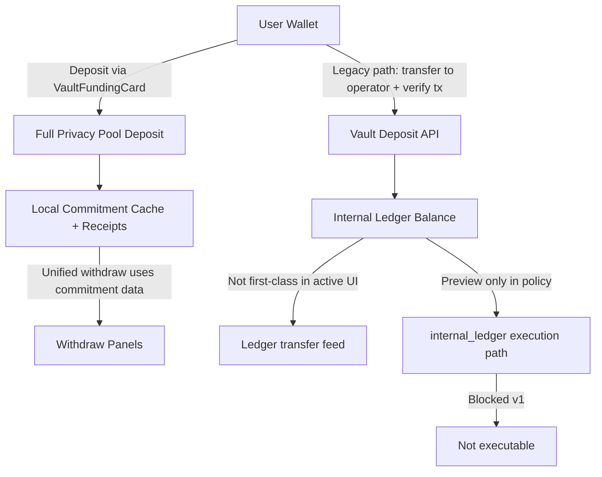
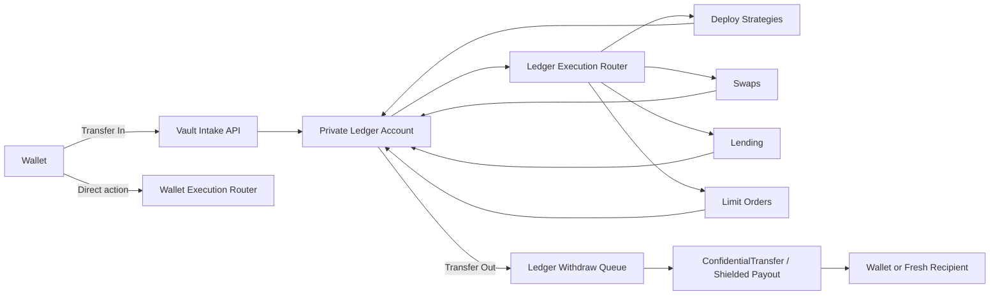
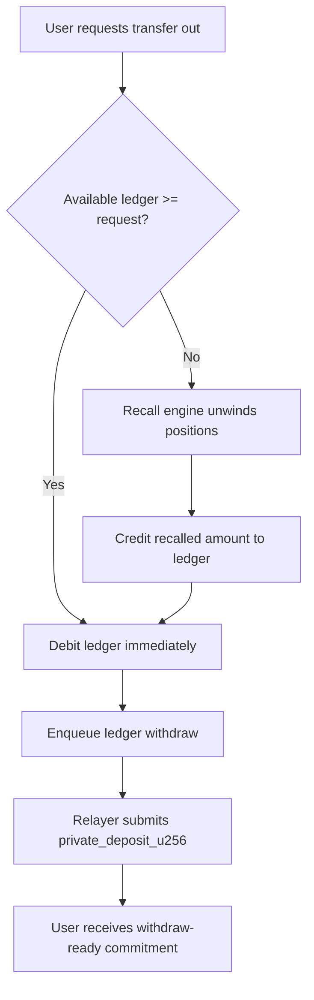

# Private Ledger Capital Flow Vision (Deep Dive)

Date: 2026-03-03
Owner: Product/Protocol + Frontend

## Executive Summary

The internal ledger architecture is real, but it is not currently the default capital rail in the frontend. Right now, user-facing funding primarily goes through direct privacy-pool deposits, while the internal ledger exists mostly as backend accounting and queue infrastructure. That split creates a confusing user experience, weakens composability across deploy/swap/lend flows, and makes the Ledger tab feel like a passive event feed instead of an actual capital account.

The right direction is to formalize two explicit rails:

1. Wallet Mode (self-custody): users sign each action from their wallet and accept the corresponding on-chain visibility profile.
2. Private Ledger Mode (opt-in managed rail): users intentionally move funds into a private internal account, then run deploy/swap/lend/limit-order actions from that account with consistent privacy semantics.

This is not a full rewrite. Most of the backend primitives already exist. The main gaps are product wiring, API surface cleanup, accounting consistency, and UX clarity.

---

## Why This Matters

### Problem

The current product language says "Fund your vault" and "Ledger," but those words refer to different execution paths depending on where the user clicks. A user can deposit to privacy pools without ever funding the internal ledger. They can see ledger timelines that are not actionable balances. They can switch privacy toggles that do not always bind to policy. The result is conceptual drift: users cannot build a reliable mental model of where their capital actually lives.

### Why It Matters

For privacy products, mental-model integrity is not cosmetic. If users do not know whether funds are wallet-native, pool-committed, or internally custodied, they cannot reason about custody risk, withdrawal latency, or privacy guarantees. That uncertainty hurts both conversion and trust.

### What Good Looks Like

A single sentence should always be true: "I can see exactly which capital account this action uses, what privacy tier it gets, and how to exit back to my wallet."

---

## Current State (What Code Shows)

### 1. Privacy tiers are clearly documented, but docs and endpoints drift

`docs/PRIVACY_TIERS.md` correctly separates on-chain visibility tiers from reputation tiers (Strict/Standard/Express) and states that Tier 1 still leaks sender/amount/recipient in practical paths. See `docs/PRIVACY_TIERS.md:7-35`.

However, the same file references stale relayer endpoint names (`request-tier2`, `deposit-request`) that do not match the current relayer router. See `docs/PRIVACY_TIERS.md:41-49` vs `backend/app/api/relayer.py:305-378`.

### 2. Internal ledger engine exists, but public API/UI exposure is thin

The ledger service has durable SQLite tables for balances/transfers/events and vault tables for deposits/allocations/yield. See `backend/app/services/ledger_service.py:42-132`.

The mounted Ledger API used by Vault tab currently exposes only transfer feed + demo credit, not a first-class account endpoint with available/deployed/pending balances. See `backend/app/api/routes/ledger.py:1-109`.

### 3. There is a real wallet->operator->ledger deposit flow, but it is not the active UX path

Backend `POST /api/v1/zkdefi/vault/deposit` verifies wallet transfer to operator and credits ledger balance. See `backend/app/api/routes/vault.py:200-249` and `backend/app/services/ledger_service.py:592-655`.

A frontend implementation exists in `VaultDashboardPanel` (send transfer, then submit tx hash) but this panel is effectively not the active capital surface. See `frontend/src/components/zkdefi/VaultDashboardPanel.tsx:187-228`.

### 4. Active "Fund Vault" flow deposits to privacy pool directly, bypassing ledger credit

`VaultFundingCard` currently executes Full Privacy Pool deposit for all privacy modes and stores commitment data, then logs a manual wallet event. It does not credit internal ledger balance in that path. See `frontend/src/components/zkdefi/VaultFundingCard.tsx:339-372`.

### 5. Internal-ledger execution path is explicitly blocked in policy/gate layer

Even when policy resolves `internal_ledger`, execution is blocked with `internal_ledger_not_available_v1`. See `backend/app/services/policy_compiler_service.py:111-116` and `backend/app/api/routes/privacy_unified.py:157-167`.

Withdraw-ready API also marks internal ledger as preview-only/non-executable. See `backend/app/api/routes/state.py:814-827`.

### 6. Ledger tab is a feed, not a capital account

The tab renders transfer rows and a receipt timeline. It has no transfer-in/transfer-out controls, no reserve visibility, and no execution-source selector. See `frontend/src/components/zkdefi/surfaces/VaultSurfaceContainer.tsx:1290-1303` and `frontend/src/components/zkdefi/VaultLedger.tsx:71-117`.

### 7. Timeline status logic makes backend-only system events look perpetually pending

Receipt aggregation marks backend-only receipts as `pending` by default. See `frontend/src/hooks/useReceiptAggregator.ts:135-146`.

Local commitment sync appends proof receipts (`local_commitment_migration`) frequently, so timeline can be noisy and look stalled. See `backend/app/api/routes/state.py:1227-1233`.

### 8. Accounting consistency gap: live allocation records active positions without debiting live ledger

In non-demo execute-allocation paths, allocations are recorded, but ledger debit is not performed in those same live paths. Demo path debits, live path mostly does not. See `backend/app/api/routes/strategies.py:559-577` vs `backend/app/api/routes/strategies.py:691-700`.

This can make "liquid" and "deployed" semantics ambiguous.

### 9. Relayer and docs claim internal-accounting behaviors that are partially stale

Docs describe relayer ledger balance/transfers endpoints under `/relayer/ledger/*`, but the current mounted routes differ (claims/events exist in relayer, transfers are in `/ledger/transfers`, balance endpoint absent). See `docs/INTERNAL_ACCOUNTING_NEXT.md:19-33` and `backend/app/api/relayer.py:553-570`, `backend/app/api/routes/ledger.py:38-64`.

---

## Current Capital Flow (Fragmented)



### Why this is a problem

Two funding paths have different accounting consequences, but the UI language makes them sound equivalent. This is the root of the "ledger tab sucks" feedback.

---

## Target Product Model

## A. Two Explicit Capital Rails

### Wallet Mode (self-custody)

User keeps funds in wallet. Actions are wallet-signed and route through existing privacy path compiler. Best for users who want direct control and minimal custodial assumptions.

### Private Ledger Mode (opt-in managed rail)

User intentionally transfers funds into an internal account. Actions draw from this account by default. System handles private settlement, queueing, and strategy operations using relayer/operator infrastructure.

No hidden switching. The active rail must be explicit in every action card.

## B. Unified Account Surface

Replace the current Ledger tab concept with a "Capital Account" view:

- Available (immediate)
- Deployed (in strategies)
- Pending (queued in/out)
- Yield accrued
- Withdrawal ETA class (instant vs recall-required)

Add two primary actions directly on this surface:

- `Transfer In` (wallet -> private ledger)
- `Transfer Out` (private ledger -> wallet or shielded commitment)

## C. Programmatic Privacy as Policy, not just tab choice

Every action should accept two orthogonal selectors:

- `capital_source`: `wallet` | `private_ledger`
- `privacy_intent`: `basic_shielded` | `full_privacy` | `hashed_claims`

The compiler resolves execution path from both inputs and tier gates, then returns deterministic route/proof requirements.

---

## Target Capital Flow (Unified)



### Why this works

It gives users one coherent capital lifecycle while preserving optional self-custody.

---

## Withdrawal Semantics (Fast Path + Recall Path)



### Why this matters

Users get clear latency expectations and deterministic fallback, instead of silent failures or ambiguous "pending" states.

---

## Privacy Tier Mapping in the New Model

Use the existing tier definitions, but express them per rail:

- Wallet Mode:
  - Tier 1 baseline available to everyone.
  - Tier 2/3 enabled only when relayer path and reputation gates pass.
- Private Ledger Mode:
  - Inbound transfer can be public or relayed.
  - Internal operations remain off-chain-accounted.
  - Outbound settlement chooses privacy route (shielded/full/hashed) according to policy + tier.

Reputation tiers (Strict/Standard/Express) should continue gating relayer privileges, not redefining on-chain privacy semantics.

---

## Frontend Optimization Plan

## Phase 1: UX truthfulness (quick wins)

1. Fix tier display bug in vault store (`tier` vs `current_tier`) so privacy tier card stops showing `—`. (`frontend/src/contexts/VaultStore.tsx:171-183`)
2. Make receipt timeline status logic respect backend `info/confirmed` for non-chain bookkeeping events (reduce false "pending"). (`frontend/src/hooks/useReceiptAggregator.ts:135-146`)
3. Normalize token labels in ledger UI (remove hardcoded `ETH` where source is STRK-denominated). (`frontend/src/components/zkdefi/VaultLedger.tsx:95`)
4. Hide or de-emphasize `local_commitment_migration` in primary timeline view by default. (`backend/app/api/routes/state.py:1227-1233`)

## Phase 2: Make private ledger usable

1. Promote `wallet -> operator -> ledger` flow into active Vault surface (currently in legacy panel). (`frontend/src/components/zkdefi/VaultDashboardPanel.tsx:187-228`)
2. Add `GET /ledger/account/{address}` API response with `available/deployed/pending/yield`.
3. Add `POST /ledger/transfer_out` API with queue + status tracking (wrapping existing ledger-withdraw queue primitives).
4. Add "Transfer In / Transfer Out" controls directly to ledger tab.

## Phase 3: Programmatic source selection across actions

1. Add `capital_source` to deploy/swap/lending/limit-order API payloads.
2. Extend execution compiler to resolve route from `capital_source + privacy_policy + tier`.
3. Wire strategy/lending actions to debit/credit ledger consistently in live mode.
4. Introduce reserve manager for predictable fast-withdraw availability.

## Phase 4: Docs and naming consistency

1. Update relayer and privacy-tier docs to match active endpoint names.
2. Remove stale claims that Pool D UI is fully implemented when panel is placeholder.
3. Publish explicit custody model language in docs and UI copy.

---

## Backend Architecture Changes (Minimal, High-Leverage)

## 1. Ledger account API

Introduce one canonical response:

`GET /api/v1/zkdefi/ledger/account/{address}`

```json
{
  "address": "0x...",
  "available_wei": "...",
  "deployed_wei": "...",
  "pending_in_wei": "...",
  "pending_out_wei": "...",
  "yield_wei": "...",
  "mode": "wallet|private_ledger",
  "updated_at": 1710000000
}
```

## 2. Ledger transfer primitives

- `POST /ledger/transfer_in/verify` (reuses vault deposit verification)
- `POST /ledger/transfer_out/request` (debit + enqueue + status id)
- `GET /ledger/transfer_out/{id}`

## 3. Accounting consistency contract

For any action executed from `capital_source=private_ledger`:

- debit at intent acceptance (or reserve lock)
- credit on unwind/realized return
- append event with deterministic reason codes

## 4. Multi-asset readiness

Current ledger schema is single-asset (`balance_wei` without token key). For swaps/lending as first-class ledger actions, evolve schema toward `(address, token, balance_raw)` and token-aware transfer rows.

---

## Reputation-Based Lending Integration (Profile/Identity)

This is directionally present in docs and UI but should be tightened:

- Docs already frame lending as part of Profile/Identity trust posture (`docs/RISK_PASSPORT_ARCHITECTURE.md:16-24`).
- Lending panel already calls passport attestation for credit line (`frontend/src/components/zkdefi/LendingPanel.tsx:91-106`).

To make this coherent with private ledger mode:

1. Allow borrow proceeds to settle into private ledger by default (optional wallet payout).
2. Allow supply/repay from private ledger balances.
3. Show one unified "Credit Capacity" card in Profile with split:
   - collateral-backed line
   - reputation unsecured cap
   - active utilization

This gives users a clear trust->capital loop and makes lending feel native to the account model, not bolt-on.

---

## US-Focused Compliance Guardrails (Non-Legal Advice)

This section is implementation-oriented and not legal advice.

If you ship an opt-in managed ledger rail, add explicit controls from day one:

1. Explicit custody consent + mode switch disclosure in UI.
2. Sanctions/address screening on transfer-in and transfer-out requests.
3. Travel-rule / record-keeping hooks for managed flows.
4. Clear segregation in internal accounting (per-user liabilities, auditable event log).
5. Rate/limit controls by tier + anomaly flags before queued payouts.
6. Emergency pause path scoped to managed rail only (not wallet-only flows).

The product copy should always say whether a flow is self-custodial or managed.

---

## Recommended Vision Statement

"zkde.fi should treat privacy as an execution property and capital as a first-class account model: users can stay fully wallet-native, or opt into a private managed ledger that makes deploy, swap, lending, and exits programmable under transparent tiered privacy rules."

---

## Product Decisions Locked (2026-03-03)

1. `Private Ledger Mode` is opt-in and sticky at the account level.
2. Transfer-out default is shielded destination; user can explicitly opt to direct wallet payout.
3. Reserve policy should be solvency-first and dynamic: prioritize guaranteed withdrawability over static UX presets.
4. Managed rail ships as multi-asset; include backend `zkdETH` and `zkdAI` assets in v1 scope.
5. Rail model is explicit:
   - `Wallet Mode` (self-custody)
   - `Private Capital` (managed rail)
   - canonical flow emphasis: `wallet -> vault -> ledger`
