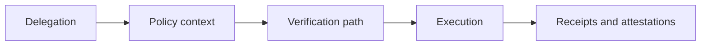

# AEGIS-1 (GATE Standard Context)

AEGIS-1 is the standards-facing frame for GATE-style autonomous execution semantics used in the zkde.fi ecosystem narrative.

## The Problem This Solves

Without a shared execution language, integrators describe delegation, policy checks, and proof artifacts differently, making cross-system interoperability difficult.

## Why This Matters

A common framing helps external builders map their systems to zkde.fi semantics while preserving flexibility in product-specific flow behavior.

## Core AEGIS/GATE Concepts

- constrained delegation
- policy-aware execution
- verification artifact lifecycle
- receipt and attestation traceability

## Conceptual Standard Flow

## Problem It Solves For Integrators

Provides a vocabulary to design:

- compatible automation controllers
- route-aware policy engines
- verifier-facing reporting and audit views

## Why It Matters For Product Teams

A standards frame is useful only when grounded in real product behavior. In zkde.fi, operational docs remain source of truth for route-specific semantics and API contracts.

## Practical Use

Use AEGIS/GATE framing as an integration design layer, then validate concrete behavior with:

- [API overview](/api-overview)
- [Architecture summary](/architecture-summary)
- [Developers](/developers)

Next: [Developers](/developers) | [API overview](/api-overview)
