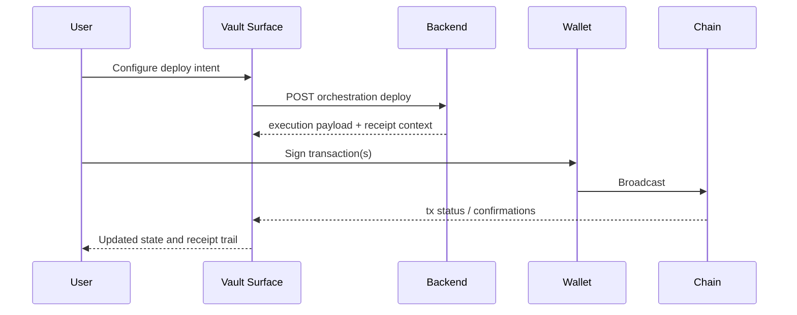

# Agent Workspace (`/agent`)

The Agent workspace is the operational center of zkde.fi. It is where users fund, deploy, trade, automate, and produce verifiable disclosures.

## The Problem This Solves

A privacy-first DeFi product has many moving parts: vault state, market execution, policy gates, automation, and proof artifacts. If these controls are fragmented across disconnected pages, users lose context and make riskier decisions.

## Why This Matters

By organizing execution into clear surfaces, the app gives users one consistent place to act while preserving verifiability. For integrators, it creates a stable IA for deep links and support runbooks.

## Canonical Surface Model

`/agent` is organized into three top-level surfaces:

- `vault` for capital, deployment, yield, ledger, and lending context
- `oracle` for market intelligence and signal surfaces
- `brain` for automation controls, model tooling, and execution pipeline

Canonical URL form:

- `/agent?v=vault`
- `/agent?v=oracle`
- `/agent?v=brain`

Optional `sub` is supported in many flows, for example:

- `/agent?v=vault&sub=trade`
- `/agent?v=oracle&sub=signals`
- `/agent?v=brain&sub=pipeline`

Legacy `/agent?tab=...` links are still mapped for backward compatibility, but new docs and integrations should use `?v=`.
Legacy `/agent?v=trade` links are still accepted and remapped to `v=oracle`.

## Surface Structure

```mermaid
flowchart TB
  Agent[/agent]
  Vault[Vault surface]
  Oracle[Oracle surface]
  Brain[Brain surface]

  VaultSub[portfolio yield trade lending staking activity]
  OracleSub[signals radar genome]
  BrainSub[agent models pipeline agents]

  Agent --> Vault
  Agent --> Oracle
  Agent --> Brain

  Vault --> VaultSub
  Oracle --> OracleSub
  Brain --> BrainSub
```

## What Lives In Each Surface

### Vault Surface (`v=vault`)

### Problem it solves

Users need one place to understand capital state across public and privacy-aware paths before they execute.

### Why it matters

Without this unification, users over-allocate, lose track of pending operations, and cannot reason about risk posture in real time.

### Core areas

- Portfolio state and aggregate position context
- Deployment and allocation controls (including Ekubo deployment paths)
- Yield and rebalance planning views
- Ledger and activity visibility
- Lending-oriented collateral and health context (when enabled)

### Oracle Surface (`v=oracle`)

### Problem it solves

Users need a dedicated space for market intelligence and model-driven signals before executing.

### Why it matters

Separating intelligence from execution lets users evaluate signal quality before moving capital.

### Core areas

- Signals
- Radar
- Genome
- Handoff into `v=vault&sub=trade` for execution

### Brain Surface (`v=brain`)

### Problem it solves

Automation is unsafe if users cannot see and control the session, gate outcomes, and execution pipeline.

### Why it matters

Autonomous systems earn trust only when controls, constraints, and receipts are visible in the same operational surface.

### Core areas

- Agent controls and session lifecycle
- Model composition and model marketplace integrations
- Pipeline observability
- Agent registry and performance tooling

## Deploy To Ekubo In The Current IA

Deploy to Ekubo is now documented in terms of surfaces, not old tabs:

1. Open `/agent?v=vault`
2. Prepare amount and pool strategy
3. Request orchestration payload from backend
4. Sign and execute wallet calls
5. Track receipt lifecycle and downstream passport signals



## Migration Notes For Existing Links

If you previously linked users to old tabs:

- `tab=dashboard`, `tab=pools`, `tab=deploy` should migrate to `v=vault`
- `tab=markets`, `v=trade` should migrate to `v=oracle`
- `tab=dex`, `tab=swap`, `tab=lp`, `tab=limits` should migrate to `v=vault&sub=trade`
- `tab=staking` should migrate to `v=vault&sub=staking`
- `tab=agent`, `tab=models`, `tab=pipeline`, `tab=disclosure` should migrate to `v=brain`

## Key Fixtures (Verified 2026-03-05)

- `/agent?v=vault`
- `/agent?v=vault&sub=trade`
- `/agent?v=oracle`
- `/agent?v=oracle&sub=signals`
- `/agent?v=oracle&sub=radar`
- `/agent?v=oracle&sub=genome`
- `/agent?v=brain&sub=agent`
- `/agent?v=brain&sub=models`
- `/agent?v=brain&sub=pipeline`
- `/agent?v=brain&sub=agents`

## Practical Guidance

For user-facing docs and support scripts, always include the explicit route value you want users to land on. This avoids ambiguity and reduces support loops where users arrive on the wrong surface after a reconnect.

Next: [Deploy to Ekubo](/guide-deploy-to-ekubo) | [Profile and identity](/profile-and-identity) | [How execution flows](/flow)
