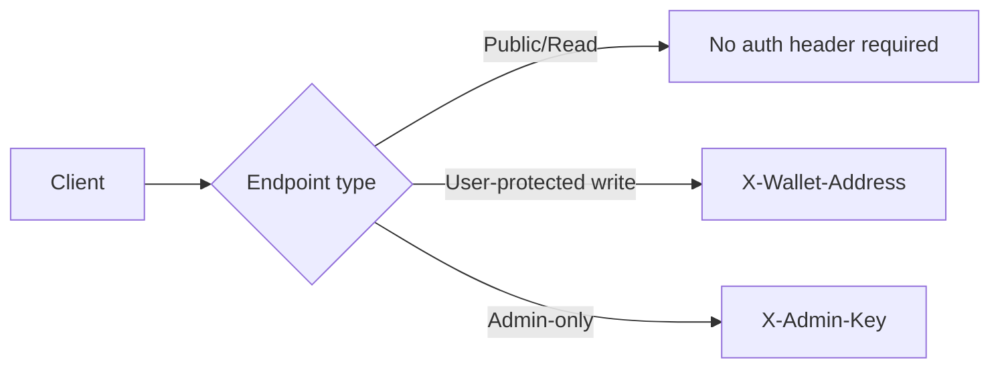

# API Overview

This page is the practical integration map for zkde.fi APIs, with endpoint-level references for the most relevant production and experimental flows.

## The Problem This Solves

Integrators need more than route-group names. They need concrete endpoint shapes, auth expectations, and scope boundaries to avoid incorrect assumptions in production integrations.

## Why This Matters

When auth and endpoint semantics are ambiguous, teams ship brittle clients, over-permissioned backend jobs, and incomplete incident runbooks.

## Base URLs

- App: `https://zkde.fi`
- Core API host: `https://zkde.fi/api/v1`
- zkdefi namespace prefix: under core host, use `/zkdefi/{resource}`

## Authentication Model (Grounded)

### Wallet-owner header

- Header: `X-Wallet-Address`
- Used on protected user-mutating paths where server enforces caller-address match.

### Admin header

- Header: `X-Admin-Key`
- Used on admin-only/destructive operations.

### Important note

Not every POST/PUT endpoint is currently wallet-header-protected by dependency wiring, so integrators should treat auth as endpoint-specific and follow this reference plus release notes.

## Core Health And Metadata

| Method | Path | Purpose | Typical auth |
|---|---|---|---|
| `GET` | `/health` | Service liveness | Public |
| `GET` | `/api/v1/phase4a/contracts` | Contract address metadata | Public |

## Identity, Reputation, Passport, Compliance

| Method | Path | Purpose | Typical auth |
|---|---|---|---|
| `GET` | `/api/v1/zkdefi/reputation/tiers` | Tier definitions | Public |
| `GET` | `/api/v1/zkdefi/reputation/user/{address}` | User reputation snapshot | Public |
| `GET` | `/api/v1/zkdefi/reputation/proofs/{address}` | FICO pack proof status (all 5 proofs) | Public |
| `POST` | `/api/v1/zkdefi/reputation/upgrade-tier` | Tier upgrade request | App flow |
| `POST` | `/api/v1/zkdefi/reputation/proof/solvency` | Generate solvency proof | App flow |
| `POST` | `/api/v1/zkdefi/reputation/proof/risk-passport` | Generate risk passport tier proof | App flow |
| `POST` | `/api/v1/zkdefi/reputation/proof/performance` | Generate trader performance proof | App flow |
| `POST` | `/api/v1/zkdefi/reputation/proof/strategy-integrity` | Generate strategy integrity proof | App flow |
| `POST` | `/api/v1/zkdefi/reputation/proof/execution-integrity` | Generate execution integrity proof | App flow |
| `GET` | `/api/v1/zkdefi/risk_passport/user/{address}` | User passport | Public |
| `GET` | `/api/v1/zkdefi/risk_passport/pool/{pool_id}` | Pool passport | Public |
| `GET` | `/api/v1/zkdefi/risk_profile/{address}` | Aggregated risk profile bundle | Public |
| `GET` | `/api/v1/zkdefi/compliance/profiles/{user_address}` | Compliance profiles | Public |
| `GET` | `/api/v1/zkdefi/linked_addresses/{address}` | Linked-address map | Public |
| `PUT` | `/api/v1/zkdefi/linked_addresses` | Update linked addresses | App flow |

## Onboarding And Agent Registration

| Method | Path | Purpose | Typical auth |
|---|---|---|---|
| `POST` | `/api/v1/zkdefi/onboarding/generate_authorization` | Generate onboarding authorization payload | App flow |
| `POST` | `/api/v1/zkdefi/onboarding/submit_agent` | Submit onboarding/agent registration | App flow |
| `GET` | `/api/v1/zkdefi/onboarding/status/{user_address}` | Onboarding status | Public |

## Orchestration (Deploy And Utilities)

| Method | Path | Purpose | Typical auth |
|---|---|---|---|
| `POST` | `/api/v1/zkdefi/orchestration/deploy` | Build/record deploy orchestration flow | App flow |
| `GET` | `/api/v1/zkdefi/orchestration/receipt/{receipt_id}` | Read deploy receipt | Public |
| `POST` | `/api/v1/zkdefi/orchestration/receipt/confirm` | Attach tx hash to receipt | App flow |
| `POST` | `/api/v1/zkdefi/orchestration/swap-strk-to-usdc` | Build STRK to USDC calldata | App flow |
| `POST` | `/api/v1/zkdefi/orchestration/faucet/eth` | Testnet ETH faucet utility | App flow |

## Session Keys And Rebalancer

| Method | Path | Purpose | Typical auth |
|---|---|---|---|
| `POST` | `/api/v1/zkdefi/session_keys/grant` | Build session grant request | App flow |
| `POST` | `/api/v1/zkdefi/session_keys/grant/confirm` | Confirm granted session | App flow |
| `POST` | `/api/v1/zkdefi/session_keys/revoke` | Build session revoke request | App flow |
| `POST` | `/api/v1/zkdefi/session_keys/revoke/confirm` | Confirm revoke | App flow |
| `GET` | `/api/v1/zkdefi/session_keys/list/{owner_address}` | List sessions | Public |
| `POST` | `/api/v1/zkdefi/rebalancer/propose` | Create rebalance proposal | App flow |
| `POST` | `/api/v1/zkdefi/rebalancer/check` | Run risk/anomaly checks | App flow |
| `POST` | `/api/v1/zkdefi/rebalancer/advisory-check` | Non-blocking policy check | App flow |
| `POST` | `/api/v1/zkdefi/rebalancer/prepare` | Prepare execution context | App flow |
| `POST` | `/api/v1/zkdefi/rebalancer/execute` | Execute rebalance | App flow |
| `POST` | `/api/v1/zkdefi/rebalancer/autonomous/start` | Start autonomous mode | `X-Wallet-Address` |
| `POST` | `/api/v1/zkdefi/rebalancer/autonomous/stop` | Stop autonomous mode | `X-Wallet-Address` |
| `POST` | `/api/v1/zkdefi/rebalancer/autonomous/pause/{user_address}` | Pause autonomous mode | `X-Wallet-Address` |
| `POST` | `/api/v1/zkdefi/rebalancer/autonomous/resume/{user_address}` | Resume autonomous mode | `X-Wallet-Address` |
| `GET` | `/api/v1/zkdefi/rebalancer/autonomous/all` | Fleet status | `X-Admin-Key` |

## Auth Session (Dual-Wallet Bind)

| Method | Path | Purpose | Typical auth |
|---|---|---|---|
| `POST` | `/api/v1/zkdefi/auth/session/start` | Start dual-wallet auth session | App flow |
| `POST` | `/api/v1/zkdefi/auth/session/complete` | Complete dual-wallet auth session | App flow |
| `GET` | `/api/v1/zkdefi/auth/session/{starknet_address}` | Read active auth session | Public |
| `DELETE` | `/api/v1/zkdefi/auth/session/{starknet_address}` | Revoke active auth session | App flow |

## Trade, Market, And Ekubo

| Method | Path | Purpose | Typical auth |
|---|---|---|---|
| `GET` | `/api/v1/zkdefi/market/surface` | Market surface bundle | Public |
| `GET` | `/api/v1/zkdefi/ekubo/capabilities` | Ekubo capability metadata | Public |
| `GET` | `/api/v1/zkdefi/ekubo/positions` | Ekubo position view | App flow |
| `POST` | `/api/v1/zkdefi/ekubo/swap/quote` | Swap quote | App flow |
| `POST` | `/api/v1/zkdefi/ekubo/swap/build` | Build swap tx | App flow |
| `POST` | `/api/v1/zkdefi/ekubo/lp/add/build` | Build LP add tx | App flow |
| `POST` | `/api/v1/zkdefi/ekubo/lp/remove/build` | Build LP remove tx | App flow |
| `POST` | `/api/v1/zkdefi/ekubo/lp/collect-fees/build` | Build fee-collect tx | App flow |
| `POST` | `/api/v1/zkdefi/ekubo/lp/recommend` | LP recommendation | App flow |

## Reputation-Based Lending

| Method | Path | Purpose | Typical auth |
|---|---|---|---|
| `GET` | `/api/v1/zkdefi/lending/pool` | Lending pool stats | Public |
| `GET` | `/api/v1/zkdefi/lending/positions/{address}` | User lending positions | Public |
| `POST` | `/api/v1/zkdefi/lending/supply` | Build supply calldata | App flow |
| `POST` | `/api/v1/zkdefi/lending/borrow` | Build borrow calldata (attestation-based) | App flow |
| `POST` | `/api/v1/zkdefi/lending/repay` | Build repay calldata | App flow |
| `POST` | `/api/v1/zkdefi/lending/withdraw` | Build withdraw calldata | App flow |
| `GET` | `/api/v1/zkdefi/lending/health/{address}` | Health factor context | Public |
| `POST` | `/api/v1/zkdefi/lending/proof/credit-eligibility` | Credit eligibility proof generation | App flow |

## zkML Inference And Circuit Scan

| Method | Path | Purpose | Typical auth |
|---|---|---|---|
| `POST` | `/api/v1/zkdefi/zkml/scan` | Scan model/circuit inputs and return zkML risk signals | App flow |

## Privacy And State

| Method | Path | Purpose | Typical auth |
|---|---|---|---|
| `POST` | `/api/v1/zkdefi/full_privacy/deposit/generate_commitment` | Privacy commitment generation | App flow |
| `POST` | `/api/v1/zkdefi/full_privacy/deposit/register_commitment` | Register commitment | App flow |
| `POST` | `/api/v1/zkdefi/full_privacy/withdraw/generate_proof` | Withdrawal proof generation | App flow |
| `GET` | `/api/v1/zkdefi/full_privacy/merkle/root` | Merkle root state | Public |
| `POST` | `/api/v1/zkdefi/full_privacy/merkle/reset` | Merkle reset | `X-Admin-Key` |
| `POST` | `/api/v1/zkdefi/privacy/deposit` | Unified privacy deposit | App flow |
| `POST` | `/api/v1/zkdefi/privacy/withdraw` | Unified privacy withdraw | App flow |
| `GET` | `/api/v1/zkdefi/wallet/state/{user_address}` | Wallet state snapshot | Public |
| `POST` | `/api/v1/zkdefi/execution/preflight` | Preflight execution checks | App flow |
| `POST` | `/api/v1/zkdefi/state/manual-wallet-event` | Manual wallet event injection | App flow |

## Policy, Relayer, And Ledger

| Method | Path | Purpose | Typical auth |
|---|---|---|---|
| `GET` | `/api/v1/zkdefi/policy/vault/{user_address}` | Read vault policy | Public |
| `PUT` | `/api/v1/zkdefi/policy/vault/{user_address}` | Update vault policy | `X-Wallet-Address` |
| `POST` | `/api/v1/zkdefi/policy/compile` | Compile policy | App flow |
| `POST` | `/api/v1/zkdefi/policy/reset/{user_address}` | Reset policy state | `X-Admin-Key` |
| `POST` | `/api/v1/zkdefi/relayer/request` | Relay request | App flow |
| `GET` | `/api/v1/zkdefi/relayer/pending/{address}` | Pending relay queue | Public |
| `GET` | `/api/v1/zkdefi/ledger/transfers` | Ledger transfers | Public |
| `POST` | `/api/v1/zkdefi/ledger/demo-credit` | Demo credit path | App flow |

## Integrator APIs Outside `/zkdefi`

| Method | Path | Purpose | Typical auth |
|---|---|---|---|
| `POST` | `/api/v1/identity/credit-proof` | Identity credit proof flow | App flow |
| `GET` | `/api/v1/identity/commitment/{commitment}` | Commitment lookup | Public |
| `GET` | `/api/v1/agents/models/list` | Model catalog | Public |
| `POST` | `/api/v1/agents/create` | Create agent entry | App flow |
| `GET` | `/api/v1/strategies/price/live` | Price feed | Public |
| `POST` | `/api/v1/strategies/recommend` | Strategy recommendation | App flow |
| `POST` | `/api/v1/deployments/execute` | Deployment execution | App flow |
| `POST` | `/api/v1/vault/execute` | Vault execution path | App flow |

## Experimental Scope (Changing Faster)

- `GET /api/v1/phase4a/status`
- `GET /api/v1/phase4a/orchestrated/dashboard`
- `GET /api/v1/phase4a/rebalancer/stats`
- `GET /api/v1/vault-live/positions/{user_address}`
- `POST /api/v1/vault-live/rebalance`
- `POST /api/v1/vault-live/execute`
- `GET /api/v1/zkdefi/sim/health`
- `GET /api/v1/zkdefi/sim/state`
- `GET /api/v1/zkdefi/sim/events`
- `GET /api/v1/zkdefi/sim/contracts`

Treat these as version-sensitive and monitor release notes before depending on response contracts.

## Legal And Compliance Posture

These docs describe technical capabilities and API behavior only. They are not legal advice, not investment advice, and not a representation that any user automatically meets regulatory requirements in any jurisdiction.

Next: [Developers](/developers) | [Architecture summary](/architecture-summary) | [Troubleshooting](/troubleshooting)
