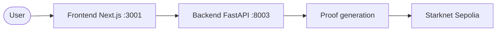

# Architecture summary

A one-page overview of how zkde.fi is built. For full detail, see [ARCHITECTURE.md](https://github.com/obsqra-labs/zkdefi/blob/main/docs/ARCHITECTURE.md) and [AGENT_FLOW.md](https://github.com/obsqra-labs/zkdefi/blob/main/docs/AGENT_FLOW.md) in the repo.

## Hybrid proof system

| Layer | Proof system | Use case |
|-------|--------------|----------|
| **Privacy** | Garaga (Groth16/SNARK) | zkML models, confidential transfers |
| **Execution** | Integrity (STARK) | Constraint proofs, slippage bounds |

SNARK proofs hide model outputs; STARK proofs verify execution. Both are zero-knowledge.

## High-level flow

User connects via the frontend; the backend orchestrates proof generation (Garaga for privacy/zkML, Integrity for execution) and submits to Starknet.

## Main components

| Component | Role |
|-----------|------|
| **Frontend** (port 3001) | Next.js app: Agent, Profile, protocol panels, Deploy to Ekubo, compliance. |
| **Backend** (port 8003) | FastAPI: API for reputation, risk passport, orchestration, full privacy, zkML, relayer, etc. |
| **Starknet Sepolia** | Deployed contracts (ProofGatedYieldAgent, Garaga verifier, Full Privacy pool, etc.). |

Full detail: [ARCHITECTURE.md](https://github.com/obsqra-labs/zkdefi/blob/main/docs/ARCHITECTURE.md), [AGENT_FLOW.md](https://github.com/obsqra-labs/zkdefi/blob/main/docs/AGENT_FLOW.md) in the repo.

Next: [Flow](/flow) | [Contracts](/contracts)
