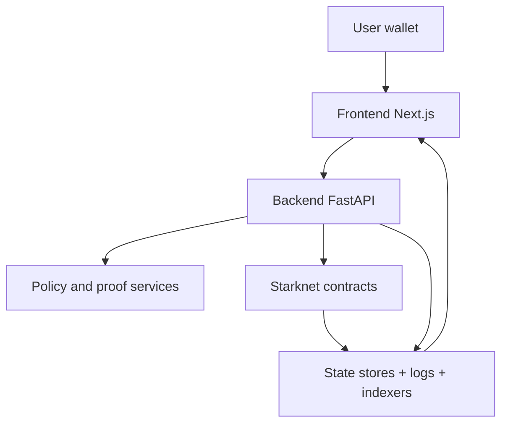
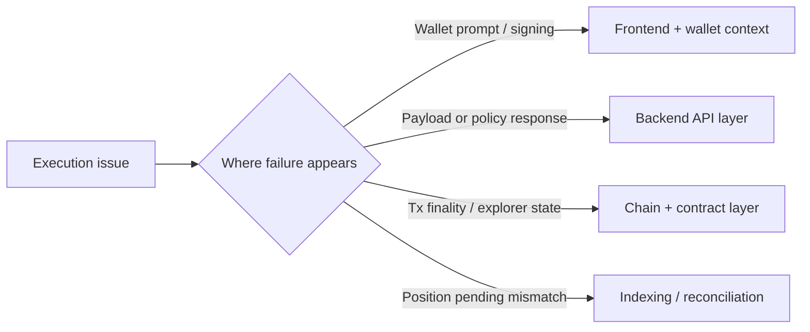

# Architecture Summary

This page is the condensed architecture view for product operators and GATE integrators.

For deeper implementation detail, see:

- <https://github.com/obsqra-labs/zkdefi/blob/main/docs/ARCHITECTURE.md>
- <https://github.com/obsqra-labs/zkdefi/blob/main/docs/AGENT_FLOW.md>

## The Problem This Solves

Operational teams need a shared model of where decisions are made, where state is persisted, and where verification artifacts enter the lifecycle.

## Why This Matters

Without a clear model, incidents are misrouted between frontend, backend, chain, and data dependencies.

## Layered View

## Component Responsibilities

| Component | Responsibility | Why it matters |
|---|---|---|
| Frontend | User-facing surfaces (`vault`, `trade`, `brain`, profile tabs) | Keeps execution intent and risk context understandable |
| Backend | Orchestration, policy checks, API composition, receipt lifecycle | Converts UI intent into actionable and auditable flows |
| Starknet contracts | Final execution and on-chain verifiability primitives | Preserves user custody and deterministic settlement |
| Data/indexing services | Position and status reconciliation | Allows users and integrators to inspect post-trade truth |

## Verification Is Flow-Specific

Not all routes share identical proof strictness:

- Gate-critical flows enforce stronger pre-execution checks.
- Advisory flows may return non-blocking risk signals.
- Wallet-first flows rely on signed execution and downstream reconciliation.

This is intentional and should be treated as a capability model, not a single global mode.

## Production And Experimental Scope

### Production core

- `/agent`, `/profile`, reputation/passport/compliance endpoints, orchestration deploy paths.

### Experimental and rapidly evolving

- selected `/phase4a`, `/vault-live`, and simulator-oriented surfaces.

## Troubleshooting Ownership Map

This map is useful for runbooks, incident triage, and partner-support escalation paths.

Next: [API overview](/api-overview) | [Contracts](/contracts) | [Deploying zkde.fi](/deploying-zkde-fi)
