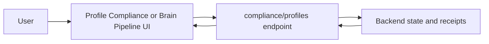

# Compliance And Disclosure

zkde.fi supports selective disclosure workflows that let users present scoped claims without exposing full strategy history.

## The Problem This Solves

Users and partner verifiers often need evidence of bounded behavior, but full account transparency can expose sensitive positioning, timing, or strategy details.

## Why This Matters

Selective disclosure creates a middle path: enough evidence to support operational checks, without forcing full public data disclosure.

## Where Users Access This In The App

- `/profile?tab=compliance` for identity/compliance-oriented review
- `/agent?v=brain&sub=pipeline` for workflow-oriented pipeline and disclosure context
- legacy `sub=disclosure` links are mapped into supported Brain tabs by compatibility routing

## Core API

- `GET /api/v1/zkdefi/compliance/profiles/{user_address}`

This endpoint returns compliance profile artifacts for the target Starknet address.

## Data Flow

## Problem It Solves In Practice

### For users

Allows users to share bounded claims without exposing complete transaction history.

### For integrators

Provides a structured integration point for compliance-adjacent checks and verifier dashboards.

## Why It Matters Operationally

Teams can separate “proof of claim context” from “full trade transparency,” which improves privacy posture while preserving useful verification signals.

## Legal Boundary (Important)

This page describes product and API behavior only. It is not legal advice, not tax advice, and not investment advice. Availability of disclosure artifacts does not, by itself, guarantee regulatory sufficiency for any specific jurisdiction or use case.

## Practical Guidance

If you are an integrator:

1. Treat profile records as technical artifacts, not legal determinations.
2. Pair disclosure artifacts with your own policy and legal review process.
3. Keep jurisdiction-specific interpretation outside your API client logic.

Next: [Risk Passport](/risk-passport) | [Profile and identity](/profile-and-identity) | [API overview](/api-overview)

## Key Fixtures (Verified 2026-03-05)

- `GET /api/v1/zkdefi/compliance/profiles/{user_address}`
- `GET /api/v1/zkdefi/risk_passport/v2/user/{address}`
- `GET /api/v1/zkdefi/risk_profile/v2/{address}`
