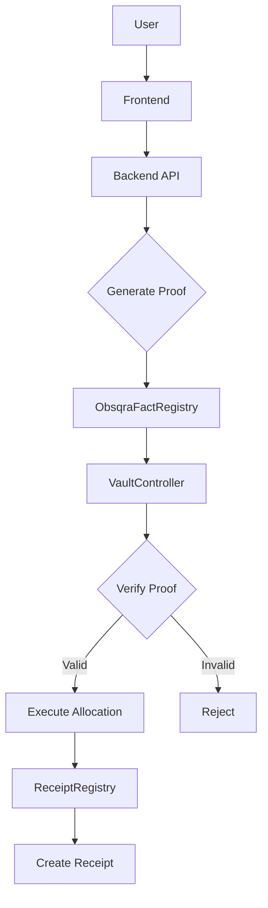
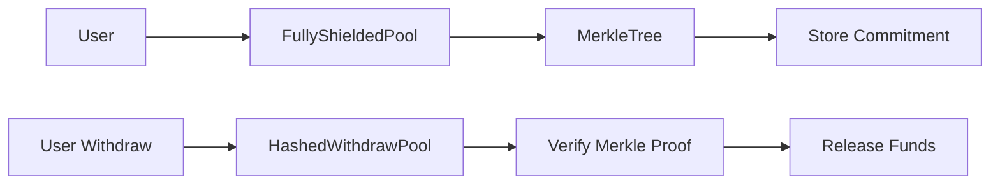
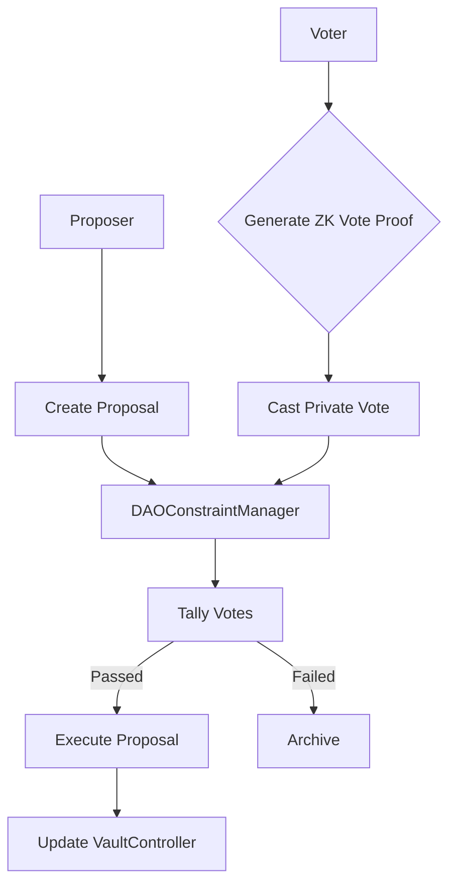

# Contracts

This page lists core Starknet Sepolia contract references used by zkde.fi and related flows.

## The Problem This Solves

Integrators and operators need an explicit contract map for explorer verification, runbook triage, and environment validation.

## Why This Matters

Route-level errors often trace back to chain mismatch or incorrect contract references. A clear table reduces diagnosis time.

## Core Contract Map (Sepolia)

| Contract | Address |
|---|---|
| ProofGatedYieldAgent | `0x012ebbddae869fbcaee91ecaa936649cc0c75756583ae4ef6521742f963562b3` |
| SelectiveDisclosure | `0x00ab6791e84e2d88bf2200c9e1c2fb1caed2eecf5f9ae2989acf1ed3d00a0c77` |
| ConfidentialTransfer | `0x07fdc7c21ab074e7e1afe57edfcb818be183ab49f4bf31f9bf86dd052afefaa4` |
| ConstraintReceipt | `0x04c8756f9baf927aa6a85e9b725dd854215f82c65bd70076012f02fec8497954` |
| SessionKeyManager | `0x01c0edf8ff269921d3840ccb954bbe6790bb21a2c09abcfe83ea14c682931d68` |
| IntentCommitment | `0x062027ceceb088ac31aa14fe7e180994a025ccb446c2ed8394001e9275321f70` |
| ComplianceProfile | `0x05aa72977c1984b5c61aee55a185b9caed9e9e42b62f2891d71b4c4cc6b96d93` |
| ZkmlVerifier | `0x068abd64a4a78172a5ee15a30bbe614257d62482f07d3ff7fdb72da5aad08923` |
| GaragaVerifier | `0x06d0cb7a48b48c5b6ca70f856d249caccea90f506ad7596a6838502fe3aa6d37` |

## Phase 10 & Reputation (Starknet Sepolia)

Governance and FICO-pack reputation verifiers (deployed March 2026).

| Contract | Address | Purpose |
|---|---|---|
| ReceiptRegistry | `0x02900291a932aa63f6510b9320e13fc25cf2dd7c2274ebe3a671ec6daecd83cd` | Immutable receipt per vault operation |
| DAOConstraintManager | `0x0101bd9710017c0870077dcf03bf6fe68a955d9f9b9922ed5d673afed7497fc2` | Private DAO governance, emergency pause/unpause |
| ObsqraFactRegistry | `0x02009ab87f581a0a92f65906ce84664a5cfcb86f7266651f48a04fac3c62faa3` | Registers verified proofs (reputation + other facts) |
| SolvencyProofVerifier | `0x043b253e3f2fcac35eef0b08fd2f8f4ff81aeb52848f11640d62879854329c9b` | Groth16 verifier for solvency proofs |
| RiskPassportTierVerifier | `0x05e71cc0c4b87908230414644d675164fb90cd6d8cfafeae87198241e60eb788` | Risk tier proofs |
| TraderPerformanceVerifier | `0x04c8087855dd0812042de58b2a3f3838d3cea45118c86f07d32ac87648e90769` | Trader performance proofs |
| StrategyIntegrityVerifier | `0x00c9478f355bdad25caf13899a0d5bf2ee1accb1678e9934ebeda40f2653e549` | Strategy compliance proofs |
| ExecutionIntegrityVerifier | `0x03bb26a38ea2d8e4bd21895f665d0056a5496f31ad84f4d77e040d9e63e6873b` | Execution fairness proofs |

## Contract Interaction Topology

### Proof-Gated Execution Flow

### Privacy Vault Flow

### DAO Governance Flow

## Problem It Solves For Integrators

Provides a single checklist when validating:

- chain/network alignment
- explorer visibility
- call target correctness in generated calldata

## Why It Matters Operationally

Misconfigured addresses can appear as policy or wallet bugs, but are often deployment/environment drift. Contract verification should be an early triage step.

## Source-Of-Truth Guidance

Use this page as an operator-facing quick reference. For release-critical automation, source addresses from deployment artifacts and environment configuration in CI/CD.

Next: [API overview](/api-overview) | [Deploying zkde.fi](/deploying-zkde-fi) | [Developers](/developers)
