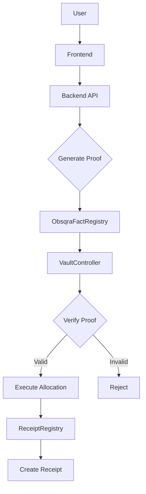
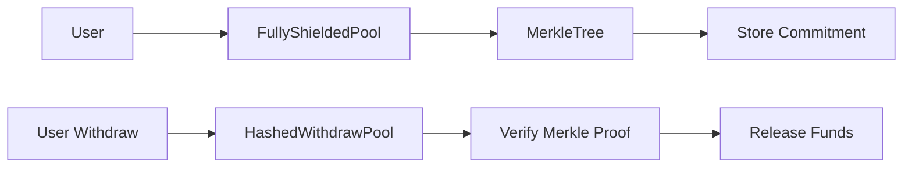
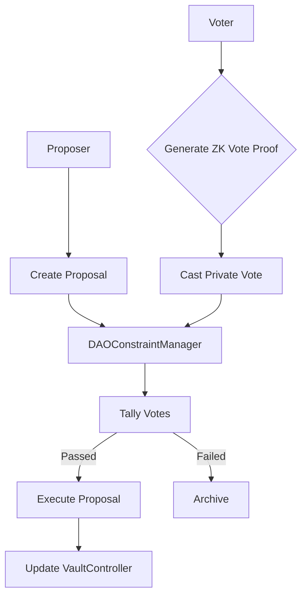

# Deployed Contracts

zkde.fi is deployed across three networks: Starknet Sepolia, Ethereum Sepolia, and a dedicated Madara L3 appchain. Every contract listed here is live and independently verifiable via block explorer.

For live proof verification across all contracts: **[zkde.fi/test](https://zkde.fi/test)**

## Ethereum Sepolia (L1)

| Contract | Address | Purpose |
|---|---|---|
| Halo2Verifier (EZKL KZG) | [`0xF7b555ca4E54a8c7B9A0DDBFa17341575a852Ab9`](https://sepolia.etherscan.io/address/0xF7b555ca4E54a8c7B9A0DDBFa17341575a852Ab9) | EZKL proof verification on L1 |
| L1 EZKL Bridge Sender | [`0x2a1b030f2835cB0ADC4ea271105e96da293853ab`](https://sepolia.etherscan.io/address/0x2a1b030f2835cB0ADC4ea271105e96da293853ab) | L1→L2 proof bridge |

## Madara L3 (Proof Appchain)

| Contract | Address | Purpose |
|---|---|---|
| VerifiedFactRegistry | `0x5ed322b12ddc28d27b7797d79516ca285137f9bab9fde870191119b4c68d691` | Proof fact registration on dedicated L3 |

## Core Contract Map (Sepolia)

| Contract | Address |
|---|---|
| ProofGatedYieldAgent | `0x012ebbddae869fbcaee91ecaa936649cc0c75756583ae4ef6521742f963562b3` |
| SelectiveDisclosure | `0x00ab6791e84e2d88bf2200c9e1c2fb1caed2eecf5f9ae2989acf1ed3d00a0c77` |
| ConfidentialTransfer | `0x07fdc7c21ab074e7e1afe57edfcb818be183ab49f4bf31f9bf86dd052afefaa4` |
| ConstraintReceipt | `0x04c8756f9baf927aa6a85e9b725dd854215f82c65bd70076012f02fec8497954` |
| SessionKeyManager | `0x01c0edf8ff269921d3840ccb954bbe6790bb21a2c09abcfe83ea14c682931d68` |
| IntentCommitment | `0x062027ceceb088ac31aa14fe7e180994a025ccb446c2ed8394001e9275321f70` |
| ComplianceProfile | `0x05aa72977c1984b5c61aee55a185b9caed9e9e42b62f2891d71b4c4cc6b96d93` |
| ZkmlVerifier | `0x068abd64a4a78172a5ee15a30bbe614257d62482f07d3ff7fdb72da5aad08923` |
| GaragaVerifier | `0x06d0cb7a48b48c5b6ca70f856d249caccea90f506ad7596a6838502fe3aa6d37` |

## Phase 10 & Reputation (Starknet Sepolia)

Governance and FICO-pack reputation verifiers (deployed March 2026).

| Contract | Address | Purpose |
|---|---|---|
| ReceiptRegistry | `0x02900291a932aa63f6510b9320e13fc25cf2dd7c2274ebe3a671ec6daecd83cd` | Immutable receipt per vault operation |
| DAOConstraintManager | `0x0101bd9710017c0870077dcf03bf6fe68a955d9f9b9922ed5d673afed7497fc2` | Private DAO governance, emergency pause/unpause |
| ObsqraFactRegistry | `0x02009ab87f581a0a92f65906ce84664a5cfcb86f7266651f48a04fac3c62faa3` | Registers verified proofs (reputation + other facts) |
| SolvencyProofVerifier | `0x043b253e3f2fcac35eef0b08fd2f8f4ff81aeb52848f11640d62879854329c9b` | Groth16 verifier for solvency proofs |
| RiskPassportTierVerifier | `0x05e71cc0c4b87908230414644d675164fb90cd6d8cfafeae87198241e60eb788` | Risk tier proofs |
| TraderPerformanceVerifier | `0x04c8087855dd0812042de58b2a3f3838d3cea45118c86f07d32ac87648e90769` | Trader performance proofs |
| StrategyIntegrityVerifier | `0x00c9478f355bdad25caf13899a0d5bf2ee1accb1678e9934ebeda40f2653e549` | Strategy compliance proofs |
| ExecutionIntegrityVerifier | `0x03bb26a38ea2d8e4bd21895f665d0056a5496f31ad84f4d77e040d9e63e6873b` | Execution fairness proofs |

## Contract Interaction Topology

### Proof-Gated Execution Flow

### Privacy Vault Flow

### DAO Governance Flow

## Agent System Contracts (Starknet Sepolia)

| Contract | Address |
|---|---|
| ReputationRegistry | [`0x10d00b33b5683afd776c58638a222aa10605d7eeafa95979b5246312b7e022`](https://sepolia.voyager.online/contract/0x10d00b33b5683afd776c58638a222aa10605d7eeafa95979b5246312b7e022) |
| VaultController (v3) | [`0x2f29b985bc962f065160828296ab3889769a92a313d11077f186a81d0853b63`](https://sepolia.voyager.online/contract/0x2f29b985bc962f065160828296ab3889769a92a313d11077f186a81d0853b63) |
| ValidationProofRegistry | [`0x20ea9a32eae3fe6fe5137ca9f576383f8723913e1619f17120cf1aeb7e06305`](https://sepolia.voyager.online/contract/0x20ea9a32eae3fe6fe5137ca9f576383f8723913e1619f17120cf1aeb7e06305) |
| AllocationRouter | [`0xabda1150d8fc9db11b99c8485d671c53bc2ad65fe21a8d218c1e621a85843b`](https://sepolia.voyager.online/contract/0xabda1150d8fc9db11b99c8485d671c53bc2ad65fe21a8d218c1e621a85843b) |
| AgentSkillRegistry | [`0x6a039b4e59b39fc2ab44c3c70a5ecdbe765a9afabb4b2765f9bb966dfb6ddda`](https://sepolia.voyager.online/contract/0x6a039b4e59b39fc2ab44c3c70a5ecdbe765a9afabb4b2765f9bb966dfb6ddda) |
| BatchVerifier | [`0x285f944aa5cb8f90fa37c4dbdf5dd1eb2e34ab0bde9669e61fbd7a9a0f3b869`](https://sepolia.voyager.online/contract/0x285f944aa5cb8f90fa37c4dbdf5dd1eb2e34ab0bde9669e61fbd7a9a0f3b869) |

## Privacy Contracts (Starknet Sepolia)

| Contract | Address |
|---|---|
| FullPrivacyPoolV2 | [`0x03dde5617d362a6f9202cd3955b4508e2bd6b1c5d35250153beeb6237c811559`](https://sepolia.voyager.online/contract/0x03dde5617d362a6f9202cd3955b4508e2bd6b1c5d35250153beeb6237c811559) |
| FullyShieldedPool | [`0x07fed6973cfc23b031c0476885ec87a401f1006bdc8ba58df2bd8611b38b5ff5`](https://sepolia.voyager.online/contract/0x07fed6973cfc23b031c0476885ec87a401f1006bdc8ba58df2bd8611b38b5ff5) |

## Execution Adapters (Starknet Sepolia)

| Contract | Address |
|---|---|
| EkuboLpAdapter | [`0x1f5e68f5470f2d316afdd057029438d950baa3dc59fc7060fd0a57ef88c4245`](https://sepolia.voyager.online/contract/0x1f5e68f5470f2d316afdd057029438d950baa3dc59fc7060fd0a57ef88c4245) |
| LendingAdapter | [`0x2f76cf75ca90657b933686807884b3a1ffdc43347a9c5a053f2c2d108431357`](https://sepolia.voyager.online/contract/0x2f76cf75ca90657b933686807884b3a1ffdc43347a9c5a053f2c2d108431357) |
| StakingAdapter | [`0x66c048e79c11c5f3f94ad2a7f7cdd033e5cd5b5b3d207f6dd37cc22526edadf`](https://sepolia.voyager.online/contract/0x66c048e79c11c5f3f94ad2a7f7cdd033e5cd5b5b3d207f6dd37cc22526edadf) |

---

Next: [Proof Pipeline](/proof-pipeline) | [API Overview](/api-overview) | [Developers](/developers)
