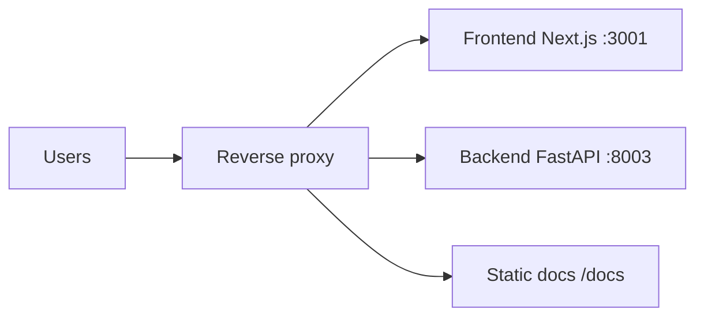

# Deploying zkde.fi

This page covers the high-level serving model for app + API + docs.

## The Problem This Solves

Teams often deploy frontend and backend correctly but forget docs static sync or reverse-proxy path routing, resulting in partial outages.

## Why This Matters

A reliable deployment model must treat product app, APIs, and docs as one operational surface.

## Runtime Topology



## Serving Responsibilities

- Frontend serves main web app routes.
- Backend serves `/api/*` and health endpoints.
- Docs are built from `docs-site` and synced into public static serving path.

## Docs Build And Sync

Run from repository root:

```bash
./scripts/sync-docs.sh
```

This builds VitePress docs and syncs output to `frontend/public/docs/` for serving.

## Operational Problem It Solves

Ensures docs stay version-aligned with deployed application behavior and avoids stale static content.

## Why It Matters For Integrators

Integrators depend on docs route stability for runbooks and onboarding, so deployment must preserve `/docs` availability as a first-class target.

## Additional References

- `docs/DOCS_DEPLOYMENT.md`
- `docs/ENV.md`
- `docs/OPS_NGINX_ZKDEFI.md`

Next: [Developers](/developers) | [API overview](/api-overview)
