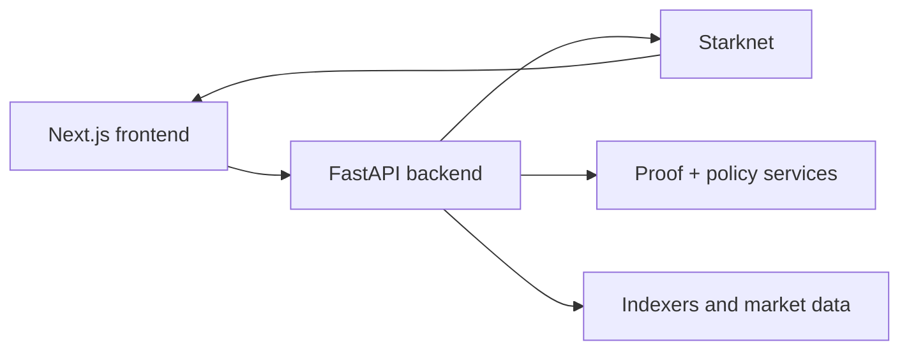

# Developers

This section is for builders who want to verify the system independently, integrate with the proof pipeline, or contribute to the codebase.

## Start Here

**Live backend showcase (every claim verified):**
[zkde.fi/test](https://zkde.fi/test)

**Source code:**
[github.com/obsqra-labs/zkdefi](https://github.com/obsqra-labs/zkdefi)

### Primary Contracts — Starknet Sepolia

| Contract | Address |
|---|---|
| ReputationRegistry | [`0x10d00b33b5683afd776c58638a222aa10605d7eeafa95979b5246312b7e022`](https://sepolia.voyager.online/contract/0x10d00b33b5683afd776c58638a222aa10605d7eeafa95979b5246312b7e022) |
| FullPrivacyPoolV2 | [`0x03dde5617d362a6f9202cd3955b4508e2bd6b1c5d35250153beeb6237c811559`](https://sepolia.voyager.online/contract/0x03dde5617d362a6f9202cd3955b4508e2bd6b1c5d35250153beeb6237c811559) |
| VaultController (v3) | [`0x2f29b985bc962f065160828296ab3889769a92a313d11077f186a81d0853b63`](https://sepolia.voyager.online/contract/0x2f29b985bc962f065160828296ab3889769a92a313d11077f186a81d0853b63) |
| ObsqraFactRegistry | [`0x02009ab87f581a0a92f65906ce84664a5cfcb86f7266651f48a04fac3c62faa3`](https://sepolia.voyager.online/contract/0x02009ab87f581a0a92f65906ce84664a5cfcb86f7266651f48a04fac3c62faa3) |
| ZkmlVerifier | [`0x068abd64a4a78172a5ee15a30bbe614257d62482f07d3ff7fdb72da5aad08923`](https://sepolia.voyager.online/contract/0x068abd64a4a78172a5ee15a30bbe614257d62482f07d3ff7fdb72da5aad08923) |

### Primary Contracts — Ethereum Sepolia

| Contract | Address |
|---|---|
| Halo2Verifier (EZKL KZG) | [`0xF7b555ca4E54a8c7B9A0DDBFa17341575a852Ab9`](https://sepolia.etherscan.io/address/0xF7b555ca4E54a8c7B9A0DDBFa17341575a852Ab9) |
| L1 EZKL Bridge Sender | [`0x2a1b030f2835cB0ADC4ea271105e96da293853ab`](https://sepolia.etherscan.io/address/0x2a1b030f2835cB0ADC4ea271105e96da293853ab) |

### Madara L3

| Contract | Address |
|---|---|
| VerifiedFactRegistry | `0x5ed322b12ddc28d27b7797d79516ca285137f9bab9fde870191119b4c68d691` |

For the full contract map, see [Deployed Contracts](/contracts).

## Integration Orientations

### 1) User-facing product integrations

Use deep links and route-state conventions to guide users into the correct operational surface.

### 2) Backend/system integrations

Use endpoint-level APIs, enforce header discipline, and classify dependencies as production or experimental.

### 3) GATE-aligned ecosystem integrations

Use AEGIS/GATE semantics where relevant, but keep user UX grounded in current app and API behavior.

## System Shape

## Practical Starting Points

- [API overview](/api-overview) for endpoint-level integration map
- [Architecture summary](/architecture-summary) for service boundaries
- [Contracts](/contracts) for deployed address references
- [Deploying zkde.fi](/deploying-zkde-fi) for serving model and docs pipeline
- [AEGIS-1](/aegis) for GATE standard framing

## Repository References

- Setup: <https://github.com/obsqra-labs/zkdefi/blob/main/docs/SETUP.md>
- Environment variables: <https://github.com/obsqra-labs/zkdefi/blob/main/docs/ENV.md>
- Architecture details: <https://github.com/obsqra-labs/zkdefi/blob/main/docs/ARCHITECTURE.md>
- Agent flow details: <https://github.com/obsqra-labs/zkdefi/blob/main/docs/AGENT_FLOW.md>
- Source repository: <https://github.com/obsqra-labs/zkdefi>

## Production Vs Experimental Discipline

### Problem it solves

Teams often consume experimental endpoints as if they were stable contracts.

### Why it matters

This causes breakage during upgrades and avoidable incident response.

### Guidance

- Treat these route families as faster-changing surfaces:
  - `/api/v1/phase4a/status`, `/api/v1/phase4a/orchestrated/dashboard`
  - `/api/v1/vault-live/positions/{user_address}`, `/api/v1/vault-live/rebalance`
  - `/api/v1/zkdefi/sim/health`, `/api/v1/zkdefi/sim/state`
- Version pin response expectations in your client code.
- Keep fallback handling explicit for optional fields and async reconciliation states.

## Authentication Ground Rules

For user-protected mutation flows, use `X-Wallet-Address` where required by endpoint policy. For admin-only routes, use `X-Admin-Key`. Do not assume all write routes are identically guarded; verify by endpoint and release.

## Compliance And Legal Boundary

This documentation is technical only. It does not provide legal, tax, or investment advice, and it does not guarantee that any generated disclosure artifact satisfies regulatory obligations in your jurisdiction.

Next: [API overview](/api-overview) | [Architecture summary](/architecture-summary) | [Deploying zkde.fi](/deploying-zkde-fi)

## Key Fixtures (Verified 2026-03-05)

- `GET /api/v1/zkdefi/risk_profile/v2/{address}`
- `GET /api/v1/zkdefi/risk_passport/v2/user/{address}`
- `GET /api/v1/zkdefi/session_keys/list/{owner_address}`
- `POST /api/v1/zkdefi/auth/session/start`
- `POST /api/v1/zkdefi/lending/proof/credit-eligibility`
- `POST /api/v1/zkdefi/zkml/scan`
