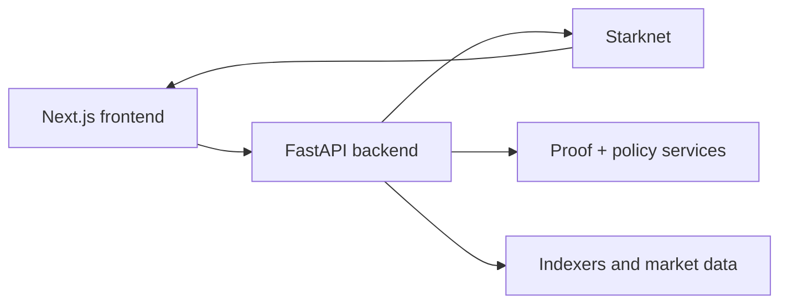

# Developers (Users + GATE Integrators)

This section is for builders who need to understand how zkde.fi is wired today and how to integrate responsibly with production and experimental paths.

## The Problem This Solves

Most “developer pages” stay too generic and force builders to reverse-engineer behavior from source. That slows delivery and increases integration risk.

## Why This Matters

When builders can see architecture intent, endpoint shape, and auth boundaries in one place, they ship safer clients and maintain cleaner production operations.

## Integration Orientations

### 1) User-facing product integrations

Use deep links and route-state conventions to guide users into the correct operational surface.

### 2) Backend/system integrations

Use endpoint-level APIs, enforce header discipline, and classify dependencies as production or experimental.

### 3) GATE-aligned ecosystem integrations

Use AEGIS/GATE semantics where relevant, but keep user UX grounded in current app and API behavior.

## System Shape

## Practical Starting Points

- [API overview](/api-overview) for endpoint-level integration map
- [Architecture summary](/architecture-summary) for service boundaries
- [Contracts](/contracts) for deployed address references
- [Deploying zkde.fi](/deploying-zkde-fi) for serving model and docs pipeline
- [AEGIS-1](/aegis) for GATE standard framing

## Repository References

- Setup: <https://github.com/obsqra-labs/zkdefi/blob/main/docs/SETUP.md>
- Environment variables: <https://github.com/obsqra-labs/zkdefi/blob/main/docs/ENV.md>
- Architecture details: <https://github.com/obsqra-labs/zkdefi/blob/main/docs/ARCHITECTURE.md>
- Agent flow details: <https://github.com/obsqra-labs/zkdefi/blob/main/docs/AGENT_FLOW.md>
- Source repository: <https://github.com/obsqra-labs/zkdefi>

## Production Vs Experimental Discipline

### Problem it solves

Teams often consume experimental endpoints as if they were stable contracts.

### Why it matters

This causes breakage during upgrades and avoidable incident response.

### Guidance

- Treat these route families as faster-changing surfaces:
  - `/api/v1/phase4a/status`, `/api/v1/phase4a/orchestrated/dashboard`
  - `/api/v1/vault-live/positions/{user_address}`, `/api/v1/vault-live/rebalance`
  - `/api/v1/zkdefi/sim/health`, `/api/v1/zkdefi/sim/state`
- Version pin response expectations in your client code.
- Keep fallback handling explicit for optional fields and async reconciliation states.

## Authentication Ground Rules

For user-protected mutation flows, use `X-Wallet-Address` where required by endpoint policy. For admin-only routes, use `X-Admin-Key`. Do not assume all write routes are identically guarded; verify by endpoint and release.

## Compliance And Legal Boundary

This documentation is technical only. It does not provide legal, tax, or investment advice, and it does not guarantee that any generated disclosure artifact satisfies regulatory obligations in your jurisdiction.

Next: [API overview](/api-overview) | [Architecture summary](/architecture-summary) | [Deploying zkde.fi](/deploying-zkde-fi)

## Key Fixtures (Verified 2026-03-05)

- `GET /api/v1/zkdefi/risk_profile/v2/{address}`
- `GET /api/v1/zkdefi/risk_passport/v2/user/{address}`
- `GET /api/v1/zkdefi/session_keys/list/{owner_address}`
- `POST /api/v1/zkdefi/auth/session/start`
- `POST /api/v1/zkdefi/lending/proof/credit-eligibility`
- `POST /api/v1/zkdefi/zkml/scan`
