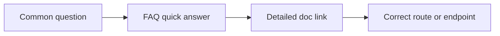

# FAQ

## The Problem This Solves

Users and integrators need short, decision-ready answers to recurring operational questions without searching across long pages.

## Why This Matters

Fast answers reduce support loops and keep users moving through the correct surface and API flows.

## Who is this for?

Users who want privacy-aware DeFi controls, and GATE integrators who need endpoint-level operational surfaces.

## Is the app production or experimental?

Both. Core user paths are production-oriented, while specific endpoint families and advanced surfaces are explicitly experimental.

## What is the canonical agent URL model now?

Use `/agent?v=vault|trade|brain` with optional `sub` where needed.

## What is the canonical profile URL model now?

Use `/profile?tab=trust|reputation|compliance|connections`.

## Are old links still supported?

Many legacy links still map for compatibility, but new docs and integrations should not rely on old tab conventions.

## Does every action use exactly the same proof mode?

No. Verification behavior is flow-specific. Some actions are strict-gated, some are advisory, and some are wallet-first with reconciliation.

## Is this legal or compliance advice?

No. Documentation describes technical behavior only and does not provide legal, tax, or investment advice.

## Where should integrators start?

Start with [API overview](/api-overview), then [Developers](/developers), then [Architecture summary](/architecture-summary).

Next: [Troubleshooting](/troubleshooting) | [API overview](/api-overview)
