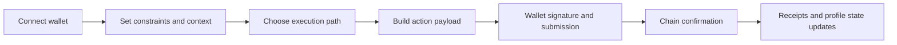
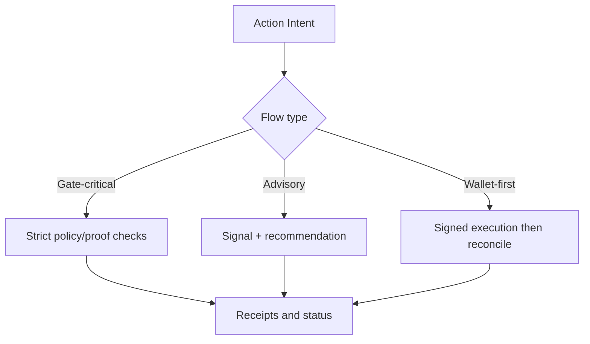

# How Execution Flows

This page explains the end-to-end user flow with current route semantics and flow-specific verification behavior.

## The Problem This Solves

Users and integrators need one coherent mental model that connects UI actions, backend orchestration, wallet signing, and post-execution verification artifacts.

## Why This Matters

When this flow is ambiguous, teams misclassify failures, users retry incorrectly, and audits become slower because artifacts are disconnected from user intent.

## High-Level Flow

## Stage 1: Connect And Establish Context

### Problem it solves

Execution without context leads to mismatched assumptions about policy, available balance, and trust posture.

### Why it matters

The app uses this initial state to decide which controls are available and which paths should be advisory versus hard-gated.

## Stage 2: Select A Surface And Action

Canonical routes:

- `/agent?v=vault` for capital, execution, yield, and lending
- `/agent?v=oracle` for market intelligence (`signals`, `radar`, `genome`)
- `/agent?v=brain` for automation and pipeline controls
- `/agent?v=vault&sub=trade` for execution-specific workflows
- legacy `/agent?v=trade` remaps to `v=oracle`

### Problem it solves

Separates execution intent by operating mode while preserving one workspace.

### Why it matters

Users can reason about “what am I doing now” and integrators can deep-link to a deterministic context.

## Stage 3: Flow-Specific Verification Behavior

### Problem it solves

Avoids pretending every action uses identical verification semantics.

### Why it matters

It aligns docs with production reality and prevents overpromising “always hard-gated” behavior where the implementation is intentionally advisory.

## Stage 4: Wallet Submission

User signs transaction(s) and submits to chain. This is the hard ownership checkpoint where custody remains user-controlled.

### Problem it solves

Ensures users maintain cryptographic authority over action execution.

### Why it matters

Even when orchestration is backend-assisted, the final execution decision remains with the wallet signer.

## Stage 5: Receipts, Timeline, And Profile Impact

After submission and confirmation, backend and UI reconcile state:

- receipt and status updates
- profile/reputation/passport context refresh
- execution timeline visibility

### Problem it solves

Turns one-off transaction events into traceable operational history.

### Why it matters

Users and integrators can validate what happened, when, and under which policy context.

Next: [Agent workspace](/agent-dashboard) | [Risk Passport](/risk-passport) | [API overview](/api-overview)

## Key Fixtures (Verified 2026-03-05)

- `/agent?v=vault`
- `/agent?v=vault&sub=trade`
- `/agent?v=oracle`
- `/agent?v=brain&sub=pipeline`
- `/profile?tab=trust`
