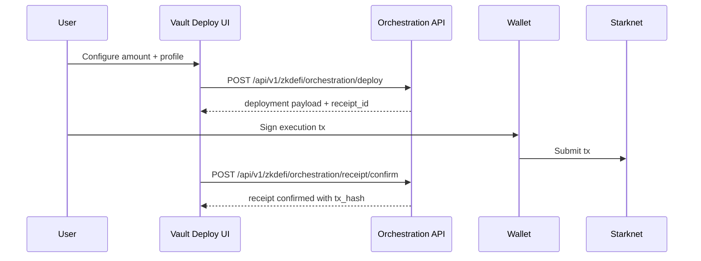

# Deploy To Ekubo (End-To-End)

This guide documents the current deploy flow for Ekubo from the live app.

## The Problem This Solves

Users want an allocation workflow that is opinionated enough to be usable but still transparent enough to verify what is being executed.

## Why This Matters

If deploy UX hides execution structure, users cannot debug failures, and integrators cannot build reliable support or monitoring around deployment outcomes.

## Canonical Entry Point

Use:

- `/agent?v=vault&sub=deploy`

Do not rely on legacy “Dashboard tab” language in runbooks.

## Step-By-Step User Flow

1. Connect wallet at `https://zkde.fi`.
2. Open `vault` deploy surface.
3. Enter deployable amount and risk profile context.
4. Request deployment orchestration payload.
5. Sign and submit wallet transaction(s).
6. Confirm receipt and monitor position status.

## API Endpoints In This Flow

### 1) Build orchestration payload

- `POST /api/v1/zkdefi/orchestration/deploy`

### 2) Fetch receipt state

- `GET /api/v1/zkdefi/orchestration/receipt/{receipt_id}`

### 3) Confirm chain submission

- `POST /api/v1/zkdefi/orchestration/receipt/confirm`

## Common Failure Modes And What They Solve

### Ekubo API unavailable

Problem: backend cannot complete downstream Ekubo data operations.

Why it matters: execution may have succeeded on-chain while UI state remains “pending” until backend/indexer sync recovers.

### Network mismatch

Problem: wallet chain differs from expected Starknet Sepolia environment.

Why it matters: contract address resolution and transaction calls fail even with valid user inputs.

### Missing gas/token balance

Problem: wallet cannot fund approval/swap/liquidity calls.

Why it matters: orchestration payload generation can succeed while execution fails at wallet submit time.

## Production Vs Experimental Note

This guide covers production deployment behavior while acknowledging that downstream position indexing and some strategy paths can still be marked experimental in active releases.

Next: [Agent workspace](/agent-dashboard) | [Troubleshooting](/troubleshooting) | [API overview](/api-overview)
