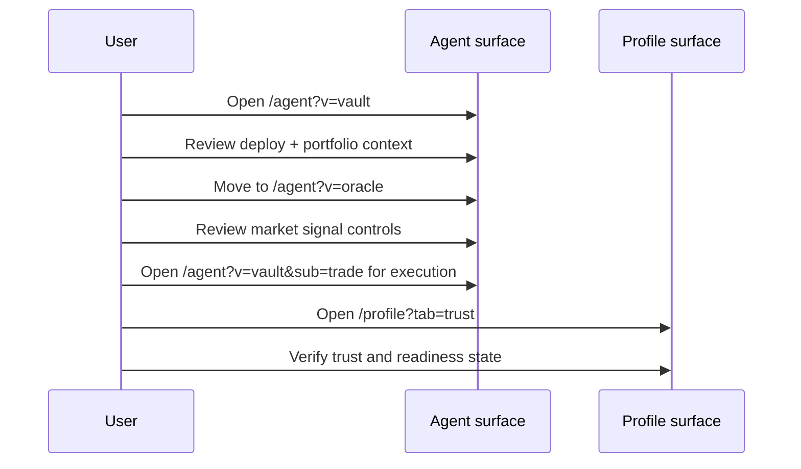

# First-Time Setup (Live App)

This guide expands on quick start and is meant to prevent the most common first-day misconfigurations.

## The Problem This Solves

Users often fail early because of network mismatch, missing testnet funds, or opening the wrong UI context from stale links.

## Why This Matters

If setup is correct once, later flows such as deployment, disclosure, and automation become predictable and reproducible.

## Step 1: Wallet And Network

Use a Starknet wallet and set network to **Starknet Sepolia**.

- ArgentX: <https://www.argent.xyz/argent-x/>
- Braavos: <https://braavos.app/>

## Step 2: Funding Context

You may need testnet funds for gas and certain execution paths.

- ETH for transaction gas
- STRK for relevant operations in current testnet flows

## Step 3: Connect And Confirm Route State

After connecting at `https://zkde.fi`, open canonical routes:

- `/agent?v=vault`
- `/profile?tab=trust`

Avoid starting from legacy deep links that use old `/agent?tab=` conventions.

## Step 4: Complete First Operational Loop

## What This Setup Sequence Solves

- Prevents route confusion from stale docs links
- Establishes production path before experimental features
- Gives users a clear trust/risk checkpoint before automation

## Key Fixtures (Verified 2026-03-05)

- `/agent?v=vault`
- `/agent?v=oracle`
- `/agent?v=vault&sub=trade`
- `/profile?tab=trust`

Next: [Deploy to Ekubo](/guide-deploy-to-ekubo) | [Agent workspace](/agent-dashboard) | [Troubleshooting](/troubleshooting)
