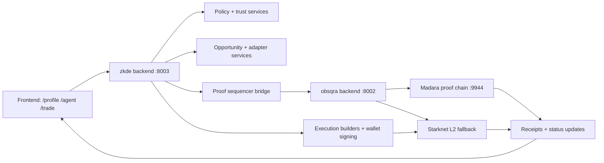

# How Systems Work

This is the operator map from UI action to proof/receipt state.

## System Path (UI -> Services -> Settlement)

## Route Responsibilities

### `/profile`

- Identity binding and trust/reputation context.
- Gate readiness for flows that depend on policy thresholds.

### `/agent` (Capital OS)

- Capital posture and orchestration controls.
- Pre-trade checks and policy preparation.

### `/trade` (Trade Desk)

- Opportunity selection, adapter route selection, simulation, execution.

## Runtime Lifecycle

1. Load trust context (`/profile`).
2. Load opportunities + adapter metadata (`/trade`).
3. Evaluate gate/policy state for selected action.
4. Build and simulate calldata.
5. Sign + submit tx from wallet.
6. Reconcile receipts/outcomes back into UI state.
7. For proof flows, settlement updates arrive through sequencer path.

## Core Health Checks

- `GET /api/v1/zkdefi/proofs/sequencer-status` (zkde backend)
- `GET /api/v1/aggregation/stats` (obsqra backend)
- `GET /api/v1/aggregation/madara/health` (obsqra backend)

## Common Failure Domains

- Opportunity exists but adapter route metadata missing.
- Gate state blocks execution despite valid-looking simulation.
- Wallet submit failure after simulation success.
- Sequencer/settlement unreachable (proof status stalls).

## First Triage Order

1. Verify route-level health checks above.
2. Verify adapter route exists for selected opportunity.
3. Re-run simulation with explicit slippage and current state.
4. Check settlement path health if proof-related state is stale.

Next: [Quick Start](/quick-start) | [Capital OS](/capital-os) | [Trade Desk](/trade-desk)
