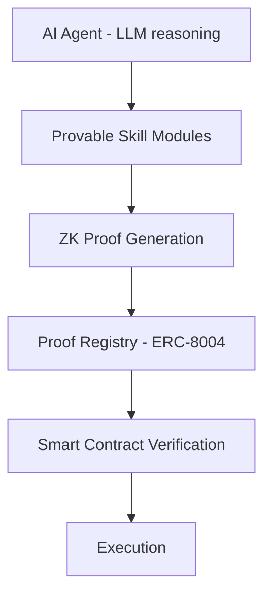

# Innovation

This page describes where zkde.fi is architecturally distinct — not by marketing claim, but by what the system actually does differently.

## The Core Innovation: Computation Oracles

Oracle networks today provide raw data — price feeds, block headers, API results. But most DeFi decisions depend on **interpretation** of data: is this pool safe? is this allocation optimal? is this borrower creditworthy?

That interpretation layer is currently centralized. A server runs a model, posts a score, and users trust it. zkde.fi replaces trust with verification:

```
Data Oracle (Chainlink, Pyth)     Computation Oracle (Obsqra)
─────────────────────────────     ───────────────────────────
Proves: "ETH price is $3,200"     Proves: "This pool scored safe
                                   based on 8 risk factors,
                                   computed by this specific model,
                                   on this specific input data"
```

The oracle becomes computation, not authority.

## Provable AI Agents

The LLM orchestration layer calls provable skill modules. Each skill maps to a ZK circuit. The circuit proves the computation; the proof registry records it; smart contracts verify before execution.



This means agent decisions are backed by cryptographic evidence. Not "trust the bot" — verify the bot.

## Trust Boundary Separation

The system explicitly separates advisory and proven computation:

| Layer | Trust Model | What It Does |
|-------|-------------|--------------|
| LLM reasoning | Advisory (off-chain, auditable via `llm_provider_hash`) | Chooses which skills to invoke, synthesizes results |
| ML inference | Proven (ZK circuit) | Risk scoring, anomaly detection, yield forecasting |
| Execution | Verified (on-chain) | Contracts check proofs before capital movement |

Many projects conflate AI reasoning with cryptographic proof. zkde.fi does not — LLM decisions are advisory; ML inference is proven. This is the correct trust boundary.

## Additional Architectural Innovations

### Proof registry as verifiability middleware

The `ValidationProofRegistry` is not a storage table — it is the bridge between off-chain AI and on-chain execution. Contracts query it to check whether an agent's claim is backed by verified computation. This enables cross-agent trust and composable verification.

### Flow-specific verification

Proof behavior varies by execution path: gate-critical (proof required), advisory (risk signal without hard block), and wallet-first (signed execution with post-action reconciliation). This reflects production reality rather than a single rigid proof mode.

### Multi-tier privacy with explicit trust boundaries

Privacy guarantees are stated honestly. Deposit-visible mode means the chain sees amounts but not strategy. Full privacy mode uses relayer-mediated execution. The system does not claim stronger privacy than it provides.

Next: [Architecture summary](/architecture-summary) | [AEGIS-1](/aegis) | [API overview](/api-overview)
