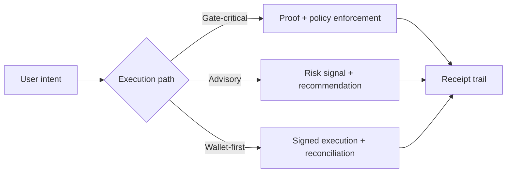

# Introduction

zkde.fi is the first **privacy-preserving AI capital allocator** built on Obsqra's zero-knowledge infrastructure. It brings AI-powered DeFi to Starknet where **your data stays private** while every decision is cryptographically proven.

## Privacy + Verification = zkDeFi

Every vault operation carries cryptographic guarantees:

**Every vault operation now has:**
- ✅ **STARK proof** — cryptographic correctness guarantee
- ✅ **On-chain receipt** — immutable audit trail with proof hash  
- ✅ **Privacy option** — shielded pools hide amounts

**Architecture:** Backend generates proof → Submit to FactRegistry → VaultController verifies → Execute → Create receipt

---

Designed for two audiences:

- **Users** who want AI-powered yield optimization without exposing portfolio details, risk profiles, or strategy preferences
- **Integrators** building privacy-preserving computation APIs and proof-gated execution patterns

## The Privacy + Verification Problem

DeFi automation forces an impossible choice:

- **Transparent (public):** Your positions, strategies, and risk tolerance are visible to MEV bots, competitors, and chain analysts
- **Opaque (centralized):** Send private data to off-chain servers, trust they run the right AI model, no verification

You can't have **privacy + verification** — until now.

## Why Privacy-Preserving Proofs Matter

zkde.fi introduces **zero-knowledge AI agents**: autonomous agents whose decisions are proven correct **without revealing your private data**.

- Every risk score, anomaly detection, and allocation signal passes through a **zkML circuit** (zero-knowledge machine learning)
- Proofs verify the AI model ran correctly on real inputs **without exposing those inputs**
- Deposits and withdrawals use **shielded pools** (Poseidon commitments) to hide amounts and break on-chain links
- Smart contracts verify proofs before authorizing execution

The result: **AI-powered DeFi where you keep your data private AND prove everything is correct**.

## What zkde.fi Combines

- **Privacy-preserving AI (zkML)** — Machine learning inference inside zero-knowledge proofs (22 Circom + 3 EZKL circuits)
- **Shielded pools** — Poseidon commitment-based deposits/withdrawals that hide amounts and break address links
- **Confidential strategy engine** — Risk scoring and recommendations computed on encrypted user profiles
- **Proof registry (ERC-8004)** — Verifiable computation catalog enabling cross-agent trust without data exposure
- **Session-based delegation** with privacy-aware constraint scoping and proof-gated execution

## Flow-Specific Proof Model (Important)

Proof behavior is flow-dependent. zkde.fi does not frame all actions as identical.

- Some paths are fully gate-critical and require strict proof/receipt confirmation before execution acceptance.
- Some paths are advisory or policy-preview oriented and may return risk signals without hard blocking.
- Some operational paths rely on wallet-authorized execution with post-action state reconciliation.

This flow-specific model reflects production reality and avoids over-promising a single “one size fits all” proof mode.

## Surfaces You Will Use

- `/agent` for execution surfaces (`vault`, `trade`, `brain`)
- `/profile` for trust, reputation, compliance, and connections
- `/docs` for operational and integration references

## Production And Experimental Scope

These docs intentionally include both production and experimental capabilities. Pages identify when a flow is stable versus rapidly evolving so users and integrators can make informed decisions about adoption risk.

Next: [Why zkde.fi?](/why) | [Concepts](/concepts) | [Quick start](/quick-start)
