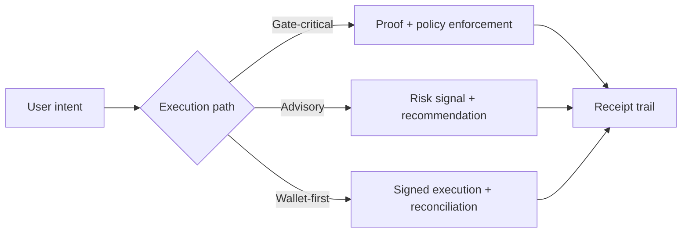

# Introduction

zkde.fi is the first application built on Obsqra's verifiable AI infrastructure. It is an AI-driven capital allocator for DeFi on Starknet, designed for two audiences:

- users who want AI-powered yield optimization where every decision is provably computed
- integrators building on verifiable computation APIs and proof-gated execution patterns

## The Problem This Solves

DeFi automation is either fully transparent (leaking strategy alpha) or fully opaque (requiring blind trust). When an AI agent says "this pool is safe" or "rebalance 60/40," there is no way to verify that the algorithm actually ran on real data — or ran at all.

## Why This Matters

zkde.fi introduces **verifiable AI agents** — autonomous agents whose critical decisions are backed by cryptographic proofs. Every risk score, anomaly detection, and allocation signal passes through a ZK circuit that proves the computation was performed correctly. Smart contracts verify these proofs before authorizing execution. The result: AI-powered DeFi where trust is replaced by verification.

## What zkde.fi Combines

- **Provable skill modules** — AI agent skills backed by ZK circuits (22 Circom + 3 EZKL circuits)
- **Proof registry as verifiability middleware** — ERC-8004 proof catalog enabling cross-agent trust
- **Multi-tier privacy** — from deposit-visible to fully shielded, with commit-reveal execution
- **Session-based delegation** with constraint scoping and proof-gated execution
- **Computation oracle pattern** — risk analysis that proves interpretation, not just data

## Flow-Specific Proof Model (Important)

Proof behavior is flow-dependent. zkde.fi does not frame all actions as identical.

- Some paths are fully gate-critical and require strict proof/receipt confirmation before execution acceptance.
- Some paths are advisory or policy-preview oriented and may return risk signals without hard blocking.
- Some operational paths rely on wallet-authorized execution with post-action state reconciliation.

This flow-specific model reflects production reality and avoids over-promising a single “one size fits all” proof mode.

## Surfaces You Will Use

- `/agent` for execution surfaces (`vault`, `trade`, `brain`)
- `/profile` for trust, reputation, compliance, and connections
- `/docs` for operational and integration references

## Production And Experimental Scope

These docs intentionally include both production and experimental capabilities. Pages identify when a flow is stable versus rapidly evolving so users and integrators can make informed decisions about adoption risk.

Next: [Why zkde.fi?](/why) | [Concepts](/concepts) | [Quick start](/quick-start)
