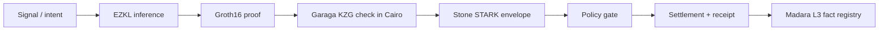

# The Primitive

## What zkde.fi Is

zkde.fi is a reference implementation of proof-gated private finance built on top of the [Obsqra Labs](https://obsqra.xyz) proving infrastructure. It is not a DeFi app. The DeFi surfaces — Capital OS, Trade Desk, privacy vaults — are demonstrations of the proof system working in production.

The parent infrastructure layer is [StarkForge](https://starkforge.xyz). zkde.fi is one application built on top of it.

## The Gap This Closes

On-chain execution is trustless — smart contracts enforce rules deterministically. Off-chain computation is not. When an AI model says "this pool is safe" or "allocate 40% here," there is no cryptographic guarantee that the model ran correctly, that the inputs were real, or that the output wasn't manipulated.

The primitive closes that gap: **off-chain computation produces on-chain-verifiable proof before capital moves.**

## The Architecture: SNARK-in-STARK Dual Lane

zkde.fi uses a dual-lane proving architecture:

- **SNARK lane (Garaga/Groth16):** EZKL converts ML model inference into Groth16 proofs. These are verified on-chain via Garaga's BN254 pairing check implemented natively in Cairo. This lane handles zkML verification — proving that a specific model produced a specific output from specific inputs.

- **STARK lane (Stone):** The same STARK prover infrastructure that generates validity proofs for Starknet blocks. This lane handles execution integrity — proving that the full computation (policy checks, gate evaluation, settlement routing) executed correctly.

When both lanes are active (`FULL_DUAL_PROVER` mode), a single action produces two independent cryptographic guarantees: the AI output is correct (SNARK), and the execution that consumed it was faithful (STARK).

## What The System Can Prove

1. **Input provenance** — the data fed to a model came from a verified source (oracle, on-chain state, committed private input)
2. **Model integrity** — the ML model that produced a recommendation is the same model whose weights were committed on-chain via KZG
3. **Execution constraints** — the transaction that resulted from the recommendation respected slippage bounds, allocation limits, and policy gates
4. **Policy compliance** — the user's trust posture (reputation tier, collateral ratio, proof history) met the minimum threshold for the action
5. **Settlement finality** — the proof was registered on Madara L3 (or Starknet L2 fallback) and is independently verifiable via block explorer

## What's Deployed Right Now

| Network | Contracts | Examples |
|---|---|---|
| **Starknet Sepolia** | ZkmlVerifier, ModelBridgeVerifier, GaragaVerifier, ReputationRegistry, VaultController, ObsqraFactRegistry, ReceiptRegistry, DAOConstraintManager, 5 FICO-pack verifiers, and more | [ZkmlVerifier on Voyager](https://sepolia.voyager.online/contract/0x068abd64a4a78172a5ee15a30bbe614257d62482f07d3ff7fdb72da5aad08923) |
| **Ethereum Sepolia** | Halo2Verifier (EZKL KZG), L1 Bridge Sender | [Halo2Verifier on Etherscan](https://sepolia.etherscan.io/address/0xF7b555ca4E54a8c7B9A0DDBFa17341575a852Ab9) |
| **Madara L3** | VerifiedFactRegistry | Dedicated appchain for proof fact registration |

- **31** Circom circuits compiled to WASM + zkey
- **2** EZKL ML models (yield forecast, anomaly detector) with Halo2/KZG proofs
- **136+** on-chain trust receipts
- **5** verified proof lanes: Groth16 (Garaga), STARK (Stone), Noir HONK, Native KZG, hash-only fallback

Full live verification: **[zkde.fi/test](https://zkde.fi/test)**

## Next

- [Live Proof Readout](/proof-readout) — see every claim verified at zkde.fi/test
- [Proof Pipeline](/proof-pipeline) — ProofMode table, verifier lanes, settlement paths
- [Deployed Contracts](/contracts) — full on-chain contract map
