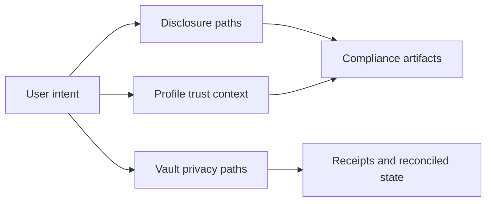

# Privacy Features

zkde.fi is built on **zero-knowledge cryptography** to keep your financial data private while proving everything is correct. Every privacy feature uses zero-knowledge proofs (zkSNARKs/zkSTARKs) to verify computation without revealing inputs.

## The Privacy Problem in DeFi

Traditional DeFi exposes **everything**:
- Your wallet balance is public
- Every trade is linked to your address
- AI services require sending private data to centralized servers
- Risk scores reveal your portfolio composition
- Strategy preferences are visible to MEV bots

You're forced to choose: **privacy** (hide your data, lose verification) OR **transparency** (prove correctness, expose everything).

## Why Zero-Knowledge Privacy Matters

zkde.fi eliminates this tradeoff. Zero-knowledge proofs let you **prove a computation was done correctly WITHOUT revealing the inputs**. You can verify AI decisions, risk calculations, and strategy recommendations while keeping your data completely private.

**Real-world impact:**
- Institutional users can prove compliance without exposing trading strategies to competitors
- Retail users can get personalized recommendations without data harvesting
- DAO treasuries can prove risk management without revealing portfolio positions
- Protocols can verify agent behavior without accessing user secrets

## Core Privacy Technologies

### 1) Private Deposits & Withdrawals (Shielded Pools)

**What it does:** Deposit/withdraw funds without linking transactions to your identity.

**How it works:**
- Deposits create a **Poseidon commitment** (cryptographic hash) stored on-chain
- Your deposit amount and nullifier stay private (stored locally)
- Withdrawals use a **zero-knowledge proof** to show you own a valid commitment
- No on-chain link between deposit and withdrawal addresses

**Circuits:** `private_deposit.cairo`, `private_withdraw.cairo`, `full_privacy_withdraw.cairo`

**Contracts:** `ConfidentialTransfer`, `FullyShieldedPool`, `HashedWithdrawPool`

### 2) Privacy-Preserving AI Risk Scoring (zkML)

**What it does:** AI models analyze your portfolio and generate risk scores **without seeing your data**.

**How it works:**
- zkML circuits run machine learning inference **inside a zero-knowledge proof**
- Input: Your private positions, balances, risk tolerance
- Output: Risk score + proof that the score was computed correctly
- Smart contracts verify proofs before allowing capital movement

**Circuits:** `pool_risk_evaluator.cairo`, `yield_predictor.cairo`, `il_estimator.cairo`, `liquidation_risk.cairo`

**Privacy guarantee:** The AI never sees your raw data. You get a proven risk score without revealing portfolio details.

### 3) Confidential Strategy Recommendations

**What it does:** Get personalized DeFi strategy suggestions without exposing preferences.

**How it works:**
- Your risk profile, capital allocation, and preferences stay on your device
- Strategy Intelligence Service computes recommendations using **homomorphic properties** of Poseidon hashes
- Proofs verify the strategy was computed using real market data + your hidden profile
- Oracle recommendations are proven without revealing your targets

## Capability Map

## Problem It Solves In Real Workflows

### For users

Allows users to share enough information to move forward in integrations without fully disclosing private strategy state.

### For integrators

Creates explicit artifact surfaces that can be consumed in policy workflows and verifier dashboards.

## Why It Matters Operationally

Teams can support user privacy while still preserving traceability for action outcomes and verification checkpoints.

## API Surfaces (Representative)

| Method | Endpoint | Purpose |
|---|---|---|
| `GET` | `/api/v1/zkdefi/compliance/profiles/{user_address}` | Read disclosure/compliance profiles |
| `POST` | `/api/v1/zkdefi/disclosure/generate` | Generate disclosure artifact |
| `POST` | `/api/v1/zkdefi/disclosure/risk_compliance` | Risk compliance disclosure flow |
| `POST` | `/api/v1/zkdefi/disclosure/performance` | Performance disclosure flow |
| `POST` | `/api/v1/zkdefi/disclosure/aggregation` | Aggregated-value disclosure flow |
| `POST` | `/api/v1/zkdefi/full_privacy/deposit/generate_commitment` | Privacy commitment generation |
| `POST` | `/api/v1/zkdefi/full_privacy/withdraw/generate_proof` | Withdrawal proof generation |

## Legal Boundary

These privacy features are technical capabilities, not legal determinations. They do not constitute legal advice, and they do not guarantee that a specific disclosure artifact satisfies jurisdiction-specific compliance obligations.

Next: [Compliance and disclosure](/compliance-and-disclosure) | [Risk Passport](/risk-passport) | [Concepts](/concepts)
