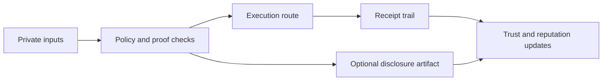

# Privacy And Unlocks

Privacy is not a side feature in zkde.fi. It is the operating model.

## What Stays Private Vs What Is Shared

Private by default:

- Strategy intent and portfolio-sensitive inputs
- Private deposit/withdraw secrets and commitment material
- Internal decision context used by policy and model layers

Shared when needed:

- Proofs that a check passed
- Receipts that an execution happened
- Disclosure artifacts for partner/compliance workflows

## Privacy Modes You Will See In Product

Trade and execution flows can run with different privacy levels.

- `public`: standard transparent route
- `shielded`: partial privacy with proof-linked controls
- `fully_private`: commitment/proof-first flow with minimal disclosure

## What Privacy Unlocks

- Access to sensitive strategies without exposing full intent on every step
- Policy-aware automation with proof checkpoints
- Better trust posture over time via verifiable outcomes
- Credit and partner workflows that consume artifacts, not raw private state

## Where This Appears In The App

- `/profile`: trust, reputation, compliance and disclosure context
- `/agent` (Capital OS): privacy vault actions, controls, and orchestration
- `/trade` (Trade Desk): privacy level per opportunity, adapter routes, slippage simulation, execution receipts

## Core Privacy Flow

## Representative APIs

| Method | Endpoint | Purpose |
|---|---|---|
| `POST` | `/api/v1/zkdefi/full_privacy/deposit/generate_commitment` | Build privacy commitment |
| `POST` | `/api/v1/zkdefi/full_privacy/withdraw/generate_proof` | Build withdrawal proof |
| `POST` | `/api/v1/zkdefi/privacy/deposit` | Unified privacy deposit flow |
| `POST` | `/api/v1/zkdefi/privacy/withdraw` | Unified privacy withdraw flow |
| `GET` | `/api/v1/zkdefi/compliance/profiles/{user_address}` | Read compliance/disclosure profile |

## Boundary

These are technical capabilities. They are not legal, tax, or investment advice.

Next: [Profile And Identity](/profile-and-identity) | [Capital OS](/capital-os) | [Trade Desk](/trade-desk)
