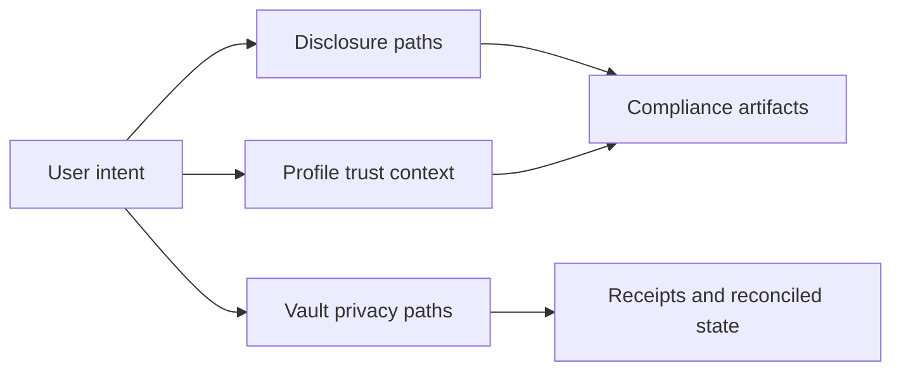

# Privacy Features

This page explains privacy capabilities in the current zkde.fi product surface.

## The Problem This Solves

DeFi users often need to prove bounded claims while keeping strategy and allocation details private. Most products force an all-or-nothing disclosure choice.

## Why This Matters

Practical privacy is not just cryptography. It is about giving users selective control over what becomes visible to counterparties, partners, and auditors.

## Privacy Capability Families

### 1) Selective disclosure

Users can expose scoped claims through compliance-oriented profiles without publishing full trade history.

### 2) Privacy-aware operational flows

Certain vault and withdrawal routes support privacy-preserving settlement patterns and post-action verification artifacts.

### 3) Aggregated posture presentation

User-facing views can focus on compositional trust and total posture rather than leaking unnecessary strategy detail.

## Capability Map

## Problem It Solves In Real Workflows

### For users

Allows users to share enough information to move forward in integrations without fully disclosing private strategy state.

### For integrators

Creates explicit artifact surfaces that can be consumed in policy workflows and verifier dashboards.

## Why It Matters Operationally

Teams can support user privacy while still preserving traceability for action outcomes and verification checkpoints.

## API Surfaces (Representative)

| Method | Endpoint | Purpose |
|---|---|---|
| `GET` | `/api/v1/zkdefi/compliance/profiles/{user_address}` | Read disclosure/compliance profiles |
| `POST` | `/api/v1/zkdefi/disclosure/generate` | Generate disclosure artifact |
| `POST` | `/api/v1/zkdefi/disclosure/risk_compliance` | Risk compliance disclosure flow |
| `POST` | `/api/v1/zkdefi/disclosure/performance` | Performance disclosure flow |
| `POST` | `/api/v1/zkdefi/disclosure/aggregation` | Aggregated-value disclosure flow |
| `POST` | `/api/v1/zkdefi/full_privacy/deposit/generate_commitment` | Privacy commitment generation |
| `POST` | `/api/v1/zkdefi/full_privacy/withdraw/generate_proof` | Withdrawal proof generation |

## Legal Boundary

These privacy features are technical capabilities, not legal determinations. They do not constitute legal advice, and they do not guarantee that a specific disclosure artifact satisfies jurisdiction-specific compliance obligations.

Next: [Compliance and disclosure](/compliance-and-disclosure) | [Risk Passport](/risk-passport) | [Concepts](/concepts)
