# Privacy Rails

Privacy in zkde.fi is not a feature toggle — it is a proving pipeline. The system uses a commitment → nullifier → claim hash → relayer → settlement flow that enables private execution while retaining on-chain verifiability.

This page documents how private capital movement works, from deposit through withdrawal, across three enforcement tiers.

## The Pipeline

```mermaid
flowchart LR
  DEP[Deposit] --> CMT[Commitment: hash of secret + nullifier]
  CMT --> TREE[Merkle tree insertion]
  TREE --> POOL[Shielded pool state]
  POOL --> WD[Withdraw intent]
  WD --> NUL[Nullifier reveal: prevents double-spend]
  NUL --> CLAIM[Claim hash: binding proof of entitlement]
  CLAIM --> RELAY[Relayer submission: optional, breaks tx-graph link]
  RELAY --> SETTLE[Settlement: on-chain or L3]
  SETTLE --> RCPT[Receipt: immutable, verifiable]
```

### Step by Step

1. **Commitment generation** — the user creates a commitment: `hash(secret, nullifier, amount)`. The secret stays private. The commitment is added to the pool's Merkle tree.
2. **Merkle tree state** — the pool maintains a Merkle tree of all commitments. The current root is publicly readable; individual leaves are not.
3. **Withdrawal proof** — to withdraw, the user generates a ZK proof that they know a leaf in the Merkle tree (their commitment) without revealing which one. They also reveal the nullifier to prevent double-spend.
4. **Claim hash** — a binding hash that ties the withdrawal proof to a specific recipient and amount, without revealing the depositor.
5. **Relayer submission** — optionally, a relayer submits the transaction on the user's behalf, so the withdrawal tx is not linked to the depositor's address.
6. **Settlement** — the withdrawal is settled on-chain (Starknet L2) or via the Madara L3 path.
7. **Receipt** — an immutable receipt is stored in the ReceiptRegistry.

## Privacy Tiers

| Tier | Proof Requirement | Relayer | Timing | Use Case |
|---|---|---|---|---|
| **Strict** | Full ZK proof, Merkle inclusion proof, nullifier | No relayer — user submits directly | No delay | Maximum control, user manages own tx submission |
| **Standard** | Full ZK proof, Merkle inclusion proof, nullifier | Relayer submits on user's behalf | Configurable delay (batching) | Default tier — breaks depositor-withdrawer tx link |
| **Express** | Optimistic batch verification | Relayer with batch aggregation | Batched settlement | Lower-value flows where batching saves gas |

## Privacy Circuits

The privacy pipeline uses dedicated Circom circuits:

| Circuit | Purpose |
|---|---|
| `FullPrivacyWithdraw` | Standard full-privacy withdrawal proof |
| `FullPrivacyWithdrawHashed` | Withdrawal with hashed recipient binding |
| `FullPrivacyWithdrawWithChange` | Withdrawal with change output (partial withdrawal) |
| `PrivateDeposit` | Commitment generation and Merkle insertion proof |
| `PrivateWithdraw` | Simplified privacy withdrawal |
| `PoolMembership` | Proves membership in a shielded pool without revealing position |

## Selective Disclosure

Selective disclosure means the user can prove specific properties about their private state without revealing the state itself:

- "I have at least X collateral" — without revealing the exact amount
- "My position has been open for at least Y days" — without revealing the entry date
- "I passed the risk screening" — without revealing the risk score

This is implemented via the `SelectiveDisclosure` contract on Starknet Sepolia ([`0x00ab6791e84e2d88bf2200c9e1c2fb1caed2eecf5f9ae2989acf1ed3d00a0c77`](https://sepolia.voyager.online/contract/0x00ab6791e84e2d88bf2200c9e1c2fb1caed2eecf5f9ae2989acf1ed3d00a0c77)) and the `BalanceAboveThreshold` and `TenureAboveThreshold` circuits.

## Privacy Contracts

| Contract | Address | Purpose |
|---|---|---|
| FullPrivacyPoolV2 | [`0x03dde5617d362a6f9202cd3955b4508e2bd6b1c5d35250153beeb6237c811559`](https://sepolia.voyager.online/contract/0x03dde5617d362a6f9202cd3955b4508e2bd6b1c5d35250153beeb6237c811559) | Main shielded pool with Merkle tree |
| SelectiveDisclosure | [`0x00ab6791e84e2d88bf2200c9e1c2fb1caed2eecf5f9ae2989acf1ed3d00a0c77`](https://sepolia.voyager.online/contract/0x00ab6791e84e2d88bf2200c9e1c2fb1caed2eecf5f9ae2989acf1ed3d00a0c77) | Selective disclosure verifier |
| ConfidentialTransfer | [`0x07fdc7c21ab074e7e1afe57edfcb818be183ab49f4bf31f9bf86dd052afefaa4`](https://sepolia.voyager.online/contract/0x07fdc7c21ab074e7e1afe57edfcb818be183ab49f4bf31f9bf86dd052afefaa4) | Private transfer with proof |
| FullyShieldedPool | [`0x07fed6973cfc23b031c0476885ec87a401f1006bdc8ba58df2bd8611b38b5ff5`](https://sepolia.voyager.online/contract/0x07fed6973cfc23b031c0476885ec87a401f1006bdc8ba58df2bd8611b38b5ff5) | Fully shielded variant |

## Privacy API Endpoints

| Method | Endpoint | Purpose |
|---|---|---|
| `POST` | `/api/v1/zkdefi/full_privacy/deposit/generate_commitment` | Generate commitment for private deposit |
| `POST` | `/api/v1/zkdefi/full_privacy/withdraw/generate_proof` | Generate Merkle withdrawal proof |
| `GET` | `/api/v1/zkdefi/full_privacy/merkle/root` | Current Merkle root state |
| `POST` | `/api/v1/zkdefi/privacy/deposit` | Unified privacy deposit flow |
| `POST` | `/api/v1/zkdefi/privacy/withdraw` | Unified privacy withdraw flow |
| `GET` | `/api/v1/zkdefi/compliance/profiles/{user_address}` | Compliance and disclosure profile |

## Extensions Beyond Capital Flows

The same commitment → nullifier → claim hash rails are extended to:

- **Private voting** — the `private_vote` circuit allows governance participation without revealing voting power or vote direction. Implemented via `DAOConstraintManager` ([`0x0101bd9710017c0870077dcf03bf6fe68a955d9f9b9922ed5d673afed7497fc2`](https://sepolia.voyager.online/contract/0x0101bd9710017c0870077dcf03bf6fe68a955d9f9b9922ed5d673afed7497fc2)).
- **Private lending** — credit eligibility proofs via the `CreditEligibility` circuit. Proves collateral sufficiency without revealing portfolio composition.
- **Compliance artifacts** — disclosure proofs that satisfy compliance requirements without revealing raw private state.

---

Next: [zkML + Circuit Stack](/zkml-circuits) | [Proof Pipeline](/proof-pipeline) | [Deployed Contracts](/contracts)
