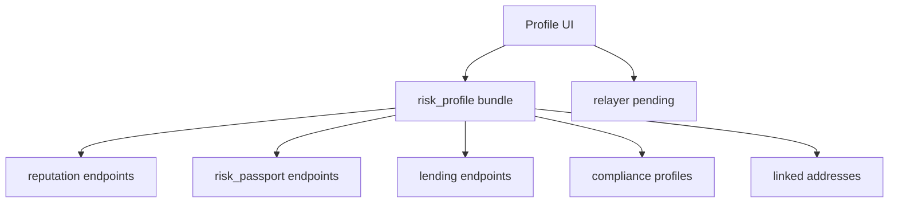

# Profile And Identity (`/profile`)

The Profile workspace is where users and integrators inspect trust posture, reputation dynamics, disclosure state, connected identity context, and reputation-based lending readiness for a Starknet address.

## The Problem This Solves

Execution quality is not only about transaction success. Users also need a consistent way to understand trust tier, collateral posture, passport signals, and disclosure readiness before they delegate automation or request privileged flows.

## Why This Matters

Without a coherent identity surface, users treat risk as an afterthought and integrators cannot reliably evaluate whether a wallet context is ready for specific execution paths.

## Canonical Tab Model

Canonical profile tabs are:

- `trust`
- `reputation`
- `compliance`
- `connections`

Canonical URL form:

- `/profile?tab=trust`
- `/profile?tab=reputation`
- `/profile?tab=compliance`
- `/profile?tab=connections`

Legacy values such as `overview`, `collateral`, `relayer`, and `agents` are compatibility-mapped, but should not be used in new docs.

## Tab Responsibilities

```mermaid
flowchart LR
  P[/profile]
  T[trust]
  R[reputation]
  C[compliance]
  N[connections]

  P --> T
  P --> R
  P --> C
  P --> N
```

### Trust Tab (`tab=trust`)

### Problem it solves

Users need a single place to assess if their identity and history are sufficient for controlled automation and gated interactions.

### Why it matters

Trust posture drives real execution outcomes: users with weak or incomplete context encounter more friction, slower paths, or blocked capabilities.

### Typical data used

- Risk profile bundle summary
- Passport score and letter signals
- Journey and onboarding completion indicators
- High-level proof/attestation timeline

### Reputation Tab (`tab=reputation`)

### Problem it solves

Users need clear feedback on tier state, collateral mechanics, and what actions improve execution posture.

### Why it matters

Tier and collateral directly affect user experience: available paths, throughput expectations, and relayer eligibility are all downstream from reputation state.

### Typical data used

- Reputation tier data
- Staking pool and position context
- Upgrade eligibility logic and transaction history cues
- Lending credit posture and borrowing readiness context

### Reputation-Based Lending In Profile

#### Problem it solves

Borrowing should not be a disconnected feature. Users need to understand lending eligibility in the same place they manage tier, collateral, and trust posture.

#### Why it matters

Reputation and collateral are direct inputs to lending outcomes. If those signals are hidden from the profile experience, users cannot predict borrowing availability or improve eligibility intentionally.

#### Lending APIs tied to profile context

- `GET /api/v1/zkdefi/lending/pool`
- `GET /api/v1/zkdefi/lending/positions/{address}`
- `GET /api/v1/zkdefi/lending/health/{address}`
- `POST /api/v1/zkdefi/lending/proof/credit-eligibility`

Profile and passport context help users interpret these lending routes before they initiate supply, borrow, repay, or withdraw actions.

### Compliance Tab (`tab=compliance`)

### Problem it solves

Users and partner verifiers need a structured place to consume disclosure-ready claims without exposing full private strategy state.

### Why it matters

Compliance is often a gating requirement for integrations, treasury policies, and institutional workflows.

### Typical data used

- Compliance profiles for address
- Verification state and receipt references
- Shareable disclosure context

### Connections Tab (`tab=connections`)

### Problem it solves

Cross-address posture (linked addresses, relayer context, pending relay activity) is operationally important but easy to lose if not centralized.

### Why it matters

Operational continuity depends on clear connections state. If users cannot confirm linked identity and pending actions, they make avoidable mistakes during transfers and automation handoffs.

### Typical data used

- Linked address map
- Relayer request and pending state
- Portable identity readiness signals

## Data Composition Flow



## Integrator Guidance

If you are integrating GATE-aware workflow checks:

1. Deep-link users to the exact profile tab required for resolution.
2. Use compliance tab links for verifier-facing flows.
3. Use reputation tab links for “action blocked” remediation guidance.

This approach shortens user support cycles and improves conversion from blocked state to executable state.

Next: [Reputation system](/reputation-system) | [Risk Passport](/risk-passport) | [Compliance and disclosure](/compliance-and-disclosure)
