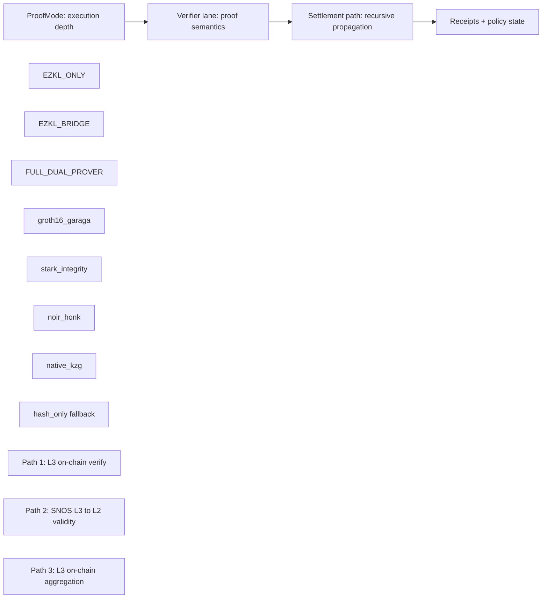
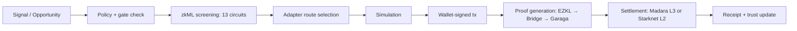
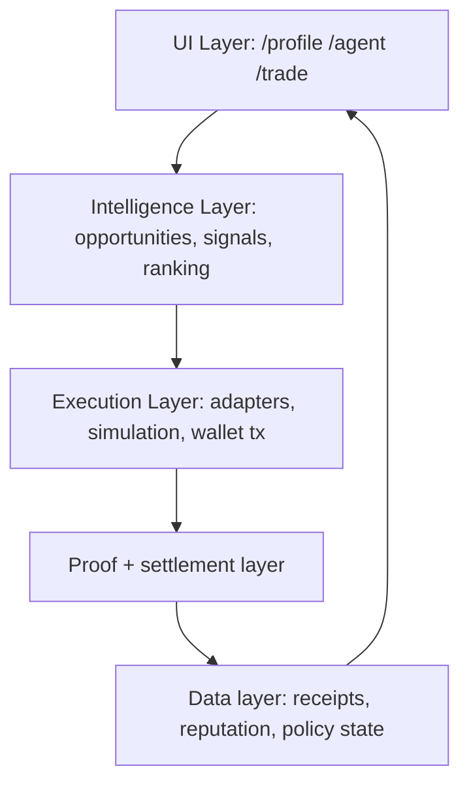

# Proof Pipeline

This is the core proving layer of zkde.fi: a system that can start with fast off-chain verification and escalate to full dual-lane on-chain guarantees depending on the trust requirements of each action.

Not every action needs the same trust guarantee. A low-stakes advisory check doesn't require the same proof weight as a high-value vault rebalance. The pipeline supports three modes that trade verification strength for cost and speed — and the system selects the appropriate mode based on policy posture and action type.

Live proof evidence for all lanes: **[zkde.fi/test](https://zkde.fi/test)**

## Layered Model

## 1) Execution Depth — ProofMode

Source: `backend/app/services/proof_mode.py`

| Mode | What Happens | Gas Profile | When It's Used |
|---|---|---|---|
| `EZKL_ONLY` | EZKL inference runs. Verification is off-chain only. No on-chain proof artifact. | 0 L2 gas | Fast advisory checks, low-stakes screening, development flows |
| `EZKL_BRIDGE` | EZKL output is bound into a bridge circuit (ModelBridge or ModelBridgeHeavy) and proven via Groth16. Garaga verifies the proof on-chain in Cairo. | ~34M L2 gas | Standard execution gating — on-chain verifiable model output |
| `FULL_DUAL_PROVER` | Bridge lane (Groth16/Garaga) **plus** an independent STARK integrity lane via Stone. Two separate proofs for the same action. | ~77M L2 gas | High-value execution where independent dual-proof verification is required |

## 2) Verifier Lanes

Source: `backend/app/services/proof_pipeline.py` and `l3_proving_path_client.py`

| Lane | Circuit / Selector | L3 Mode | Status | Evidence |
|---|---|---|---|---|
| ModelBridge | `bridge_circuit="ModelBridge"` | `groth16_garaga` | **Live** | [Tx on Voyager](https://sepolia.voyager.online/tx/0x2c8ea7551f965f4c73292cd3d00745d088b5572c7154bf6b3746c9f66a0679b) |
| ModelBridgeHeavy | `bridge_circuit="ModelBridgeHeavy"` | `groth16_garaga` | **Live** | [Tx on Voyager](https://sepolia.voyager.online/tx/0x49226ffb495953f1a981020ebb61e8ac462410b750ac672dd21d3f0a8f5b59c) |
| Noir EZKL Bridge | `bridge_circuit="NoirEzklBridge"` | `noir_honk` | **Live** | [Tx on Voyager](https://sepolia.voyager.online/tx/0x55f1d6cf06ed5e2deaf90c86479c2f03b27ed631478447d14af808f33963475) |
| Native EZKL KZG | `bridge_circuit="EzklNativeKzg"` | `native_kzg` | **Live** | [Tx on Voyager](https://sepolia.voyager.online/tx/0x5c9e21abd2119600421872f0baad9988ea7082eec54bacea8657649a8cf5f42) |
| STARK Heavy Reputation | `/risk_passport/stark-heavy-reputation` | `stark_integrity` | **Live** | [Tx on Voyager](https://sepolia.voyager.online/tx/0x7249f4a0dc41f12dd5249f4e7284c0f4d392ec69740396d1de4e0f83126739d) |

### Core Verification Contracts

| Contract | Address | Network |
|---|---|---|
| ModelBridge Verifier | [`0x037c42e8734271aca0c3c1bdf1746d9ccc098ddfd5ee211c94bbb8786fa4626f`](https://sepolia.voyager.online/contract/0x037c42e8734271aca0c3c1bdf1746d9ccc098ddfd5ee211c94bbb8786fa4626f) | Starknet Sepolia |
| ZkmlVerifier (ModelBridge-capable) | [`0x068abd64a4a78172a5ee15a30bbe614257d62482f07d3ff7fdb72da5aad08923`](https://sepolia.voyager.online/contract/0x068abd64a4a78172a5ee15a30bbe614257d62482f07d3ff7fdb72da5aad08923) | Starknet Sepolia |
| GaragaVerifier (BN254) | [`0x06d0cb7a48b48c5b6ca70f856d249caccea90f506ad7596a6838502fe3aa6d37`](https://sepolia.voyager.online/contract/0x06d0cb7a48b48c5b6ca70f856d249caccea90f506ad7596a6838502fe3aa6d37) | Starknet Sepolia |
| Halo2Verifier (EZKL KZG) | [`0xF7b555ca4E54a8c7B9A0DDBFa17341575a852Ab9`](https://sepolia.etherscan.io/address/0xF7b555ca4E54a8c7B9A0DDBFa17341575a852Ab9) | Ethereum Sepolia |

## 3) Signal-to-Receipt Lifecycle

This is the full path from user intent to settled proof:

1. **Signal arrives** — an opportunity, rebalance trigger, or user action
2. **Policy gate evaluates** — reputation tier, collateral posture, proof history
3. **zkML screening runs** — the relevant circuits from the 13-circuit bundle evaluate the action's risk characteristics
4. **Route selected** — adapter determines execution path (Ekubo swap, LP, lending, etc.)
5. **Simulation** — calldata built and simulated before signing
6. **Proof generated** — depending on ProofMode, EZKL inference → bridge circuit → Garaga verification
7. **Settlement** — proof registered on Madara L3 via ObsqraFactRegistry (or Starknet L2 fallback)
8. **Receipt created** — immutable receipt stored in ReceiptRegistry, trust/reputation state updated

## 4) Recursive Settlement Paths

| Path | What It Does | Status |
|---|---|---|
| **Path 1** | Verify proofs on L3 contracts, register facts in ObsqraFactRegistry | **Active production path** |
| **Path 2** | Prove L3 block validity to L2 via SNOS-style recursive flow | Staged / integration |
| **Path 3** | Move aggregation semantics on-chain in L3 contracts | Planned |

### Settlement Endpoints

| Method | Endpoint | Purpose |
|---|---|---|
| `GET` | `/api/v1/zkdefi/proofs/sequencer-status` | Proof sequencer status |
| `GET` | `/api/v1/aggregation/stats` | Aggregation pipeline stats |
| `GET` | `/api/v1/aggregation/madara/health` | Madara L3 health check |

## 5) Runtime Components

| Component | Port | Role |
|---|---|---|
| zkde backend | `:8003` | User-facing APIs — trade, policy, profile, privacy, sequencer |
| obsqra backend | `:8002` | Proof aggregation, sequencing, settlement |
| Madara proof chain | `:9944` | Dedicated L3 for proof fact registration |
| Frontend | `:3001` | Next.js app — /agent, /trade, /profile, /vault |

## 6) Product Unlocks

- AI guidance becomes **cryptographically gateable execution** — not opaque recommendation text
- Privacy rails (shielded / nullifier / relayer / L3 settlement) can stay private while proving compliance
- Same application flow can shift trust posture by selecting a stronger ProofMode, instead of requiring separate infrastructure

## 7) What Still Needs to Land

1. **Path B completion:** Universal `kzg_mpcheck_v1` witness extraction + live strict-mode pass receipts (sidecar/extractor hooks wired; remaining work is robust automatic extraction coverage)
2. **Path A hardening:** Recurring HONK receipts plus gas/latency benchmark cadence
3. **Path 2 and 3 rollout:** Full recursive closure from L3 → L2 → L1

---

Next: [Privacy Rails](/privacy-rails) | [zkML + Circuit Stack](/zkml-circuits) | [Live Proof Readout](/proof-readout)
