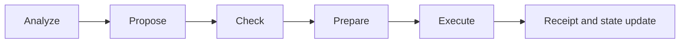

# Rebalancing

Rebalancing in zkde.fi combines proposal logic, model checks, policy context, and execution orchestration.

## The Problem This Solves

Portfolio drift happens continuously. Manual balancing is slow and inconsistent, while blind automation can violate user constraints or risk preferences.

## Why This Matters

A structured rebalancing pipeline provides controlled automation with observable checkpoints, so users can reason about both safety and execution progress.

## Pipeline Overview

## Endpoint Sequence

| Stage | Method | Endpoint | Purpose |
|---|---|---|---|
| Analyze | `POST` | `/api/v1/zkdefi/rebalancer/analyze` | Portfolio assessment |
| Propose | `POST` | `/api/v1/zkdefi/rebalancer/propose` | Create rebalance proposal |
| Check | `POST` | `/api/v1/zkdefi/rebalancer/check` | Model/policy checks |
| Advisory | `POST` | `/api/v1/zkdefi/rebalancer/advisory-check` | Non-blocking check mode |
| Prepare | `POST` | `/api/v1/zkdefi/rebalancer/prepare` | Build execution context |
| Execute | `POST` | `/api/v1/zkdefi/rebalancer/execute` | Execute rebalance |

## Autonomous Controls

| Method | Endpoint | Auth expectation |
|---|---|---|
| `POST` | `/api/v1/zkdefi/rebalancer/autonomous/start` | `X-Wallet-Address` |
| `POST` | `/api/v1/zkdefi/rebalancer/autonomous/stop` | `X-Wallet-Address` |
| `GET` | `/api/v1/zkdefi/rebalancer/autonomous/status/{user_address}` | Public/read |
| `POST` | `/api/v1/zkdefi/rebalancer/autonomous/pause/{user_address}` | `X-Wallet-Address` |
| `POST` | `/api/v1/zkdefi/rebalancer/autonomous/resume/{user_address}` | `X-Wallet-Address` |
| `GET` | `/api/v1/zkdefi/rebalancer/autonomous/all` | `X-Admin-Key` |

## Problem It Solves For Users

Users get both manual and autonomous pathways with visible state transitions rather than hidden black-box execution.

## Why It Matters For Integrators

Integrators can treat each stage as a checkpointed state machine and attach monitoring, retries, and user messaging to clear transition points.

## Verification Semantics

Rebalancing checks can operate in strict or advisory patterns depending on route and context. Integrators should not assume a single global gating mode across all rebalancing endpoints.

Next: [Session keys](/session-keys) | [Risk Passport](/risk-passport) | [API overview](/api-overview)
