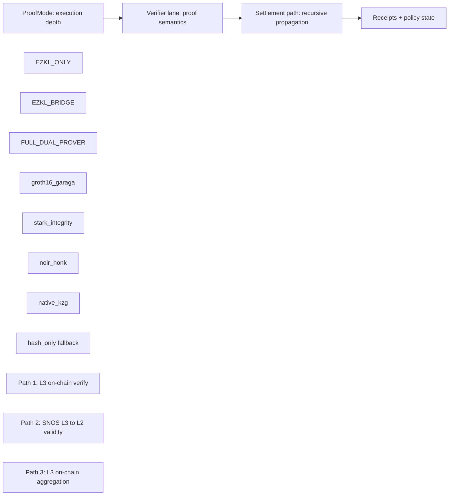

# Recursive Multichain Proving Core

This is the proving backbone of zkde.fi: a layered system that can start with fast local verification and escalate to stronger multichain cryptographic guarantees.

## Why This Layer Exists

The product needs all three at once:

- privacy-preserving execution
- deterministic policy gating
- public, explorer-verifiable receipts

The proving core is how we get those outcomes without forcing every action into the heaviest proof path.

## Layered Model

## 1) Execution Depth (`ProofMode`)

Source: `backend/app/services/proof_mode.py`

| Mode | Meaning | Typical cost profile | Unlock |
|---|---|---|---|
| `EZKL_ONLY` | EZKL verification is off-chain | `0` L2 gas | Fast advisory and low-friction checks |
| `EZKL_BRIDGE` | EZKL output bound into bridge circuit and proven via Groth16 | ~34M L2 gas | On-chain verifiable model/output gate |
| `FULL_DUAL_PROVER` | Bridge lane plus independent STARK integrity lane | ~77M L2 gas | Dual-proof trust posture for high-value actions |

## 2) Verifier Lanes

Source: `backend/app/services/proof_pipeline.py` and `l3_proving_path_client.py`

| Circuit / lane | Backend selector | L3 mode | Status |
|---|---|---|---|
| ModelBridge | `bridge_circuit="ModelBridge"` | `groth16_garaga` | Live |
| ModelBridgeHeavy | `bridge_circuit="ModelBridgeHeavy"` | `groth16_garaga` | Live lane (heavy artifacts present) |
| Noir EZKL bridge | `bridge_circuit="NoirEzklBridge"` | `noir_honk` | Implemented; environment deploy/ops dependent |
| Native EZKL KZG | `bridge_circuit="EzklNativeKzg"` | `native_kzg` | In progress with strict payload gating |
| STARK heavy reputation | `/risk_passport/stark-heavy-reputation` | `stark_integrity` | Live |

## 3) Recursive Settlement Paths

| Path | Purpose | Current state |
|---|---|---|
| Path 1 | Verify proofs on L3 contracts, then register facts | Active production path |
| Path 2 | Prove L3 block validity to L2 via SNOS-style flow | Staged/integration path |
| Path 3 | Move aggregation semantics on-chain in L3 contracts | Planned path |

Roadmap mapping:

- **Path A:** Noir HONK bridge
- **Path C:** L1 Solidity verifier + L1->L2 receiver bridge
- **Path B:** Native Cairo KZG verifier

Reference docs:
- [Recursive EZKL roadmap (repo)](https://github.com/obsqra-labs/zkdefi/blob/main/archive/ideas/docs/RECURSIVE_EZKL_ROADMAP.md)
- [Advanced implementation plan (repo)](https://github.com/obsqra-labs/zkdefi/blob/main/docs/plans/2026-03-10-advanced-l3-and-ezkl-onchain-implementation.md)

## 4) Live Receipt Examples

From latest backend showcase/readout (`/test`) and local report artifacts.

- ModelBridge L3 verify (`groth16_garaga`, `verified_on_chain=true`):
  - <https://sepolia.voyager.online/tx/0x2c8ea7551f965f4c73292cd3d00745d088b5572c7154bf6b3746c9f66a0679b>
- ModelBridgeHeavy lane verify (`groth16_garaga`, `verified_on_chain=true`):
  - <https://sepolia.voyager.online/tx/0x49226ffb495953f1a981020ebb61e8ac462410b750ac672dd21d3f0a8f5b59c>
- Heavy STARK reputation (`stark_integrity`, `verified_on_chain=true`):
  - <https://sepolia.voyager.online/tx/0x7249f4a0dc41f12dd5249f4e7284c0f4d392ec69740396d1de4e0f83126739d>

Core contracts:

- ModelBridge verifier: <https://sepolia.voyager.online/contract/0x037c42e8734271aca0c3c1bdf1746d9ccc098ddfd5ee211c94bbb8786fa4626f>
- ModelBridge-capable ZkmlVerifier: <https://sepolia.voyager.online/contract/0x068abd64a4a78172a5ee15a30bbe614257d62482f07d3ff7fdb72da5aad08923>
- L1 EZKL verifier (Sepolia): <https://sepolia.etherscan.io/address/0xF7b555ca4E54a8c7B9A0DDBFa17341575a852Ab9>

## 5) Product Unlocks

- AI guidance becomes **cryptographically gateable execution**, not opaque recommendation text.
- Privacy rails (shielded/nullifier/relayer/l3 settlement) can stay private while proving compliance and risk checks.
- Same app flow can shift trust posture by selecting a stronger mode, instead of shipping separate product stacks.

## 6) What Still Needs To Land

1. Full Path B completion: universal `kzg_mpcheck_v1` witness extraction + live strict-mode pass receipts.
2. Path A production receipts in target env (`noir_honk` tx evidence).
3. Path 2 and Path 3 operational rollout for full recursive closure.

Next: [Technical Foundations](/technical-foundations) | [How Systems Work](/how-systems-work) | [Contracts](/contracts)
