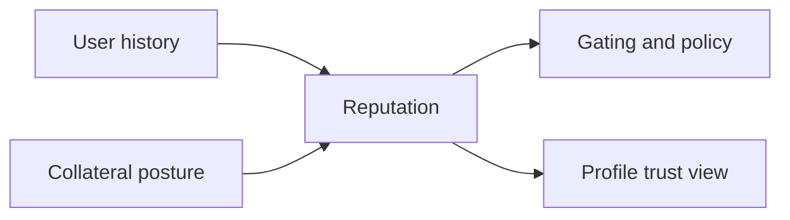

# Reputation System

Reputation is the trust context layer that affects what execution paths are available and how much friction a user sees.

## What It Changes

- Gating outcomes in Trade Desk and other controlled flows
- Trust posture shown in `/profile`
- Credit and lending eligibility quality
- Remediation guidance when a path is blocked or limited

## Simple Model

## Core Endpoints

| Method | Endpoint | Purpose |
|---|---|---|
| `GET` | `/api/v1/zkdefi/reputation/tiers` | Tier definitions |
| `GET` | `/api/v1/zkdefi/reputation/user/{address}` | User reputation snapshot |
| `POST` | `/api/v1/zkdefi/reputation/upgrade-tier` | Tier upgrade request |
| `POST` | `/api/v1/zkdefi/reputation/staking/stake` | Reputation staking flow |
| `POST` | `/api/v1/zkdefi/lending/proof/credit-eligibility` | Credit-eligibility proof |

## Important Boundary

Reputation is context, not execution proof by itself. Some flows still require strict proofs or additional policy checks.

Next: [Profile And Identity](/profile-and-identity) | [Trade Desk](/trade-desk) | [Risk Passport](/risk-passport)
