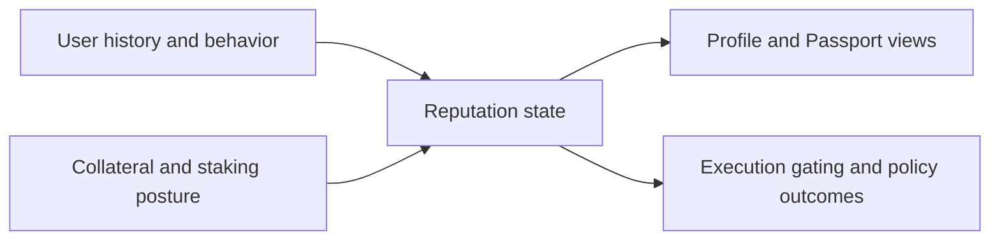

# Reputation System

The reputation system provides execution posture context that influences how users move through risk-aware and automation-aware flows.

## The Problem This Solves

If every account is treated identically regardless of history, collateral, and reliability signals, high-assurance flows become either too restrictive for everyone or too permissive for risky contexts.

## Why This Matters

Reputation introduces adaptive control. It gives users a path to stronger operational posture over time while allowing the system to keep safer defaults for uncertain contexts.

## Conceptual Model

## What Reputation Influences

- How trust posture appears in profile views
- Eligibility and quality of some execution paths
- User guidance and remediation prompts when flows are blocked or constrained
- Relay and automation readiness indicators in operational surfaces
- Reputation-based lending eligibility and credit-oriented borrow workflows

## API Endpoints

| Method | Endpoint | Purpose |
|---|---|---|
| `GET` | `/api/v1/zkdefi/reputation/tiers` | Read available tier definitions |
| `GET` | `/api/v1/zkdefi/reputation/tier/{tier_id}` | Read a specific tier |
| `GET` | `/api/v1/zkdefi/reputation/user/{address}` | Read user reputation state |
| `POST` | `/api/v1/zkdefi/reputation/upgrade-tier` | Request tier upgrade |
| `POST` | `/api/v1/zkdefi/reputation/staking/stake` | Stake collateral path |
| `POST` | `/api/v1/zkdefi/reputation/staking/claim` | Claim staking rewards |
| `POST` | `/api/v1/zkdefi/reputation/staking/exit` | Exit staking position |
| `GET` | `/api/v1/zkdefi/lending/positions/{address}` | Read lending positions linked to trust posture |
| `POST` | `/api/v1/zkdefi/lending/proof/credit-eligibility` | Build lending credit eligibility proof |

## Problem It Solves For Users

Users get explicit feedback loops instead of opaque rejection states. If an execution mode is limited, profile and reputation context can explain why and what to improve.

## Why It Matters For Integrators

Integrators can use reputation endpoints and profile tabs to design clearer remediation UX, instead of generic “request failed” responses.

## Interaction With Flow-Specific Verification

Reputation should be treated as a context layer, not a substitute for verification artifacts. Depending on execution flow, actions may still be strict-gated, advisory-checked, or wallet-first with reconciliation.

Next: [Risk Passport](/risk-passport) | [Profile and identity](/profile-and-identity) | [Rebalancing](/rebalancing)
