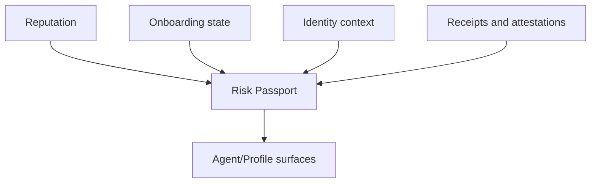

# Risk Passport

Risk Passport is a compositional view of user posture used across the app to inform execution controls, trust-facing UX, and reputation-based lending eligibility.

## The Problem This Solves

Execution systems need more than a single metric. Users require a consolidated posture view that merges reputation, onboarding, identity, and receipt context.

## Why This Matters

A compositional passport reduces fragmented decision-making and helps both users and integrators understand readiness without manually querying many independent endpoints.

## Core Endpoints

| Method | Endpoint | Purpose |
|---|---|---|
| `GET` | `/api/v1/zkdefi/risk_passport/user/{address}` | User passport summary |
| `POST` | `/api/v1/zkdefi/risk_passport/user/{address}/attestation` | Build attestation context |
| `GET` | `/api/v1/zkdefi/risk_passport/user/{address}/attestations` | List attestations |
| `POST` | `/api/v1/zkdefi/risk_passport/user/{address}/attestation/register` | Register attestation |
| `GET` | `/api/v1/zkdefi/risk_passport/pool/{pool_id}` | Pool passport summary |

## Composition Flow

## Problem It Solves In The UI

### On `/profile`

Passport context gives users a readable trust posture, receipt-linked confidence trail, and credit-line context used by lending flows.

### On `/agent`

Passport context supports execution-control messaging and helps users understand whether they are in a healthy state for automation or sensitive actions.

### On lending paths

Passport and attestation context are consumed to support reputation-driven lending eligibility and credit-aware borrowing workflows.

## Why It Matters For Integrators

Integrators can consume passport data as a compact trust context rather than stitching many low-level calls into custom heuristics.

## Practical Interpretation Guidance

Passport values are operational indicators, not legal conclusions or guarantees. Use them as part of risk-aware UX and policy design, not as a standalone compliance determination.

Next: [Compliance and disclosure](/compliance-and-disclosure) | [Reputation system](/reputation-system) | [Profile and identity](/profile-and-identity)
