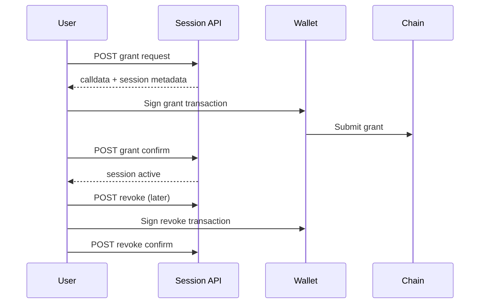

# Session Keys

Session keys are the delegation primitive behind autonomous execution controls in zkde.fi.

## The Problem This Solves

Requiring a full wallet signature for every micro-action makes automation impractical. But unconstrained delegation is unsafe.

## Why This Matters

Session keys provide bounded delegation: users grant temporary, scoped authority while retaining revocation control.

## Delegation Lifecycle

## API Endpoints

| Method | Endpoint | Purpose |
|---|---|---|
| `POST` | `/api/v1/zkdefi/session_keys/grant` | Build session grant request |
| `POST` | `/api/v1/zkdefi/session_keys/grant/confirm` | Confirm on-chain grant |
| `POST` | `/api/v1/zkdefi/session_keys/revoke` | Build revoke request |
| `POST` | `/api/v1/zkdefi/session_keys/revoke/confirm` | Confirm on-chain revoke |
| `GET` | `/api/v1/zkdefi/session_keys/list/{owner_address}` | List sessions |
| `POST` | `/api/v1/zkdefi/session_keys/validate` | Validate action under session |

## Problem It Solves For Users

Users can run automation in `/agent?v=brain` without approving every action manually, while still constraining session scope (for example max position and duration).

## Why It Matters For Integrators

Integrators can build automation around an explicit lifecycle with durable identifiers (`session_id`) and confirmation checkpoints, rather than opaque background delegation.

## Scope And Protocol Mapping Note

Protocol bitmaps and allowed protocol labels are implementation details that can evolve. Integrators should consume returned payloads and endpoint responses rather than hardcoding assumptions from old docs snapshots.

## Safety Guidance

- Keep short session durations for higher-risk strategies.
- Revoke sessions proactively when strategy context changes.
- Pair session delegation with profile/passport monitoring for safer operations.

Next: [Rebalancing](/rebalancing) | [Agent workspace](/agent-dashboard) | [API overview](/api-overview)
