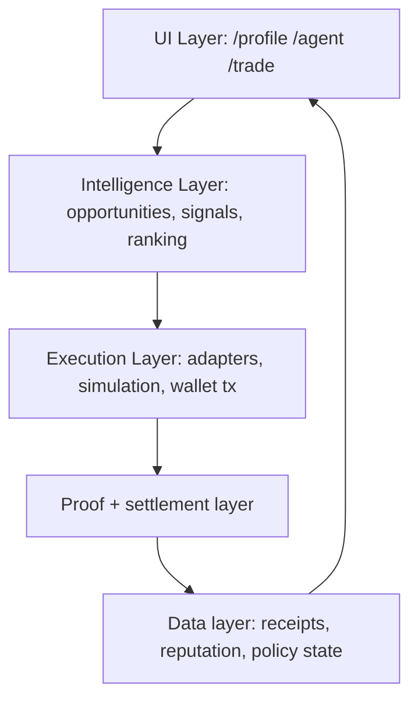
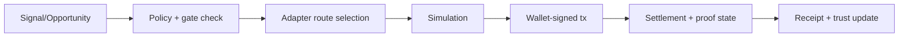

# Technical Foundations

This page captures the architecture foundations behind Capital OS and Trade Desk.
It is grounded in the stronger internal architecture docs and focused on runtime behavior.

## 1) Layered Architecture

## 2) Core Runtime Components

### Frontend surfaces

- `/profile`: trust/reputation identity context.
- `/agent`: Capital OS posture + orchestration controls.
- `/trade`: opportunity/adapters/simulation/execution.

### Backend surfaces

- `zkde backend` on `:8003`:
  user-facing APIs for trade, policy, profile, privacy, and sequencer status.
- `obsqra backend` on `:8002`:
  proof aggregation/sequencing and settlement endpoints.
- `Madara proof chain` on `:9944`:
  dedicated L3 settlement path for proof-related fact registration.

## 3) Execution Adapter Model

Trade Desk uses an adapter-based execution model so opportunities map to concrete routes.

Primary adapter families in runtime/design flow:

- `ekubo` (swap and LP routes)
- `limit_orders`
- `lending`
- `staking`
- `dca`
- privacy-route variants for shielded/full-private flows

Execution principle:
- if opportunity includes adapter metadata, user selects explicit route;
- if metadata is missing, system uses fallback builder path.

## 4) Proof + Settlement Path

Standard proof-lifecycle path:

1. zkde flow submits proof-related state/events to sequencer path.
2. obsqra aggregation/sequencer handles block/batch logic.
3. settlement targets Madara L3 when enabled.
4. fallback path is Starknet L2 when L3 is unavailable.
5. receipts/status reconcile back into user-facing state.

Operational endpoints:

- `GET /api/v1/zkdefi/proofs/sequencer-status`
- `GET /api/v1/aggregation/stats`
- `GET /api/v1/aggregation/madara/health`

## 5) Trust Domains (V3 Direction)

Portable reputation/identity architecture separates trust domains:

- `reputation`: activity consistency and execution quality signals.
- `credit`: collateral/repayment and borrowing constraints.
- `governance`: voting/delegation constraints.

The key rule is boundary separation: signals in one domain should not silently grant rights in another domain.

## 6) Signal To Receipt Lifecycle

## 7) Source Architecture References

- <https://github.com/obsqra-labs/zkdefi/blob/main/docs/TRADE_DESK_ARCHITECTURE.md>
- <https://github.com/obsqra-labs/zkdefi/blob/main/docs/ARCHITECTURE_STRATEGIES_PROOFS_DATA_FLOW.md>
- <https://github.com/obsqra-labs/zkdefi/blob/main/docs/MADARA_L3_APPCHAIN_ARCHITECTURE.md>
- <https://github.com/obsqra-labs/zkdefi/blob/main/docs/CAPITAL_OS_PORTABLE_REPUTATION_V3_SPEC.md>

Next: [Recursive Proving Core](/recursive-multichain-proving-core) | [How Systems Work](/how-systems-work) | [API Overview](/api-overview)
