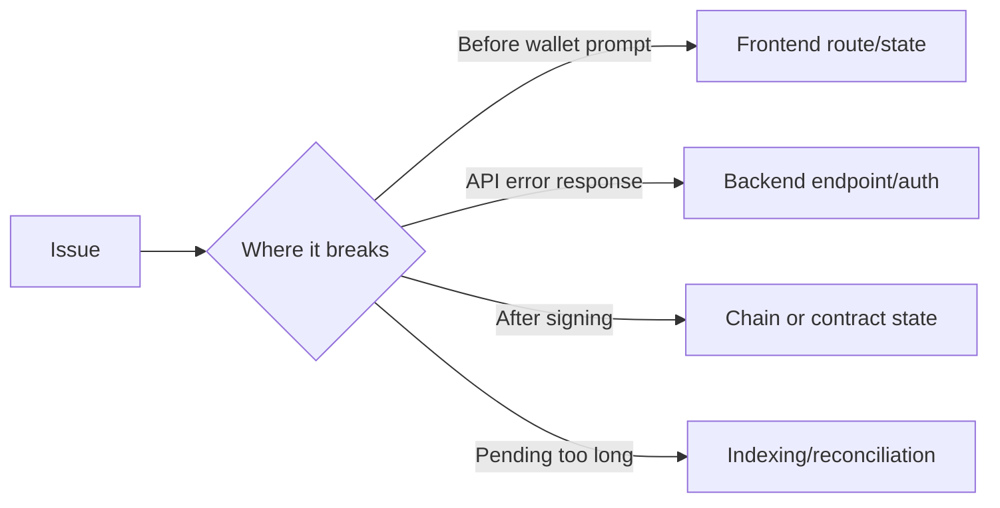

# Troubleshooting

This page prioritizes practical diagnosis for the most common user and integration failures.

## The Problem This Solves

Many failures look similar in the UI but originate from different layers: route mismatch, auth headers, wallet network, backend config, or chain state.

## Why This Matters

Fast triage depends on identifying the failing layer first, not retrying blindly.

## Quick Triage Map

## Route And Surface Mismatch

### Symptom

User lands on unexpected UI after following docs/support link.

### Fix

Use canonical links:

- `/agent?v=vault|trade|brain`
- `/profile?tab=trust|reputation|compliance|connections`

## Auth Header Failures

### Symptom

Mutating requests return `401` or `403` on protected routes.

### Fix

- For user-protected endpoints, include `X-Wallet-Address` and ensure it matches target address.
- For admin routes, provide valid `X-Admin-Key`.

## Network/Contract Mismatch

### Symptom

Wallet errors indicate contract not deployed or invalid chain context.

### Fix

Confirm Starknet Sepolia context and verify route-dependent contract configuration.

## Orchestration Or Ekubo Availability Issues

### Symptom

Deploy flow returns unavailable/pending behavior despite valid input.

### Fix

Check backend orchestration and downstream Ekubo/indexing availability. On user side, retry after short interval and verify tx hash status on explorer.

## Chunk/CSS Load Issues After Deploy

### Symptom

UI chunk load error or missing styles.

### Fix

- Hard refresh
- Clear site cache for `zkde.fi`
- Validate deployed frontend assets match current build output

## Docs Route Issues

### Symptom

`/docs` or page route returns 404 in deployment.

### Fix

Verify docs static build sync and serving path (`/docs/`) configuration in frontend/reverse proxy.

Next: [FAQ](/faq) | [Deploying zkde.fi](/deploying-zkde-fi) | [API overview](/api-overview)
