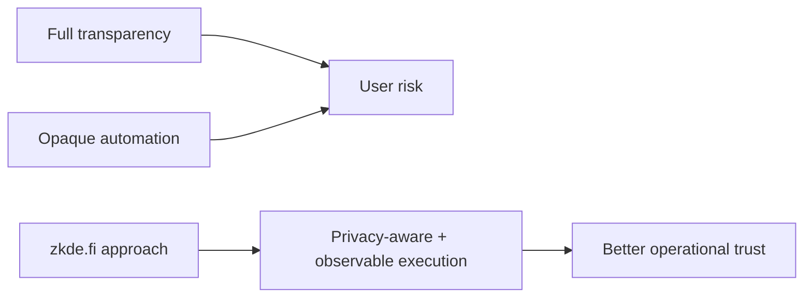

# Why zkde.fi?

## The Problem

Many DeFi users face a forced tradeoff:

- full transparency that leaks strategy and timing
- opaque delegation that weakens user assurance and auditability

## Why This Matters

When privacy and trust cannot coexist, users either avoid automation or accept unnecessary risk.

## Our Position

zkde.fi focuses on privacy-aware execution with observable control surfaces:

- user-owned wallet execution
- flow-specific verification behavior
- delegated automation bounded by session constraints
- trust context through profile and passport views

## What Problem This Solves

It removes the false choice between complete exposure and complete opacity by giving users bounded, inspectable, and route-aware controls.

Next: [Concepts](/concepts) | [Quick start](/quick-start)
