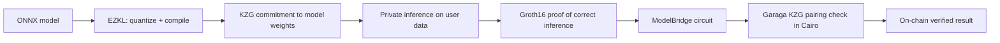

# zkML + Circuit Stack

zkde.fi uses zero-knowledge machine learning to turn AI model outputs into verifiable, policy-aware signals. The system includes 31 Circom circuits, 2 EZKL ML models, and a bridge layer (ModelBridge) that converts arbitrary ONNX model outputs into on-chain-verifiable commitments via Garaga.

The result: AI outputs become evidence-bearing, policy-aware signals — not black-box recommendations.

## The EZKL Pipeline

1. **Model training** — a standard ML model is trained and exported as ONNX
2. **EZKL compilation** — EZKL quantizes the model and compiles it into a Halo2 circuit with KZG commitments to the model weights
3. **KZG commitment** — the model's weight commitment is registered on-chain, binding the model's identity
4. **Inference** — the model runs on private user inputs; the user's data never leaves their control
5. **Groth16 proof** — EZKL generates a proof that the model ran correctly on the given inputs and produced the given output
6. **ModelBridge** — a Circom circuit that takes the EZKL proof output and bridges it into a format verifiable by Garaga's BN254 pairing check
7. **On-chain verification** — Garaga verifies the Groth16 proof in Cairo on Starknet

## EZKL ML Models

| Model | Architecture | Classes | Purpose |
|---|---|---|---|
| `yield_forecast` | Linear(12→32)→ReLU→Linear(32→16)→ReLU→Linear(16→4) | declining / stable / growing / surging | Predict yield trajectory for pool allocation decisions |
| `anomaly_detector` | Linear(8→24)→ReLU→Linear(24→12)→ReLU→Linear(12→3) | safe / warning / critical | Detect anomalous pool behavior before capital enters |

Both models are compiled via EZKL into Halo2 circuits with KZG polynomial commitments. Proofs are verified on Ethereum Sepolia via the [Halo2Verifier](https://sepolia.etherscan.io/address/0xF7b555ca4E54a8c7B9A0DDBFa17341575a852Ab9) and bridged to Starknet via L1→L2 messaging or the ModelBridge circuit path.

## The 13-Circuit Agent Screening Bundle

Before any execution path is surfaced in Trade Desk, the relevant circuits from this bundle evaluate the action:

| # | Circuit | What It Proves |
|---|---|---|
| 1 | `RiskScore` | Aggregate risk rating for a pool or position |
| 2 | `AnomalyDetector` | Whether pool behavior deviates from safe baselines |
| 3 | `YieldOptimality` | Whether the yield justifies the risk at current conditions |
| 4 | `StrategyIntegrity` | Whether the proposed strategy matches the committed parameters |
| 5 | `ExecutionIntegrity` | Whether the execution respected declared constraints (slippage, timing) |
| 6 | `ImpermanentLossPredictor` | Estimated IL exposure for LP positions |
| 7 | `SlippageBound` | Whether expected slippage stays within acceptable bounds |
| 8 | `MEVResistanceProof` | Whether the execution route has MEV protection characteristics |
| 9 | `LiquidationRisk` | Proximity to liquidation threshold for leveraged positions |
| 10 | `CorrelationRisk` | Cross-asset correlation risk in the portfolio context |
| 11 | `CreditEligibility` | Whether collateral posture meets lending thresholds |
| 12 | `SolvencyProof` | Verifiable solvency attestation |
| 13 | `AgentReputationScore` | Composite trust score from execution history |

Each circuit is compiled to WASM + zkey for fast client-side proof generation. The FICO-pack subset (Solvency, RiskPassportTier, TraderPerformance, StrategyIntegrity, ExecutionIntegrity) has dedicated on-chain verifier contracts:

| Verifier | Address |
|---|---|
| SolvencyProofVerifier | [`0x043b253e3f2fcac35eef0b08fd2f8f4ff81aeb52848f11640d62879854329c9b`](https://sepolia.voyager.online/contract/0x043b253e3f2fcac35eef0b08fd2f8f4ff81aeb52848f11640d62879854329c9b) |
| RiskPassportTierVerifier | [`0x05e71cc0c4b87908230414644d675164fb90cd6d8cfafeae87198241e60eb788`](https://sepolia.voyager.online/contract/0x05e71cc0c4b87908230414644d675164fb90cd6d8cfafeae87198241e60eb788) |
| TraderPerformanceVerifier | [`0x04c8087855dd0812042de58b2a3f3838d3cea45118c86f07d32ac87648e90769`](https://sepolia.voyager.online/contract/0x04c8087855dd0812042de58b2a3f3838d3cea45118c86f07d32ac87648e90769) |
| StrategyIntegrityVerifier | [`0x00c9478f355bdad25caf13899a0d5bf2ee1accb1678e9934ebeda40f2653e549`](https://sepolia.voyager.online/contract/0x00c9478f355bdad25caf13899a0d5bf2ee1accb1678e9934ebeda40f2653e549) |
| ExecutionIntegrityVerifier | [`0x03bb26a38ea2d8e4bd21895f665d0056a5496f31ad84f4d77e040d9e63e6873b`](https://sepolia.voyager.online/contract/0x03bb26a38ea2d8e4bd21895f665d0056a5496f31ad84f4d77e040d9e63e6873b) |

## Additional Circom Circuits (Full 31-Circuit Set)

Beyond the 13 agent screening circuits, the system includes circuits for privacy, governance, and bridge operations:

| Category | Circuits |
|---|---|
| **Privacy** | FullPrivacyWithdraw, FullPrivacyWithdrawHashed, FullPrivacyWithdrawWithChange, PrivateDeposit, PrivateWithdraw, PoolMembership |
| **Bridge** | ModelBridge, ModelBridgeHeavy |
| **Governance** | private_vote |
| **Position** | TWAPPosition, RebalanceTimingCommitment |
| **Attestation** | HistoricalPerformanceAttestation, RobustnessCertificate, SafetyDiversification |
| **Threshold** | BalanceAboveThreshold, TenureAboveThreshold |
| **DeFi** | CrossProtocolArbitrage, RiskPassportTier, TraderPerformanceProof |

Plus a **Noir circuit** (`noir_ezkl_bridge/`) for the Noir HONK proving lane.

## ModelBridge vs ModelBridgeHeavy

| Variant | Artifact Size | Proving Time | Use Case |
|---|---|---|---|
| **ModelBridge** | Standard (~2MB zkey) | ~3-5s | Default bridge for standard model outputs |
| **ModelBridgeHeavy** | Heavy (~8MB zkey) | ~10-15s | Complex model outputs requiring more constraint capacity |

Both variants produce Groth16 proofs verified by the same Garaga verifier infrastructure on Starknet.

## ModelBridge Verifier Contract

The on-chain entry point for verifying bridged EZKL proofs:

[`0x037c42e8734271aca0c3c1bdf1746d9ccc098ddfd5ee211c94bbb8786fa4626f`](https://sepolia.voyager.online/contract/0x037c42e8734271aca0c3c1bdf1746d9ccc098ddfd5ee211c94bbb8786fa4626f) (Starknet Sepolia)

## zkML API Endpoints

| Method | Endpoint | Purpose |
|---|---|---|
| `POST` | `/api/v1/zkdefi/zkml/risk_score` | Risk score proof/signal generation |
| `POST` | `/api/v1/zkdefi/zkml/anomaly` | Anomaly detection signal |
| `POST` | `/api/v1/zkdefi/zkml/combined` | Combined risk + anomaly path |
| `GET` | `/api/v1/zkdefi/zkml/status` | zkML subsystem status |
| `GET` | `/api/v1/zkdefi/zkml/pool-safety` | Pool safety snapshot |
| `POST` | `/api/v1/zkdefi/zkml/scan` | Scan-oriented model path |
| `GET` | `/api/v1/zkdefi/zkml/circuits` | Circuit metadata |

---

Next: [Proof Pipeline](/proof-pipeline) | [Privacy Rails](/privacy-rails) | [API Overview](/api-overview)
