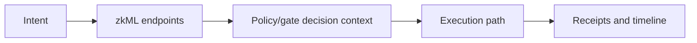

# zkML Models

zkde.fi uses zero-knowledge machine learning to turn AI model inference into verifiable computation. Each model runs on real inputs, produces an output, and generates a cryptographic proof that the computation was performed correctly by the specific model claimed.

## The Problem This Solves

When an AI model says "this pool is safe" or "this credit grade is AA," there is no way to verify that the model actually ran on real data without trusting the operator. zkML closes this gap — proofs guarantee computation integrity.

## Why This Matters

This is the **computation oracle** pattern. Data oracles prove what happened on-chain. Computation oracles prove what the data means. zkML models are the computational layer that turns raw metrics into provable risk signals, anomaly classifications, and strategy recommendations.

## Core Endpoints

| Method | Endpoint | Purpose |
|---|---|---|
| `POST` | `/api/v1/zkdefi/zkml/risk_score` | Risk score proof/signal generation |
| `POST` | `/api/v1/zkdefi/zkml/anomaly` | Anomaly signal generation |
| `POST` | `/api/v1/zkdefi/zkml/combined` | Combined risk + anomaly path |
| `GET` | `/api/v1/zkdefi/zkml/status` | zkML subsystem status |
| `GET` | `/api/v1/zkdefi/zkml/pool-safety` | Pool safety snapshot |
| `POST` | `/api/v1/zkdefi/zkml/scan` | Scan-oriented model path |
| `GET` | `/api/v1/zkdefi/zkml/circuits` | Circuit metadata |

## Model Usage Context

## Problem It Solves In Execution

Model outputs create structured risk signals before execution, reducing blind automation behavior.

## Why It Matters For Integrators

Teams can build explicit branching logic from structured outcomes instead of hardcoding opaque strategy assumptions.

## Production Vs Experimental Note

Model APIs are active but may evolve quickly in payload detail across releases. Integrators should parse defensively and pin client behavior to tested API versions.

Next: [Rebalancing](/rebalancing) | [API overview](/api-overview) | [Developers](/developers)
