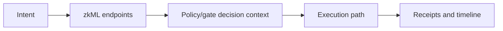

# zkML Models: Privacy-Preserving AI

zkde.fi uses **zero-knowledge machine learning (zkML)** to run AI inference **on your private data** while generating cryptographic proofs of correctness. Your portfolio positions, risk tolerance, and strategy preferences **never leave your control**, yet you still get proven AI recommendations.

## The Privacy Problem with Traditional AI

When AI says "this pool is safe for you" or "your risk grade is high," you face a dilemma:

**Centralized AI:** Send your private data to a server, trust they run the right model, no verification
**On-chain AI:** Publish your data publicly for transparency, expose everything to MEV bots and competitors

Neither option gives you **privacy + verification**.

## Why Privacy-Preserving zkML Matters

zkML **proves the AI model ran correctly WITHOUT revealing your inputs**. The computation oracle pattern means:

- **Privacy-preserving risk scoring:** AI analyzes your hidden positions, outputs a proven risk score
- **Confidential anomaly detection:** Models check pool health without exposing your stake
- **Private strategy recommendations:** Personalized suggestions based on your secret risk profile

Smart contracts verify proofs on-chain. You get AI-powered decisions with **mathematical privacy guarantees**.

## Core Endpoints

| Method | Endpoint | Purpose |
|---|---|---|
| `POST` | `/api/v1/zkdefi/zkml/risk_score` | Risk score proof/signal generation |
| `POST` | `/api/v1/zkdefi/zkml/anomaly` | Anomaly signal generation |
| `POST` | `/api/v1/zkdefi/zkml/combined` | Combined risk + anomaly path |
| `GET` | `/api/v1/zkdefi/zkml/status` | zkML subsystem status |
| `GET` | `/api/v1/zkdefi/zkml/pool-safety` | Pool safety snapshot |
| `POST` | `/api/v1/zkdefi/zkml/scan` | Scan-oriented model path |
| `GET` | `/api/v1/zkdefi/zkml/circuits` | Circuit metadata |

## Model Usage Context

## Problem It Solves In Execution

Model outputs create structured risk signals before execution, reducing blind automation behavior.

## Why It Matters For Integrators

Teams can build explicit branching logic from structured outcomes instead of hardcoding opaque strategy assumptions.

## Production Vs Experimental Note

Model APIs are active but may evolve quickly in payload detail across releases. Integrators should parse defensively and pin client behavior to tested API versions.

Next: [Rebalancing](/rebalancing) | [API overview](/api-overview) | [Developers](/developers)
