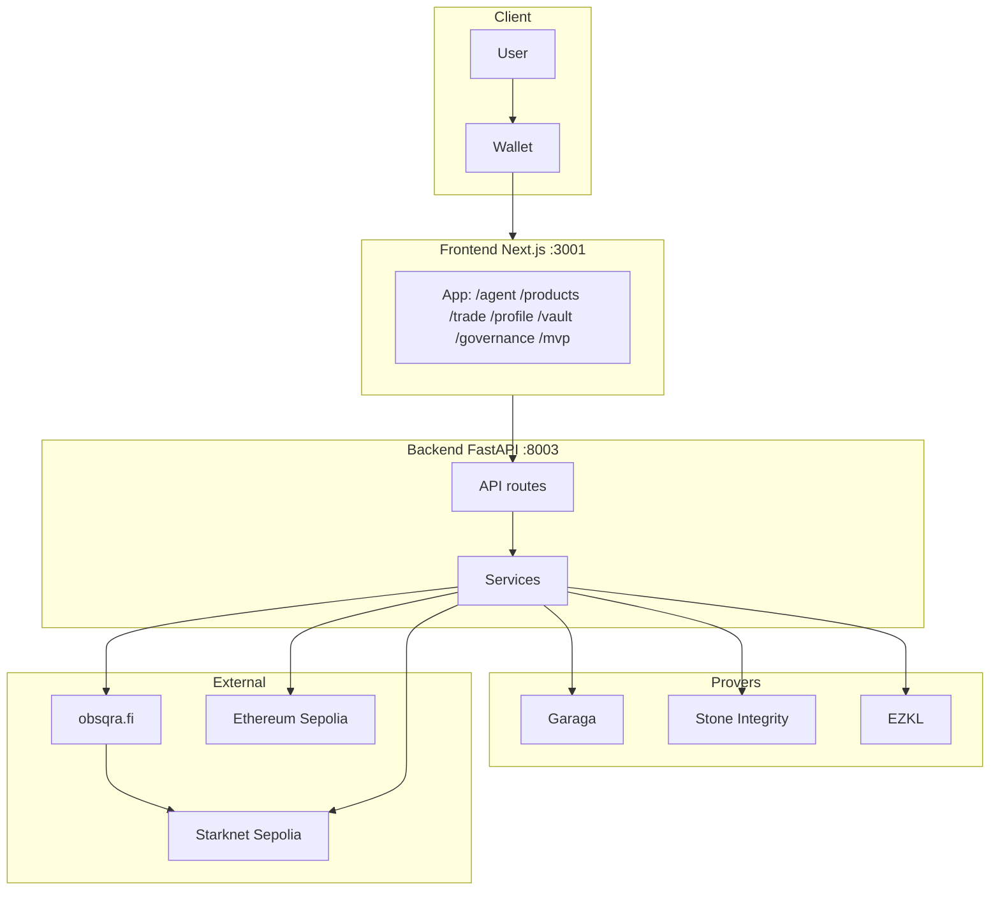
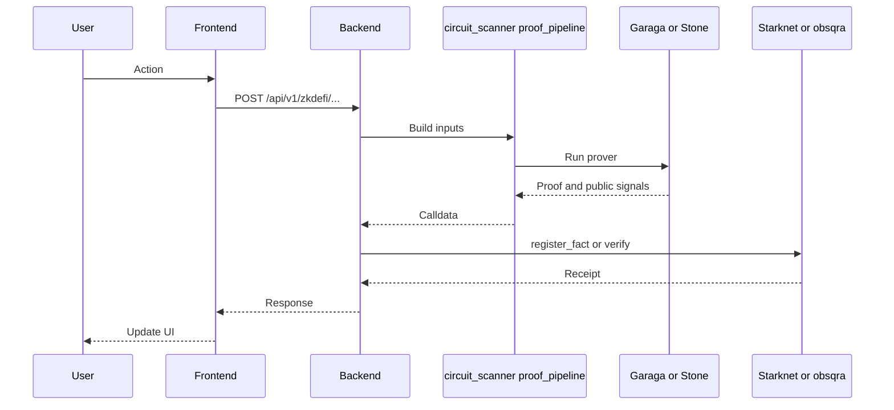
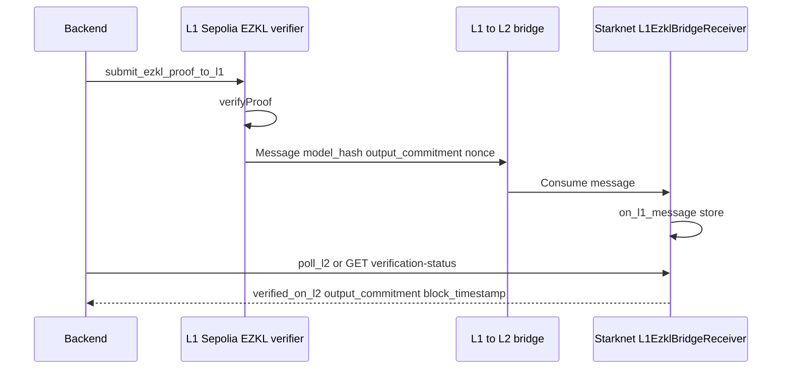

# Architecture

**Last updated:** 2026-03-10

---

## 1. System context

User and wallet connect to the frontend (Next.js, port 3001). Frontend calls the backend (FastAPI, port 8003). Backend services use Garaga (Groth16), Stone/Integrity (STARK), and EZKL for proof generation; they call obsqra.fi for aggregation/Madara settlement and Starknet Sepolia (L2) for fact registration and verifier contracts. L1 (Ethereum Sepolia) is used for the EZKL verifier and L1→L2 bridge when the L1 bridge flow is enabled.

---

## 2. Component overview

- **Frontend:** Next.js app router under `frontend/src/app/` — `agent`, `products`, `trade`, `profile`, `vault`, `governance`, `mvp`. Calls backend via `NEXT_PUBLIC_API_URL`; connects to Starknet via `NEXT_PUBLIC_RPC_URL`.
- **Backend:** Single entrypoint `backend/app/main.py` (`app.main:app`). Routers are loaded with `_optional_router("app.api.routes.<name>")` and mounted under `/api/v1/zkdefi`, `/api/v1/agents`, `/api/v1/strategies`, `/api/v1/vault`, `/api/v1/dao`, etc. Key services under `backend/app/services/`: `proof_pipeline`, `zkml/circuit_scanner`, `groth16_prover`, `session_key_service`, `agent_rebalancer`, `vault_execute_service`, `privacy_vault_service`, `receipt_service`, and others.
- **Contracts (Starknet):** `contracts/src/` — ObsqraFactRegistry, verifiers (Garaga, Integrity, ZkmlVerifier), L1EzklBridgeReceiver (L1→L2 verification results). Built with Scarb.

---

## 3. Proof-gated request flow

Backend builds circuit inputs via `circuit_scanner` or `proof_pipeline`, runs the prover (Garaga or Stone), then submits the resulting calldata to Starknet (or obsqra for L3/Madara) via `register_fact()` or a verifier contract. The receipt is returned to the frontend and the UI updates.

---

## 4. L1 EZKL bridge flow

Backend (parent repo) submits EZKL proof to the L1 Sepolia verifier; on success, L1 sends a message to the Starknet L1→L2 bridge. The L2 receiver contract (`L1EzklBridgeReceiver`) consumes the message in `on_l1_message` and stores the verification. Backend polls L2 via `poll_l2_for_verification` or GET `/api/v1/aggregation/l1/verification-status` to confirm. See [L1_EZKL_BRIDGE_SPEC.md](plans/L1_EZKL_BRIDGE_SPEC.md).

---

## 5. L3 / Madara

When Madara L3 is enabled, the proof settlement path is: zkdefi → obsqra ProofSequencer → Madara L3 (5s blocks, zero/subsidized gas) → state-diff settlement to Starknet L2. Same contract interface (`register_fact()` / `is_valid()`) on L2 and L3. Full architecture: [MADARA_L3_APPCHAIN_ARCHITECTURE.md](MADARA_L3_APPCHAIN_ARCHITECTURE.md). Implementation guide for frontend/backend: [L3_PROVING_PATHS_INTEGRATION.md](L3_PROVING_PATHS_INTEGRATION.md).

---

## 6. File mapping

| Layer | Path | Notes |
|-------|------|------|
| Backend entrypoint | `backend/app/main.py` | FastAPI app; `_optional_router("app.api.routes.<name>")`; mounts all API routers; WebSocket `/ws/{user_address}`; health/metrics if configured. |
| Backend routes | `backend/app/api/routes/*.py` | full_privacy, vault_v2, ledger, mission_control, trade_desk_v2, reputation, agents, strategies, dao, etc. |
| Backend services | `backend/app/services/` | proof_pipeline.py, zkml/circuit_scanner.py, groth16_prover.py, session_key_service.py, agent_rebalancer.py, vault_execute_service.py, privacy_vault_service.py, receipt_service.py, and others. |
| Frontend app | `frontend/src/app/` | App router: agent/, products/, trade/, profile/, vault/, governance/, mvp/. |
| Contracts | `contracts/src/*.cairo` | lib.cairo wires modules; ObsqraFactRegistry, verifiers, L1EzklBridgeReceiver, model_registry, etc. |
