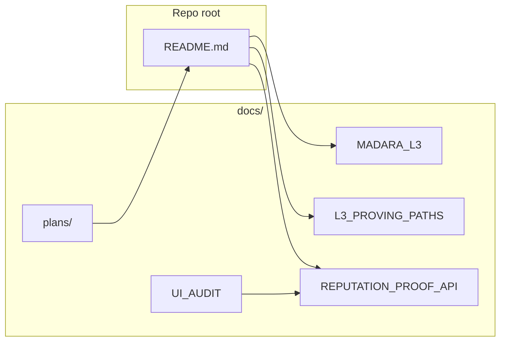

# Docs (index)

Technical docs and plans. Condensed overviews live in the [root README](../README.md) and per-directory READMEs.

---

## Architecture & integration

| Doc | Description |
|-----|-------------|
| [MADARA_L3_APPCHAIN_ARCHITECTURE.md](MADARA_L3_APPCHAIN_ARCHITECTURE.md) | Madara L3 proof chain: why, architecture, zkde.fi ↔ obsqra.fi flow, settlement. |
| [L3_PROVING_PATHS_INTEGRATION.md](L3_PROVING_PATHS_INTEGRATION.md) | L3 proving paths implementation guide for zkde.fi (frontend/backend). |
| [AGENT_BRIEF_MADARA_SETTLEMENT.md](AGENT_BRIEF_MADARA_SETTLEMENT.md) | Brief on agent settlement via Madara. |

---

## Reputation & API

| Doc | Description |
|-----|-------------|
| [REPUTATION_PROOF_API.md](REPUTATION_PROOF_API.md) | Reputation proof API: GET proof status, POST generate (all 5 types), verifier addresses. |
| [TRUST_ONBOARDING_SYSTEM_EXTERNAL.md](TRUST_ONBOARDING_SYSTEM_EXTERNAL.md) | External-facing trust and onboarding architecture: trust domains, onboarding flow, selective disclosure, integration contracts. |
| [UI_AUDIT_REPUTATION.md](UI_AUDIT_REPUTATION.md) | Reputation UI audit: components to keep/replace, Credit Hub integration. |

---

## Plans

| Doc | Description |
|-----|-------------|
| [plans/2026-03-05-reputation-credit-ui-integration.md](plans/2026-03-05-reputation-credit-ui-integration.md) | Reputation & credit UI integration plan (FICO pack, components, verification). |
| [plans/2026-03-05-reputation-production-readiness.md](plans/2026-03-05-reputation-production-readiness.md) | Production readiness: verifiers, frontend, DAO, monitoring, docs. |

---

## Quick reference

- **Reputation proofs:** [REPUTATION_PROOF_API.md](REPUTATION_PROOF_API.md).
- **L3 / Madara:** [MADARA_L3_APPCHAIN_ARCHITECTURE.md](MADARA_L3_APPCHAIN_ARCHITECTURE.md).
- **Repo layout:** [../README.md](../README.md#repository-index).
